# A Lightweight Cross-Version Binary Code Similarity Detection Based on Similarity and Correlation Coefficient Features
> 一种基于相似系数和相关系数特征的轻量级跨版本二进制代码相似度检测

## 摘要

### 研究背景 

- BCSD被应用在很多领域，如恶意检测，剽窃鉴定和漏洞挖掘
- `BCSD`的现有解决方案
	- 基于二进制的**函数控制流图**比较二进制文件之间的特定特征
	- 计算二进制函数的**embedding向量**并基于深度学习算法解决问题
		- embedding就是用一个低维的向量表示一个物体。有一个保持结构的单射f:X->Y，这个映射f就叫embedding
### 研究内容

- 本文另一个研究角度提出了一种新的**轻量级**方法来解决基于**多个特征**的**跨版本**`BCSD`问题
- 将二进制代码转化为**向量**和**符号**，计算**相似系数值**和**相关系数值**
	- 不依赖函数的控制流图，深度学习和其他相关属性
	- 直接对二进制文件的原始字节进行操作
- 大约 *423,282* 个样本的自定义数据集上对其进行评估：这个检测方法在垮版本的 BCSD 领域表现良好，此方法的召回率可以达到**96.63%**,与最先进的静态解决方案几乎相同

## INTRODUCTION

- BCSD：估计两个二进制函数是否相似
	- 被应用于恶意检测，恶意家族分类，抄袭检测，漏洞分析，寻找bug
- BSCD面临很多挑战：
	- 跨编译器：不同算法编译的源代码
	- 跨架构：在不同的平台上编译
	- 跨版本：代码可能会随着时间的推移打补丁和演变
- 跨版本和跨编译器的二进制是**语义等价**（同样的现象描述同一种实质，唯一的区别可能是描述方式的不同），但是有不同的**语法结构**。跨版本的二进制是相似的，因为都是在相同的环境，根是一样的，但是跨版本的二进制文件仍然具有不同的**语法结构**和略有不同的**语义特征**。

### 研究现状

- BCSD 问题的大多数现有解决方案依赖于二进制中函数的控制流图和图同构算法
	- 图同构：对于同一个图，我们可以用各种不同的形式来描述，这些形式都具有相同数目的边，具有相同数目的顶点，它们有着一一对应的关系，对应的顶点具有相同的连接性。这些图的不同形式，我们称之为图同构。
- `Bindiff`
	- 比较函数的CFG和它们的属性
- `BinHunt`和`iBinHunt`
	- 利用污点分析和符号执行
- `CABS`,`BinGo`，`Esh`
	- 将 CFG 划分为不同的部分，并通过计算整体 CFG 和 CFG 片段的相似性来提高它们对 CFG 变化的鲁棒性
- DiscovRE, Genius, Gemini and VulSeeker
	- 为了最大限度地降低成本计算，从 CFG 或基本块中提取一些数字特征

### A. NEED FOR THIS STUDY

#### 依赖CFG及其相关属性的缺点
- 基于CFG的检测方法会有以下缺点：
	- 二进制代码发生细微变化的时候，二进制代码的CFG可能会发生很大的变化
	- 有时候会无法提取有效的CFGs，相关属性，甚至二进制文件的CFG特征是被特地修改过

- 所以本文解决的第一个问题：   
**P1：如何在不依赖CFG及其相关属性的情况下解决跨版本BCSD问题？***

##### 不依赖CFG及其相关属性的情况下解决跨版本BCSD的例子

- Asm2Vec：采用特征学习为汇编代码构建特征向量，对于代码混淆和编译器优化提供更强的鲁棒性。
	- 特征学习：表征学习的目的是对复杂的原始数据化繁为简，把原始数据的无效的或者冗余的信息剔除，把有效信息进行提炼，形成特征（feature）
- INNEREYE：利用`word embedding`和  LSTM 自动获取指令的语义和依赖关系，解决基本块之间的BCSD
	- LSTM：长短期记忆（Long short-term memory, LSTM）是一种特殊的RNN（循环神经网络，Recurrent Neural Network，RNN，是一种用于处理序列数据的神经网络），主要是为了解决长序列训练过程中的梯度消失和梯度爆炸问题。简单来说，就是相比普通的RNN，
- SAFE：提出了一种新的架构，用于从反汇编的二进制文件中计算二进制 function embeddings 并获得更好的性能
- Besides, Alpha-Diff：是解决跨版本 BCSD 问题的最先进的解决方案之一，将函数的原始字节表示为图像，并使用 Siamese 卷积神经网络计算函数的相似度

#### 基于深度学习和自然语言处理的缺点

- 深度学习中对抗样本的问题。在恶意软件检测和剽窃鉴定，黑客可能会故意修改样本以逃避深度学习模型的检测
	- 对抗样本（adversarial examples）：对输入样本故意添加一些人无法察觉的细微的干扰，导致模型以高置信度给出一个错误的输出。

- 所以本文解决的第二个问题：   
**P2：如何在不依赖深度学习算法的情况下解决跨版本BCSD问题？**

#### 使用轻量级设备检测的必要性

- 用轻量级设备解决 BCSD 问题具有重要意义。
	- 在漏洞挖掘领域，研究人员多在高性能服务器或主机上工作，一般不使用轻量级设备；在恶意软件变种检测领域，高性能服务器可以达到更好的检测效果。但是，当新的恶意软件变种被传输到终端设备（即PC和IoT设备）时，如果可以先通过部署在终端设备上的检测技术对可疑代码进行筛查，然后再上传到云端，就​​可以节省一些资源并提高效率。

- 上述解决方案依赖的主要特性是函数的CFG、汇编代码和原始字节。然而，在一些轻量级的设备中，函数和汇编代码的CFG可能不容易提取。
- 因此，基于**原始字节**的解决方案更适合解决该领域的问题。有很多基于原始字节的纯句法解决方案，比如基于操作码的相似度检测。而且它们可以通过 Yara 搜索或其他工具来执行。但大多需要手动分析应用目标的一些独特属性，例如一些签名或其他特征，并且并非针对所有跨版本二进制文件。
- 所以本文要解决的第三个问题是：   
**P3:何从函数的原始字节中提取有价值的特征**

### B. MAJOR CONTRIBUTIONS OF THE STUDY

#### 研究的内容

- 本文提出的检测方法：二进制中的每个函数都将被转换为向量和信号。计算它们的相似系数值和相关系数值。
	1. 不依赖函数的 CFG 和其他相关特征，只专注于二进制文件的原始字节，以提取其特征
	2. 二进制文件的每个字节都可以转换为向量。我们还将原始字节表示为信号
	3. 不是使用深度学习方法和卷积神经网络，而是基于相似度系数方法和相关系数方法检测二进制文件的相似性。
		- 方便在轻量级设备上部署，不需要手机大量的例子进行训练 

#### 实验效果

- 在一个自定义数据集上评估了该方法 自定义数据集由 423,282 对跨版本函数组成，这些都是从GitHub，Debian和其他公开仓库处收集的。实验结果表明，该方法的召回率较高，可达到96.63%。
- 在跨版本的二进制代码相似性检测方面现良好，并且不依赖 CFG、深度学习算法和其他相关属性。与Bindiff, Gemini,Alpha-diff等方法相比，此方法可以作为一种替代方法，应对现实环境中的各种复杂情况的解决方案。

#### 研究贡献
1. 不依赖于函数的CFG，深度学习算法和其他相关属性，提出了一轻量级方法来提取函数的原始字节来解决 跨版本BCSD 问题，可以解决现有研究中可能存在的一些限制。
2. 从二进制文件的原始字节中提取函数特征。结合信号处理技术，该方法可以很好地解决跨版本BCSD问题。

### 论文结构
- 第二节：介绍了与BCSD问题相关的一些定义。
- 第三节，展示了如何将函数表示为信号波并检测二进制代码相似度。
- 第四节：实验的详细描述
- 第五节：讨论
- 第六节：研究的不足和未来工作
- 第七节：介绍了有关BCSD问题解决方案的相关工作
- 第八节：总结

## II. PROBLEM DEFINITION

### A. NOTATIONS AND ASSUMPTIONS

- 一个二进制文件Xi包含一系列函数fi1,fi2,...,fin，假定每个fi能通过现有技术进行准确定义
- 提出三个假设：
	1. 使用的二进制都是以高级语言编译的
	2. 所有的二进制都没有经过混淆
	3. 二进制文件中没有 debug symbols
- **二进制代码相似性检测的一个核心任务是根据给定函数在目标二进制文件中找到匹配函数**
	- 如果两个函数 fi 和 fj 的源代码相同或具有相同的名称、相同的命名空间、相同的类，并且它们在相似的上下文中使用（即来自不同版本的相同源代码项目的相同函数），则认为它们是匹配的

### B. CROSS-VERSION BCSD PROBLEM

1. 函数匹配问题：对于二进制X1中的每一个函数f1i，在二进制X2中找到与之匹配的f2j
2. 相似性评分计算问题：对于每一对匹配的函数，计算他们的相似程度，给出一个0-1之间的分数

### C. CROSS-VERSION BINARY SAMPLE

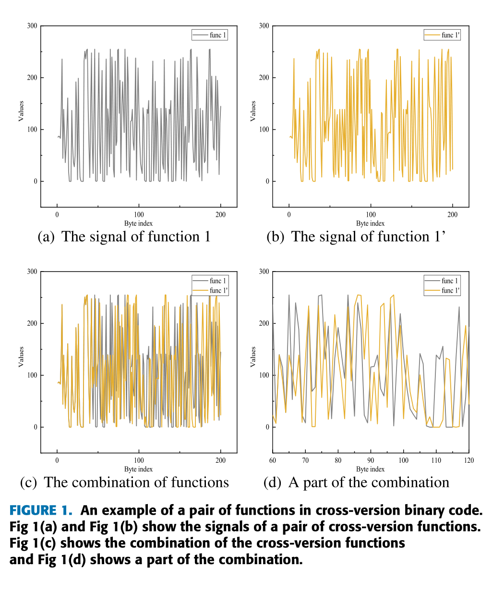   

- 我们可以看出，尽管信号中的值不同，但信号的趋势（向上和达到）彼此相似

## III. APPROACH

### A. OVERVIEW

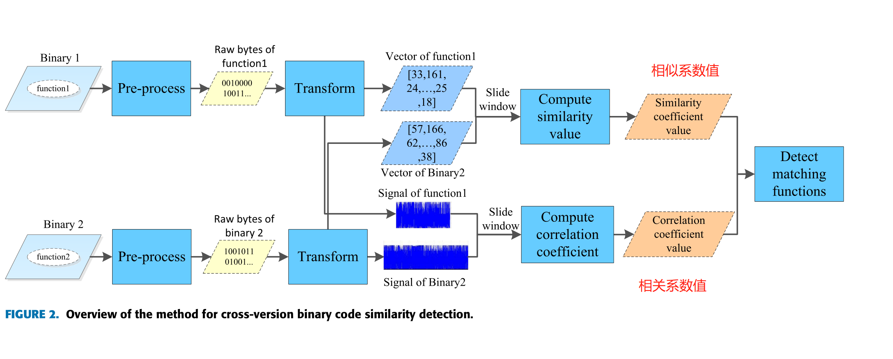    

### B. TRANSFORMATION

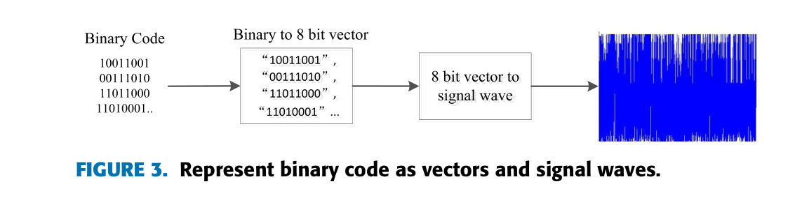    

1. 二进制代码表示为`01`值
2. `01`值看成8位的的整数，重新划分成一个数组。每个值都在 [0,255] 这个范围里
3. 二进制代码中的每个函数都能被表示成为一个向量，然后转为一个信号

### C. MATCHING FUNCTION DETECTION

#### 1）生成函数候选集和划分输入函数
> 根据f1i的长度生成函数候选集X2'，将f1i的原始字节分成 D 份

- 匹配的函数是从具有相同命名空间、类的函数中编译而来，并在类似的上下文中使用。甚至函数也有相同的原始字节。
- 假设匹配函数具有几个相似的属性，其中**函数的长度**是比较直观和重要的。所以根据f1i给X2中的函数增加一个长度限制

> 生成 [函数候选代码] X2'
1. 根据 f1i 的长度 L,设置一个长度限制[L1i,L1i']，例如[0.5L,2L]  
2. 对于X2中的每个函数，如果其长度符合这个长度限制，将这个函数加入 [函数候选集] 。根据这个 [函数候选集] 生成 [函数候选代码X2'] 
3. 将 f1i 平均分成 D 部分。 D 的初始值为 1 。
	- 这意味着，在整个操作的开始，根据f1i整个原始字节计算相似性
	- 如果函数的变化比较明显，导致整体匹配函数的相似度不高于其他函数，我们将函数分成几个部分（即我们增加D的值）。
	- 有些函数块主要由一些不变的函数组成。这些部分的相似性比其他部分更明显。

#### 2）生成相似性波阵列

> 根据f1i函数和 X2' 构建 *相似波阵列* S
- 相似性波阵列指示两个二进制文件的哪些部分具有高相似性，因此是一种可视化工具，允许我们在二进制 X2 中找到匹配 f2j
- 相似波阵列是基于**相似系数方法**（例如Jaccard系数）计算的
1. 从第一个字节到X2'的末尾，使用**滑动窗口法**在X2'中生成几个候选部分，这些部分组成 [集合B]
	- 窗口的大小=f1i_m的大小
	- 滑动的大小=1字节    

2. 计算 [集合B] 中的每一个 b 和输入函数的相似值
	- 通过此方法，能够找到X2中与输入函数匹配的部分，并且能知道其在X2中的位置
		- 原文应该写错了，应该是X2'中的位置
3. 将函数的原始字节表示为 向量 和 信号，然后计算 b 和 f1i 的相似系数，使用 b 的第一个字节在X2'中的位置索引和这些值来构成相似度波。

##### a: 计算向量的相似系数

- **相似系数法**用于计算**向量**之间的距离和相似值。
	- 距离最小的向量将是匹配函数的向量
- （向量）余弦相似度定义为    

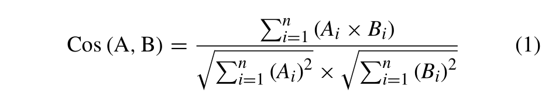    

问题：当A和B的长度不一致怎么办；因为进行长度限制时，判断条件是是否在一个范围里面

- （集合）Jaccard相似系数    
	- 两个集合A和B的交集元素在A，B的并集中所占的比例

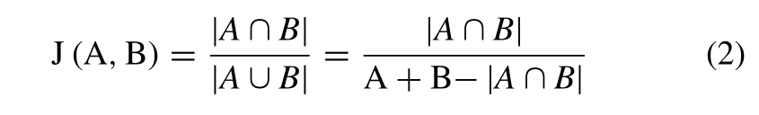   

##### b: 计算信号的相关系数

- **将每个字节表示为信号的瞬时值**，并将这些瞬时值连接起来，从而将 二进制 转换为 离散信号
- 使用**互相关（cross-correlation）**:表示的是两个时间序列之间的相关程度，即描述信号x(t),y(t)在任意两个不同时刻t1，t2的取值之间的相关程度。
	- 在信号处理中，互相关则用来表示两个信号之间的相似性，它是两个信号之间相对于时间的一个函数，有时也称为“滑动点积”。
	- 两个函数做相关运算，本质上是两个函数做内积运算。即向量内积的连续形式。两个向量做内积的物理意义是：一个向量在另一个向量上的投影。内积结果越大，投影越大，两个向量间夹角越小，方向越一致，相似度越高。    
- 互相关函数：    

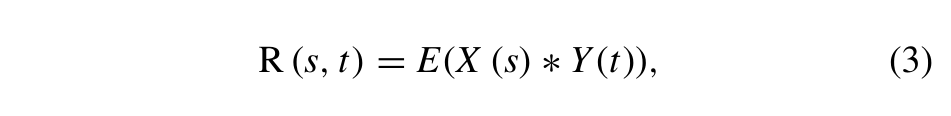    

- 离散信号的互相关函数：    
	- n：一个时刻
	- m：从负无穷->正无穷

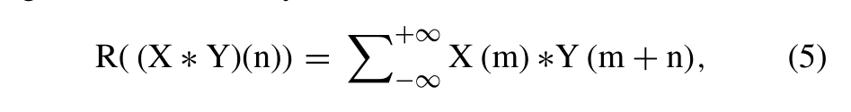    

- **Pearson Correlation Coefficientis**：互相关 方法之一，用来衡量两个信号波之间的线性关系
	- 两个变量之间的皮尔逊相关系数定义为两个变量之间的**协方差**和**标准差**的商
	- 计算出来的值在 [-1,1]，当值为正数时，表示两个变量线性正相关    

    

#### 3）寻找匹配函数
> 根据 *相似波阵列* S 找到匹配的函数f2j

- S[i]（S：相似波）高的值 对应的函数，就是X2'中匹配到的函数f2j     

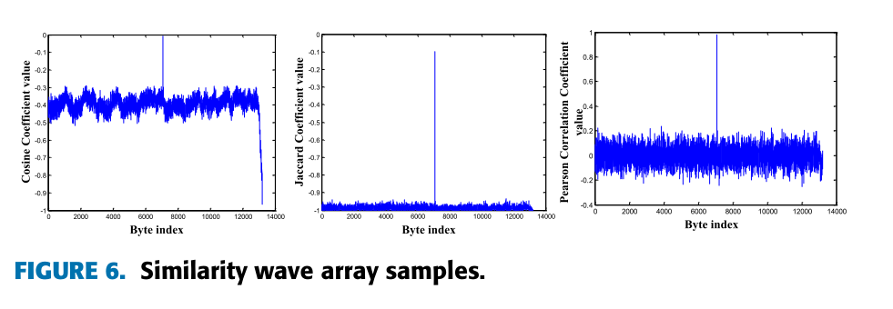     

- 如果没有找到匹配的函数，但是，其中可能会有一小部分没有改变。所以 D 进行加一操作，然后重复上述过程

## IV. EVALUATION

### A. 实现

- 数据集：Alpha-Diff中提供的

	- 数据源1：Github仓库。该数据集包括来自 31 个项目的源代码，共 9,419 个版本。每个版本都使用带有默认优化选项的编译器 GCC 进行编译，并且每个项目的两个连续版本的二进制文件被视为一对。
	- 数据源2：Debian 软件包存储库，从 Ubuntu 12.04、14.04 和 16.04 平台收集了 895 个包含 1,842 个版本的软件包。每个版本的二进制文件及其最接近的版本被分组为一对

- 将测试数据集分为一个大子集和一个小子集。小子集由11,797对跨版本二进制代码组成，其中包括289,165对跨版本匹配函数。大子集由 203 对跨版本二进制文件组成，其中包括134,117对匹配函数。

### B. 评估指标

- 此方法的目标是**准确识别匹配函数**
- TP(True positive)：判断为 匹配函数 正确的样本
- FP(False positive)（误报）：不是匹配函数但被判断为匹配函数的样本
- FN(False negative)（漏报）：作为匹配函数检测但未正确检测的样本
- 在实验中，每个查询只有一个正确答案（匹配函数），因此，FP和FN的数量相同，导致取值精度与召回率相同（因为只有一个正确答案，所以一旦误报就会漏报）。所以还引入了评估指标 *Recall@K*    

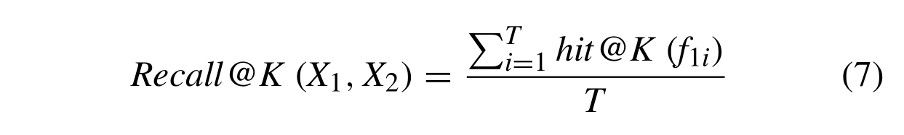     

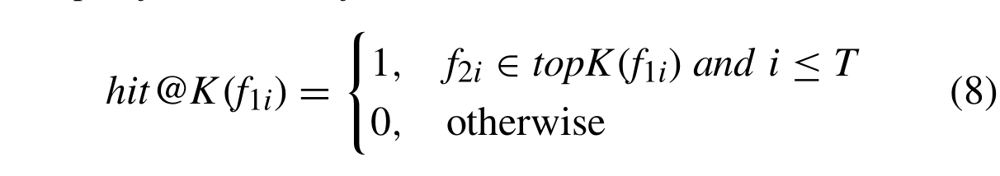     

### C. 参数选择
（a）相似系数计算算法选择
- 具有多个相似度系数算法结合的效果比任何单个使用更好     
（b）长度限制选择   
- [0.5L, 2L]综合效果最好

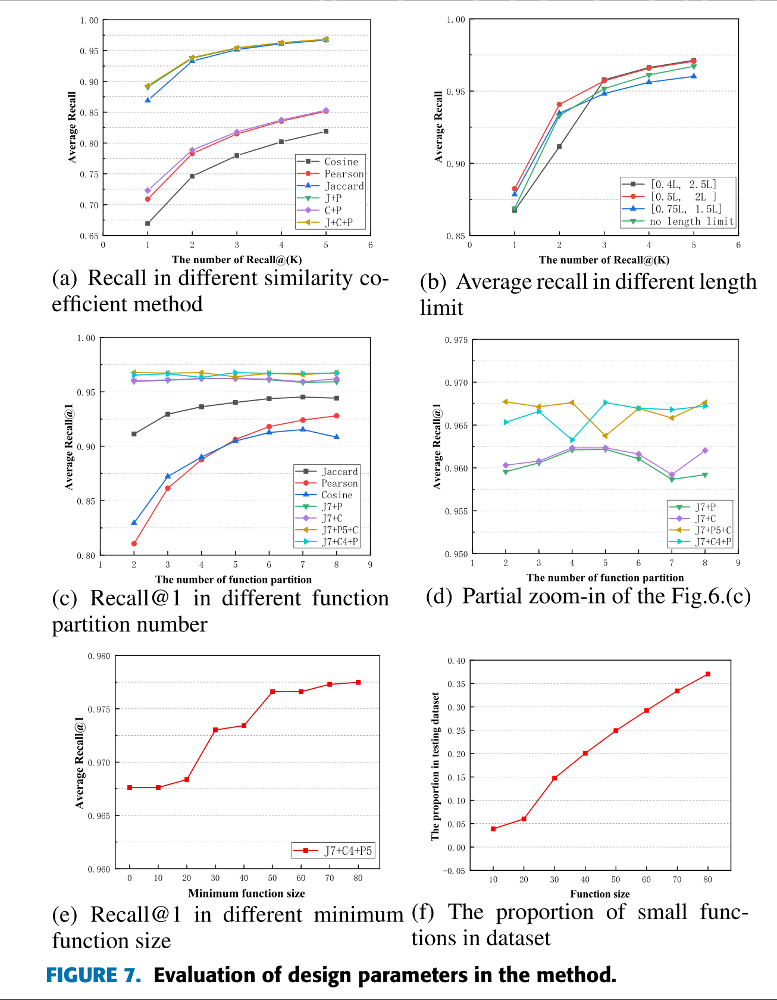    

### D. 测试集的准确性

- 有一个很好的效果

- 会降低准确性的函数的特征：
	1. 在某些二进制文件中，某些不同函数的长度和原始字节相似，这会导致准确性下降。
	2. 数据集中的某些函数发生了巨大变化，导致匹配函数之间存在巨大差异。而我们的方法无法检测到这些匹配函数。
	3. 一些指令可能具有相似的原始字节，而它们的语义含义并不相似。此外，原始字节包含一些“噪音”，如特定寄存器值。

### E. 效率

- 在数据集中，大多数二进制文件的长度小于 20,000 字节，大多数函数的长度小于 1,000 字节，这意味着在实验中，可以在 4 秒内检测到大多数样本的匹配函数。
- 滑动窗口实验的长度通常不会超出100,000字节，运行的时间大约几秒钟。 但在实践中，如果需要在大文件（超过 1MB）上测试，则滑动窗口算法的运行时间可能需要大约几十秒。
- 但是可以将大文件划分为小的子集，进行并行处理，从而提高效率

## V. DISCUSSION
- 从另一个研究角度，不依赖于CFG、深度学习算法和其他相关属性，我们提出了一种可以解决跨版本二进制代码相似性检测问题的新方法。我们的方法不是为了击败和替代各种方法，如 Bindiff、Gemini、Alpha-diff。而是用作应对现实世界环境中存在的各种复杂情况的不同方法之一。

- 有很多好的基于原始字节的解决方案，但是这些方法与提出的方法仍有一些不同的特点：
	1. 依赖于Yara等搜索工具等方法，大多需要手动分析应用目标的一些独特属性，例如一些签名或其他特征，然后利用这些特征进行匹配搜索
	2. 操作码中直接显示的特征与代码映射为向量和信号的属性特征有一定的区别。

## VI. 限制和未来的工作

- 无法处理跨编译器和跨平台二进制文件中原始字节的差异
	- 原始字差别大但是指令的语义含义相似
- 当函数太短，或者变化太大，或者二进制文件很小，基于信号处理的方法效果不佳
- 如何在小范围的函数中选择匹配函数以提高方法的有效性还需要更多的研究
- 跨版本二进制代码中的噪声相对较少。本文提出的方法在检测相似度时受噪声影响较小。但是，对于交叉架构、交叉编译器和交叉编译选项二进制等更复杂的代码，本文提出的方法暂时效果不佳。

## VII. 相关工作

- 大多数以前关于二进制代码相似性检测的工作都是基于函数的控制流图 (CFG) 和图同构理论。
	- Eschweiler：提出了一组数字特征，并基于这些特征采用了预过滤器来快速识别候选函数
	- Feng：提出了一种将 CFG 转换为高级特征向量的方法
	- Gao：使用符号执行扩展图是同构以找到语义差异
	- Ming：通过深度污点和输入生成扩展 GI(图同构) 理论，在 CFG 中找到语义差异
	- Chandramo-han：使用内联技术来捕获完整的函数的语义特征，通过使用 OS 中性函数过滤生成候选函数
		- 中性函数是指最小项数和最大项数相同的函数
	- David ：将函数划分为较小的可比较片段，并通过片段之间的相似性检测函数的相似性
	- Xu： 将函数表示为具有属性的控制流图（ACFG）
	- Gao：结合二进制函数的CFG和DF​​G

- 不依赖 CFG
	- Ding：采用表示学习为汇编代码构建特征向量
	- Zuo：将指令视为单词，将基本块视为句子，并提出了一种新颖的解决跨架构 BCSD 问题的语言深度学习方法
	- Liu：他们使用函数内特征、模块间函数，通过 Siamese 网络训练一个 CNN 网络
	- Massarelli ：直接作用于反汇编的二进制函数，不需要手动特征提取。

- 信号处理领域中关于信号相似度检测已经有哼多相关研究
	- 以上研究表明，Pearson 相关系数和 Jaccard 系数分别为能很好量化信号之间的 相似性 和 相关性 的指标 
	- Hu：提出了一种检测关联警报的新方法。（使用了皮尔逊相关系数）
	- Bertin：使用 Pearson 相关系数来预测波浪能源的开发
	- Cheng 和 Zhang：提出了一个基于 Jaccard 系数的
推荐系统的双聚类和融合方法
	- Dharavath 和 Singh：提出了一种高效的基于Jaccard相似系数的实体解析问题的解决方案
	- Plansangket 和 Gan 提议一种结合两种排序检索方法的查询建议方法：TF-IDF 和 Jaccard 系数

## VIII. 结论

- 提出了一种新且轻量级方法
	- 用于解决跨版本的BCSD
	- 不依赖CFG和深度学习
	- 直接从原始字节中提取函数特征
	- 之前没有将信号处理技术应用于跨版本 BCSD 问题的工作
## 参考资料

- [什么是embedding？](https://blog.csdn.net/weixin_44493841/article/details/95341407)
- [万物皆Embedding，从经典的word2vec到深度学习基本操作item2vec](https://zhuanlan.zhihu.com/p/53194407)
- [Binary Code Similarity Detection 研究历史简述](https://zhuanlan.zhihu.com/p/72301778)
- [图同构（graph isomorphism）算法](https://www.cnblogs.com/xueqiuqiu/articles/9984388.html)
- [二进制代码比对分析研究](https://www.cnblogs.com/LittleHann/p/13451724.html)
- [ACFG](https://blog.csdn.net/weixin_43846270/article/details/106670371)
- [相似度计算之(二)——余弦距离](https://blog.csdn.net/educationer/article/details/99577712)
- [对两个信号做互相关的目的和结果是什么](https://www.zhihu.com/question/29186714)