# αDiff: Cross-Version Binary Code Similarity Detection with DNN

> αdiff：基于dnn的跨版二进制代码相似性检测
> 2018
## 摘要

### 研究背景 

- 二进制代码相似度检测（Binary code similarity detection ，BCSD）
- BSCD的应用
	- 补丁分析
	- 剽窃检测
	- 恶意软件检测
	- 漏洞挖掘
- 现有解决方案通常基于 [专家知识] 对从二进制代码中提取的特定 句法特征 进行比较。要么有比较高的性能开销，要么有比较低的检测精确度
- 很少有解决方案适用于检测跨版本二进制文件之间的相似性，它们不仅可能在句法结构上不同，而且在语义上也略有不同

### 论文工作——αDiff

-  提取三个 语义特征 ，并计算 三个特征 的距离
1.  使用 深度神经网络 (DNN)  提取每个二进制函数的**函数内（*intra-function feature*）特征**
	-  DNN 直接处理每个函数的**原始字节**，而不是专家提供的特征（例如，句法结构）

2. 提取**函数间特征** 
	- 每个二进制文件的函数调用图（在 跨版本二进制文件 中相对稳定）

3. 提取**模块间特征**
	- 导入函数调用关系

### 实验

- 在一个包含大约 250 万个样本的数据集上对其进行了评估。
- 在不同的 BCSD 设置中，αDiff 的性能平均超过最先进的静态解决方案 10% 以上

## 1. INTRODUCTION

### BCSD

- BCSD定义
	- 给定两个二进制函数，评估它们是否相似
- BCSD应用：
	- 代码剽窃检测
	- 恶意软件家族和谱系分析
	- 分析 1-day 漏洞
	- 总结漏洞模式
	- 跨架构bug搜索
- BCSD面临的挑战
	- 跨编译优化选项（cross-optimization）
	- 跨编译器（cross-compiler）
	- 跨架构（cross-architecture）
	- 跨版本（Cross-Version）
	- 语义相当，句法不同

### 研究现状

-  目前先进的BCSD解决方案严重依赖于二进制代码的语法特征（如 CFG）
-  BinDiff：利用 图同构（GI）理论 比较CFG
	-  耗时长
	-  对CFG变化敏感，低精度
- BinHunt和iBinHunt：使用符号执行和污点分析来扩展 GI
	- 低准确度，高开销
- BinGo, Esh and CABS ：通过计算CFG片段的相似性，构成总体的CFG相似性，对CFG变化提供更多的弹性空间
- DiscovRE：通过在 CFG 上使用过滤器来减少 GI 比较的数量，从而提供更好的性能。它从 CFG 中提取一些数字特征，例如指令或基本块 (BB) 的数量，并使用 kNN 算法对类似的 CFG 进行预过滤
- Genius :从 BBs(基本快) 中提取相似的数值属性，并使用它们来扩充 CFG 节点并获得 **Attributed CFGs (ACFGs)**，以支持跨架构的 BCSD
- Gemini：使用 端到端神经网络（end-to-end neural network） 嵌入 ACFG，提供更好的性能和准确性

### RQ1：如何在尽可能少的人为偏见的情况下从二进制代码中提取特征？

- 以上解决方法大多都依赖语法特征，即CFG，这些特征源自专家知识，有时可能会引入偏差。例如，即使没有代码更改或代码更改很小，CFG 也可能会发生巨大变化，并导致 BCSD 结果出现明显偏差
- 本文解决的第一个研究问题是：     
**RQ1：如何在尽可能少的人为偏见的情况下从二进制代码中提取特征？**

### RQ2：如何有效利用语义特征来提高 BCSD 的准确性？

- 除了 BinGo [6] 和 Esh [12] 之外，很少有解决方案考虑二进制代码的**语义**。这两位使用定理证明来检查 CFG 片段的语义等价性，因此**计算量很大**
- 另一方面，跨版本二进制文件的语义可能会略有变化，例如，由于打补丁。因此，严格的语义等价比较也不适合。
- 本文解决的第二个研究问题是：   
**RQ2：如何有效利用语义特征来提高 BCSD 的准确性？**

### RQ3：如何构建适合跨版本 BCSD 的解决方案？

- 跨版本 BCSD 需求大
	- 补丁分析
	- 知识转移 
- 流行工具 BinDiff 提供此功能
	- 准确度低
- 本文解决的第三个研究问题是：   
**RQ3：如何构建适合跨版本 BCSD 的解决方案？**

### 提出的方法

- 提出了一个解决方案——**αDif**，来解决以上问题：
	- 从二进制文件中提取适当的语义特征，并使用它们来计算相似度分数
	- 函数代码的（即函数内）特征、函数调用（即函数间）特征和模块交互（即模块间）特征

### 实现方法

#### 1. 表示函数内特征

- 原始字节包含函数的所有语义信息
- 将原始字节表示为矩阵，并使用卷积神经网络 (CNN) 将其转换为embedding（即向量）
- 为了确保相似函数的embedding彼此接近，将此 CNN embed 到 Siamese 网络中

#### 2. 表示函数间特征

- 通过每个函数的调用图来提取它的函数间特征
- 出于性能原因，仅提取调用图中函数节点的入度和出度作为函数的特征

#### 3. 表示模块间特征

- 相似的函数有相似的导入函数
- 将每个函数的导入函数集作为模块间特征
- 提出了一种特定算法（第 3.4 节）将该集合 embed 向量中，以支持距离计算

#### 4. 计算距离

- 先分别计算这些特征的距离
- 最后合并这三个距离来衡量这两个函数的整体相似度

### 实验效果
- 准确率有所提高
	- 在包含大约 250 万个数据的自定义数据集上对其进行评估
	- αDiff 比 BinDiff 平均高出 11 个百分点
	- 仅使用函数内特征，αDiff 平均优于 BinDiff 6 个百分点

- 对跨编译器和跨架构的二进制代码也表现良好

### 贡献

1. 提出了一种神经网络解决方案，从二进制函数的原始字节中提取函数内语义特征，而不受专家知识的干扰。连同其他两个提出的语义特征，即函数间和模块间特征，我们构建了一个能够执行跨版本 BCSD 的端到端系统αDiff。
2. 构建了一个带标签的数据集。其中包含 66,823 对二进制文件和大约 250 万对函数
3. 开发了一个原型 αDiff 并在这个数据集上对其进行了评估。结果表明，它在所有交叉编译器、跨架构和跨版本 BCSD 设置中都优于最先进的解决方案。

## 2. PROBLEM DEFINITION

### 2.1 符号定义和假设

- 假设所有二进制文件都是由高级语言编译的，没有经过混淆，并且二进制文件中的调试符号被剥离
- 二进制代码 Bi，包含的函数 fi1,fi2，假设可以正确识别每个二进制文件的函数
- 如果两个二进制函数是从具有**相同名称**（包括命名空间和类等）的函数编译并在**相似的上下文**中使用的，则认为它们是匹配的。
- 相同的函数（即具有相同的原始字节）是匹配的，但匹配的函数可能不相同。

### 2.2 跨版本BCSD问题
- 跨版本BCSD需要完成以下任务
1. 函数匹配：
2. 相似性得分：[0,1]
3. 差异识别：如果相似性得分小于1，需要确定他们代码字节中的差异

- 本文主要关注前两个任务

### 2.3 不同 BCSD 问题
- 本文专注于解决 跨版本 BCSD 问题，但是对于以下的问题也能达到一个好的效果

1. 跨编译器优化选项：旨在使用来自相同的代码，相同编译器但是**不同编译优化选项**的两个二进制文件
2. 跨编译器：旨在使用来自相同的代码，但是**不同的编译器**的两个二进制文件（例如，不同厂商）
3. 跨架构：从同一代码副本编译，针对**不同的架构**的两个二进制文件（例如，使用不同的指令集）。

### 2.4 评估标准

- BCSD 的目标是准确识别匹配函数，因此评估匹配函数是否在给定 BCSD 报告的 top K 匹配候选中，即 **Recall@K**

#### Recall@K

1. B1=f11,f12,...,f1n,B2=f21,f22,...,f2n
2. 有T对匹配函数，分别为(f11,f21),...,(f1T,f2T)
3. 对于 B1 中的任何函数 f1i，BCSD 解决方案可以根据它们与 f1i 的相似性对另一个二进制 B2 中的函数进行排序
4. topK(f1i):前K个相似函数;
5. hit@K(f1i): topK(f1i)中是否存在f1i的匹配函数

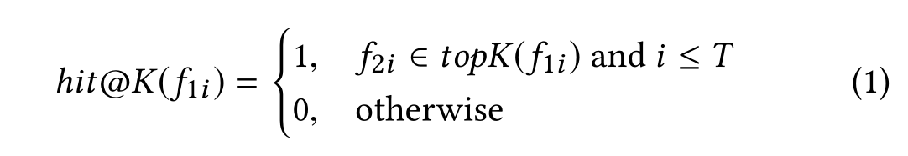    

6. BCSD的评估度量如下定义:    

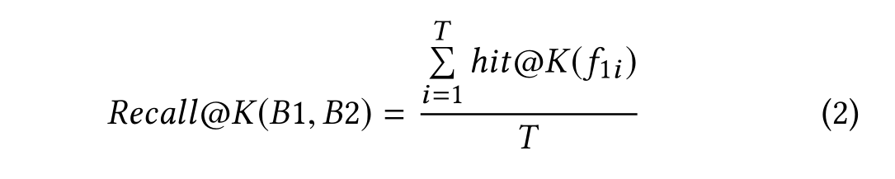       

## 3. 方法

### 3.1 概述

#### 选取特征

- 两个跨版本二进制函数的相似性应该通过它们的语义来估计，即
	1. 它们的原始字节（函数内）
	2. 它们与相同二进制文件中定义的其他函数的关系（函数间）
	3. 它们与定义在外部模块中的导入函数的关系（模块间）

#### 处理流程

- 如图所示，αdiff首先从两个二进制函数中提取这些特征，然后计算每对特征的距离，最后基于这三个距离的评估整体得分。 最终得分表示两个函数之间的相似性。      

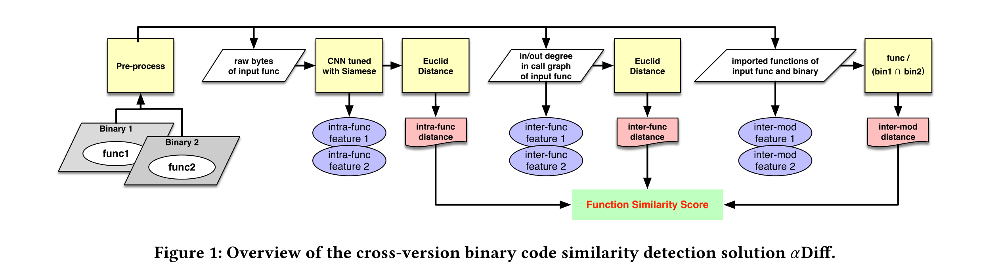    

### 3.2 函数内语义特征

1. 输入：Iq，函数的原始字节
2. 将其映射到一个 embedding f(Iq)中，即一个 d 维欧几里得空间 Rd 中的向量
	-  设n是正整数，由n个实数构成的有序数组的全体组成的集合，称为n维点集或n维欧几里得空间，记作Rⁿ
3. 训练模型：
	- 两个相似函数（embedding）之间的距离应该小，而两个不同函数（embedding）之间的距离应该大
	- 将两个相同的 CNN 嵌入到 Siamese 架构中，并训练 CNN 的参数。     

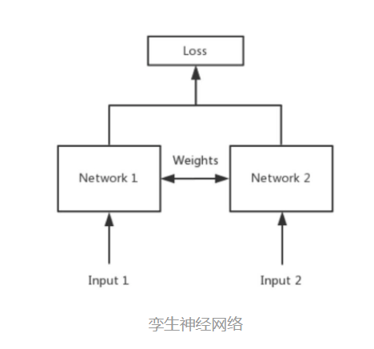    

孪生神经网络主要用于衡量两个输入的相似程度，孪生神经网络有两个输入（Input1 and Input2）,将两个输入feed进入两个神经网络（Network1 and Network2），这两个神经网络**分别将输入映射到新的空间，形成输入在新的空间中的表示**。通过Loss的计算，评价两个输入的相似度。

#### 3.2.1 使用CNN Embedding 函数

> 经典的 CNN 是专门为图像分类而设计的，需要类似于 RGB 图像的输入，至少有 3 个通道。这不适合我们的问题范围和我们的输入格式，所以设计了一个新的CNN

##### 网络结构
- 由 8 个卷积层、8 个批量归一化层、4 个最大池化层和 2 个全连接层组成。整个模型使用修正线性单元即 ReLU ，作为非线性激活函数。该网络总共有超过 160 万个参数

#### 网络的输入输出
##### 输入：100×100×1 Tensor(张量) T
> Tensor 实际上就是一个多维数组（multidimensional array），其目的是能够创造更高维度的矩阵、向量
- 将一个函数的原始字节一个字节一个字节地填充到 T 中
- 如果函数少于 10,000 个字节，将用零字节填充填充张量 T
- 如果函数大于 10,000 个字节，丢弃多余的字节
- 
##### 输出：64维 embedding

#### 数据增强

- 因为函数字节容易受到变化的影响，因为它们会改变函数语义，所以不应用任何数据增强措施

#### 过拟合问题

- 采用批量归一化来解决过拟合问题

### 3.2.2 使用 Siamese 网络进行参数学习

#### Siamese 架构

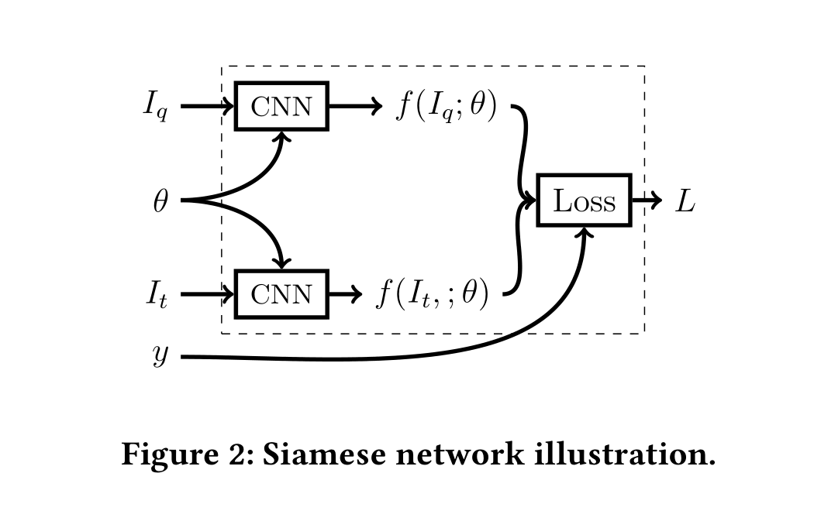     

- 每个CNN以一个函数为输入，即Iq和It
- 分别输出对应的embeddings，即f(Iq;θ)和f(It;θ)
- y:表示两个函数Iq和It是否相似。如果它们相似，y = 1，否则y = 0
- 寻找θ使之满足：如果Iq和It相似，则他们之间的距离小，反之，距离大
- 距离表示如下：     

    

#### 比对损失函数  

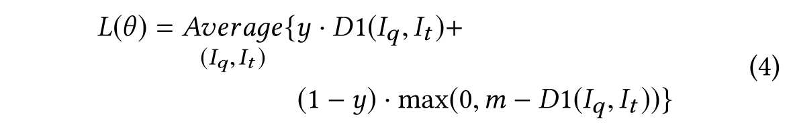   

- m：不同函数预期具有的最小边距距离

- 损失函数最小：
	- y=1，Iq和It的距离接近0
	- y=0，max(0,m − D1(Iq, It))接近0
- 需要找到θ使损失函数最小
- 可以使用**带有标准反向传播算法的随机梯度下降(SGD)**来求解

### 3.2.3 负训练样本

- 对于 mini-batch 中的每个正样本（Iq，Ip），生成两个semi-hard 负样本（hard:loss大的样本），即（Iq，In1）和（Ip，In2），In满足：    
**0 < D1(Iq, In) < m**

- 随机选择一个满足该约束的函数 In1 作为负函数。但是我们会跳过最难的负函数（即 arg min D1(Iq, In)）
- 为了得到足够多的不同的负样本，会在训练过程中对每个 epoch 的 mini-batch 正样本进行打乱

## 3.3 函数间特征：函数调用图

- 对于每个函数 Iq，将其函数间特征嵌入为 2-维向量(**出度和入度**)如下        

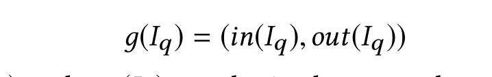     

- 使用**欧几里得距离**计算两个向量之间的距离、

## 3.4 模块间特征：导入函数集

### embed
- imp(Iq)： Iq 调用的一组导入的函数，
	- 在外部模块（库）中定义
- 将`导入函数集` embed 到一个 `superset`：   

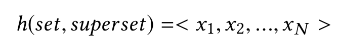    
- `superset`: imp(Bq)∩imp(Bt) ，Bq：函数Iq的二进制代码
- N: superset的大小     
- xi=1，`superset`中的第i个元素在`set`里面

### 距离计算

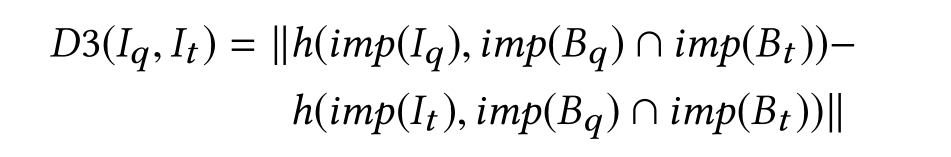   

## 3.5 总体相似度计算

- D1：函数内距离，D2：函数间距离，D3：模块间距离
	- D1和D3通常比较小
	- 跨版本二进制文件中的相似函数可能有不同的调用图，尤其是不同的入度和出度，导致函数间距离 D2 相对较大

- 总体距离计算公式：   

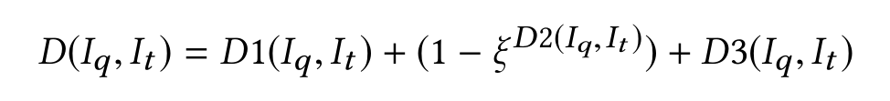     

- ξ：范围为[0,1]，抑制D2的影响

## 4. 评估

### 4.1 实现

- αDiff主要由3部分组成
	1.  预处理器（使用IDA进行提取）
	2.  特征生成器
	3.  神经网络模型（TensorFlow-1.3 和 Keras-2.0 中实现）

### 4.2 评估设置

#### 4.2.1 数据集

- 数据源：githun 和 debian
- 66,823 对跨版本二进制文件
- 2,489,793 个正样本

#### 4.2.2 数据集拆分

- 训练:验证:测试=4:1:1

#### 4.2.3 神经网络训练
> 训练用于函数内特征提取的神经网络模型。 

- 在CNN模型中，使用RMSProp优化器,将学习率设置为0.001，将遗忘因子设置为0.9
- Siamese 网络（方程 4）中，将不同函数之间的最小距离m，设置为 1.0
- 将整体相似度得分公式中的 ξ 设置为 0.75
- 对于每个 mini-batch，选择 100 个正样本，在线生成 200 个半困难负样本
- Siamese 网络训练了 200 个 epochs（3.075 h/epoch），以调整 CNN 嵌入网络中的参数。

### 4.3 Siamese网络中的超参数
> 超参数是在学习过程开始之前设置其值的参数,也是调优参数（tuning parameters），需要人为设定

1. 输入的张量和卷积层类型
2. 输出的embedding的大小
3. 困难负样本挖掘法
4. 网络架构

### 4.4 跨版BCSD中的准确性

#### 评价标准
- Recall@K
- MRR（平均倒数排名）
#### 4.4.1 对测试集的评估
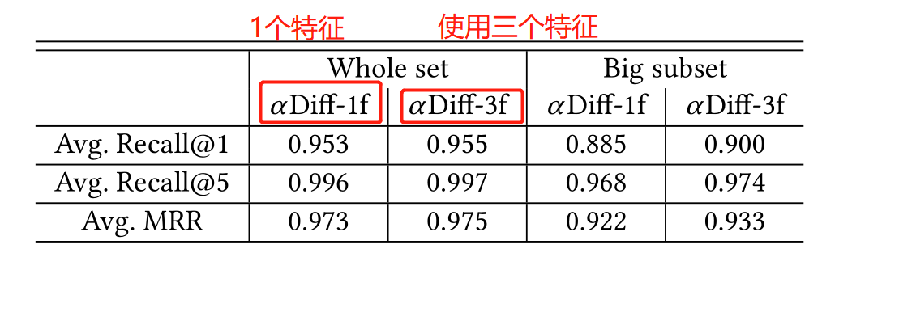    

#### 4.4.2 对 coreutils 进行评估
> coreutils 是一款软件包
- 在比较 v5.0 和 v8.29 的一些二进制文件时，αDiff 的性能优于 BinDiff 52% 以上

### 4.5 跨编译器 BCSD 中的性能

- 跨编译器 BCSD 有三个子类型
	- 跨编译器供应商
	- 跨编译器版本
	- 跨优化级别

#### 4.5.1 跨编译器供应商和跨编译器版本

- αDiff 使用最先进的工具 BinDiff 比对，

- 在修补后的二进制文件中查询易受攻击的函数
	- αDiff 在 6 个例子中有 4 个成功，而Bindiff 在所有情况下都失败了
- 函数匹配的整体准确度，即 Recall@1
	- 在除 CVE-2014-9295 之外的所有情况下，αDiff 的性能平均比 BinDiff 高 10 个百分点

#### 4.5.2 跨编译器供应商和跨优化选项

- 将 αDiff 与 BinGo 和 BinDiff 进行了比较
	- αDiff优于 BinGo 和 BinDiff

### 4.6 跨架构BCSD中性能

- 将 αDiff 与 BinGo 进行了比较
	- 42% 被工具BinGo 排名第一，而46% 被αDiff 排名第一

### 4.7 在漏洞搜索中的应用

- 当搜索一个函数（例如 TLS）时，αDiff 总是可以将两个匹配函数排在第 1 和第 2 位。一般来说，它优于其他工具。

- 这表明，神经网络自动提取的语义特征（用于αDiff）是有效的，甚至优于人类专家提供的CFG和其他属性（用于DiscovRE）

## 5 讨论

- 更具体地说，我们通过二维卷积网络 (2D-CNN) 将函数作为二维字节网格。但是一个函数，更类似于文本，这意味着 1D-CNN 似乎更合适。在我们的评估中，1D-CNN 表现不错，但是，2D-CONV具体配置效果更好。 我们无法解释这背后的原因，并计划在未来工作中基于神经网络可视化相关研究[35,36]的进展进行探索
- 未来计划将我们的方法转移到跨架构设置，即使用跨架构数据集训练模型

## 6 相关工作

### 6.1 二进制代码相似性分析

#### 静态分析

- 依赖于图匹配，它没有已知的多项式时间算法，并且忽略具体汇编级指令的语义
	- BinDiff、DiscovRE和Genius基于 CFG/CG 图同构 (GI) 理论计算
	- DiscovRE识别了一组轻量级的数字特征，并基于这些特征构建了一个预过滤器，以快速识别一小组候选函数
	- Genius将 CFG 编码为高级数字向量，以在大量固件镜像中实现实时漏洞搜索

- Gemini:提出ACFG，
	- 依赖于手动调整的功能
- BinHunt和 iBinHunt 通过符号执行和污点分析扩展了 GI，以发现语义差异
- BinGo通过选择性内联技术捕获完整的函数语义，然后利用长度变化的部分轨迹以与程序结构无关的方式对二进制函数进行建模
- Esh：根据程序验证器计算出的较小片段的语义相似性，从统计学上推断函数的相似性。
	- 耗时比较久

#### 动态分析
> 相似代码具有相似运行时行为

- 依赖于特定于体系结构的工具来执行或模拟二进制文件，并且不方便应用
	- BELX：在多个调用上下文执行环境下运行每个函数，并在受控的随机环境下收集函数的运行时行为
	- IMF-SIM [49] 引入内存模糊测试来解决动态方法的覆盖问题

### 6.2 深度度量学习
> 度量学习是一种对样本对学习区分性特征的方法

- Bromley等铺平了深度度量学习和培训的暹罗网络的签名验证。
- Chopra 等人提出了一种从数据中训练相似性度量并将其应用于人脸验证的方法
- Sean等人。使用深度卷积神经网络和孪生网络学习产品设计的细粒度视觉相似性。 
- FaceNet 使用深度卷积网络和 triplet embedding 来人脸上的统一embedding，以进行人脸验证和识别
- Song 等人通过充分利用训练批次提出了一种新的深度特征嵌入算法。

### 6.3 卷积神经网络
- CNN 通常由多层交错的卷积层、非线性激活层、局部响应归一化层、池化层和一个或多个全连接层组成

## 7 总结

- 提出一种 DNN 增强解决方案 αDiff 来解决跨版本 BCSD 问题
- 它采用三个语义特征，即函数内、函数间和模块间特征，这些特征可以通过轻量级解决方案从二进制代码中提取的
- 实现了αDiff的原型，并在大约250万个样本的数据集上对其进行了评估。 结果表明，在检测跨版本、跨编译器和跨架构二进制文件之间的相似性时，αDiff 平均优于最先进的静态解决方案 10% 以上

## CNN

### 组成

1. 卷积层：提取图像中的局部特征
2. 池化层：大幅降低参数量级(降维)，防止过拟合
3. 全连接层：类似传统神经网络的部分，用来输出想要的结果

## 参考资料

- [recall@k](https://zhuanlan.zhihu.com/p/143296492)

- [Siamese network 孪生神经网络--一个简单神奇的结构](https://zhuanlan.zhihu.com/p/35040994)
- [卷积神经网络 – CNN](https://easyai.tech/ai-definition/cnn/)
- [卷积神经网络基础](https://www.bilibili.com/video/av28733156/?p=3)
- [【零基础】神经网络优化之mini-batch](https://www.cnblogs.com/cation/p/11741740.html)
- [深度学习 | 三个概念：Epoch, Batch, Iteration](https://www.jianshu.com/p/22c50ded4cf7)