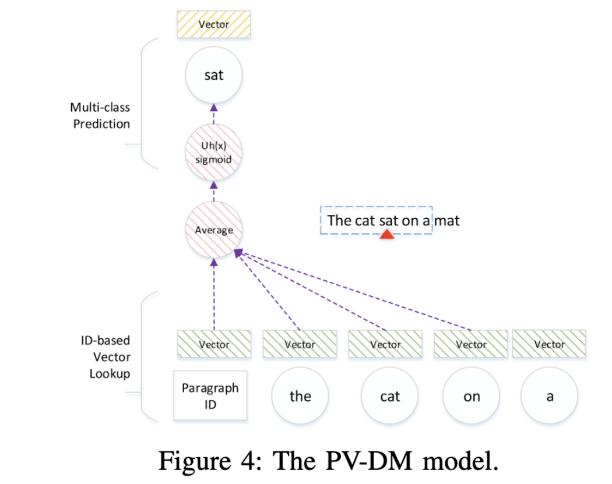
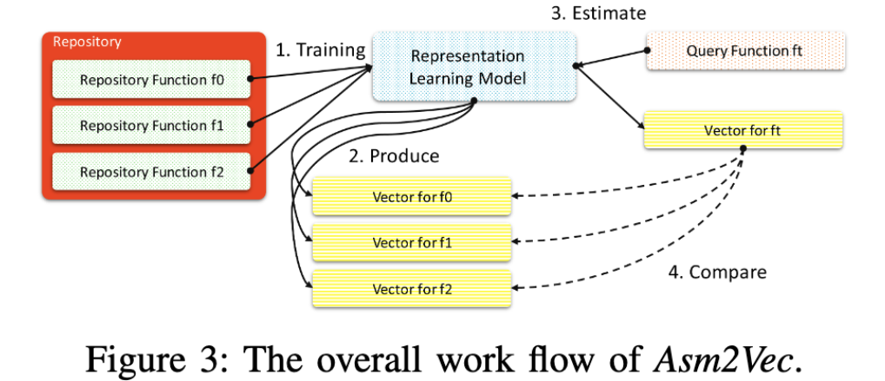
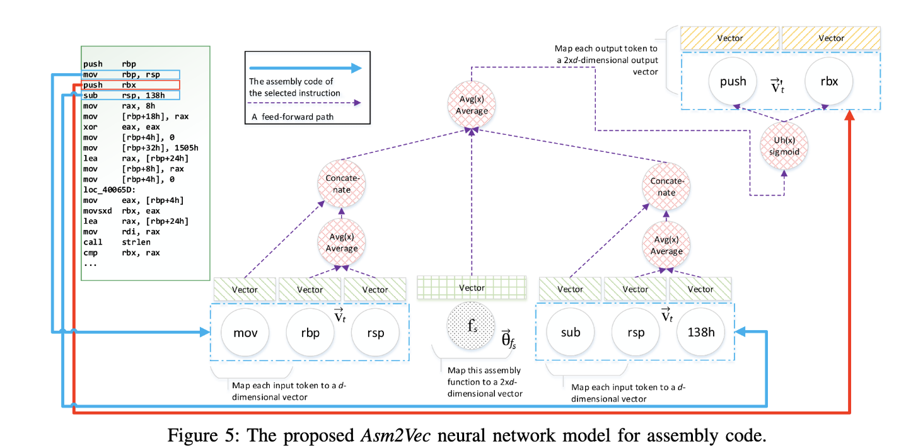
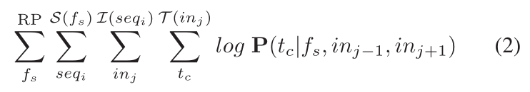
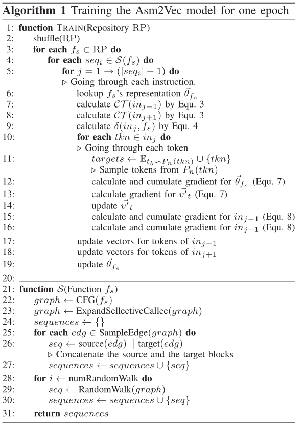
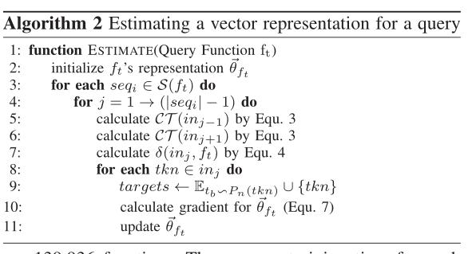

# Asm2vec: Boosting static representation robustness for binary clone search against code obfuscation and compiler optimization

> [1] DING S H H, FUNG B C M, CHARLAND P. Asm2Vec: Boosting Static Representation Robustness for Binary Clone Search against Code Obfuscation and Compiler Optimization[C/OL]//2019 IEEE Symposium on Security and Privacy (SP). 2019: 472-489. DOI:10.1109/SP.2019.00003.

* CCF A
* 网安四大顶会：S&P
* 当前被引用数：211

## Summary

写完笔记之后最后填，概述文章的内容，以后查阅笔记的时候先看这一段。

> 注：写文章summary切记需要通过自己的思考，用自己的语言描述。忌讳直接Ctrl + C原文。

## Research Objective(s)

- 实现一个健壮的代码克隆搜索引擎，能够很好抵抗编译器优化、代码混淆的操作，能够考虑到特征之间的语义关系
- 解决的是一个一对多的查询问题
    - 给定一个目标函数`ft`，搜索问题是检索`top k`库函数`fs`∈`RP(repository)`，根据它们的语义相似度进行排序，因此可以认为它们是**语法相似型克隆**。

## Background / Problem Statement

研究的背景以及问题陈述：作者需要解决的问题是什么？
- 研究背景
    - 克隆搜索引擎通过识别那些重复的或已知的部件，方便了逆向工程师的工作
- 针对编译器优化、代码混淆，逻辑上相似汇编函数不同。所以克隆搜索引擎需要具有**健壮性**

- P1：现有静态方法未能考虑特征之间的关系
    - Discovre和Genius等都假定每个特征或类别是一个独立的维度
    - 在特征工程过程中加入词汇语义关系
    - Asm2Vec探索了token间的共现关系，并发现了token间丰富的词汇语义关系，并且**不需要先验知识**（例如memncpy和mempcpy似乎在语义上彼此相似）
- P2:现有的静态方法假设特征是同等重要的
## Method(s)

### 基础知识
- 整个模型基于「表征学习（representation learning）」
- 具体模型是基于`PV-DM`模型       

          

1. 对句子进行滑动窗口，中间词为目标(sat)，周围单词为上下位
2. 窗口向前移动      
3. 每一步都会执行`muli-class预测`任务
    - 将当前「句子」映射为一个基于句子ID的向量，将上下文中的每个词映射为一个基于「词」ID的向量
    - 对上述向量进行平均，并通过**softmax分类**从词汇表中预测target word
    - 反向传播分类误差用于更新向量         

### 整体工作流程
           

1. 先使用一批反汇编代码作为训练数据，来建立一个神经网络（不需要先验知识）
2. 训练结束后，该模型为每个库中每个函数产生一个向量表示
3. 对目标函数ft生成一个向量表示
4. 通过**余弦相似性**进行相似性计算，检索`TOP k`

### The Asm2Vec Model
> 基于PV-DM模型
- 汇编代码包含结构上不同的操作、操作数、控制流，PV-DM无法解决这些     

---      

- 二进制代码 -> CFG -> 多个序列 -> 每个序列对应一个潜在的行动轨迹（线性排列的汇编指令）
1. 将每个存储在库中的函数fs映射到一个向量$\theta_{fs} \in R^{2×d}$。并且收集所有不同的token（操作数和操作），将每一个token t映射到一个数字向量$v_t \in R^{d}$和$v_t' \in R^{2xd}$
    - d:用户选择的参数
    - $v_t$可以用来可视化token之间的关系（比如相同操作的函数）
    - $v_t'$：预测token
    - $v_t$和$\theta_{fs}$：初始化0附近的小的随机值
    - $v_t'$：初始化0
    - 2xd：操作数和操作链接起来表示一条指令
2. 每个函数表示为一个multiple sqquences：$S(f_s) = seq[1:i]$，一个sequences表示为指令的列表：$I(sqe_i)=in[i:j]$ ，一个指令$in_j$包含操作数$A(in_j)$和操作$P(in_j)$,token表示为$T(in_j)=P(in_j) || A(in_j)$
    - sequences的序列是随机的
    > 操作序列的顺序还是有意义的
3. 对于$f_s$中的每一个sequence $seq_i$，神经网络从头开始遍历指令。收集当前指令$in_j$，前一个指令$in_{j-1}$和下一个指令$in_{j+1}$，并且忽略越界指令，使得库中下述log概率值最大化        
> out-of-boundary instruction：个人理解是跳转相关的指令，或者说是在这个序列中属于下一个基本块的指令            

            

> 因此将汇编函数转化为多个序列表示，对于每一个序列，从前往后扫描每一行汇编代码A，将其前后的汇编代码(上下文)和一个代表该函数的向量(类比paragraph-ID)一起，经过average和concate操作，最后经过sigmoid函数预测中心汇编代码A。其中为A生成的汇编代码向量叫做t'，用来做token的预测，而训练过程中得到的汇编代码向量叫做t，用于表示token的语义信息。

### modeling assembly functions

> 将CFG建模为边缘覆盖序列和随机游走
1. 选择性被调用扩张
2. 边缘覆盖
3. 随机游走
4. 训练，评估，搜索      

---

- 算法1如下所示，针对存储库中的每一个汇编函数，采用边采样和随机游走的方式生成序列(下图function S)。对于每个序列，其遍历每一条指令并更新Asm2vec模型权重(训练过程)。        

                

- 训练完成后，对于一个要查询的函数，算法二如下所示。对于一个query函数$f_t$，随机初始化一个向量$\thetaf_t$，大小取0附近的小值。我们选取和训练过程相同的方式，先提取出各个sequence，然后依次遍历汇编代码，但是此时我们固定所有的t和t'，只对$\thetaf_t$反向传播更新权重，最终得到的$\thetaf_t$的值即为target function对应的向量表示。       

         

- 最后，target function对应的向量表示和repository function向量表示的余弦相似度，选取相似度高的k个，即为结果。

## Evaluation 

作者如何评估自己的方法？实验的setup是什么样的？感兴趣实验数据和结果有哪些？有没有问题或者可以借鉴的地方？

## Conclusion

作者给出了哪些结论？哪些是 `strong conclusions`, 哪些又是 `weak conclusions`（即作者并没有通过实验提供 `evidence`，只在 `discussion` 中提到；或实验的数据并没有给出充分的 `evidence`）?

## Notes(optional) 

- T-SNE clustering visualization

## References(optional) 

- PV-DM模型
> [20]
## Origin

给出指向你个人论文仓库的本篇论文阅读笔记原文链接。

## Tags

逗号分隔本文的所有标签，标签使用规范参见以下 `GitLab Issue 标签使用规范` 。

2021, SCI, SCI-1, CyberRange, Playbook, Ansible, Scenario, CTF

------ 以下内容仅为解释说明，请在提交时删除 ------

### GitLab Issue 标签使用规范

* 在不影响语义理解的前提下，标签关键词要尽可能短
* 优先选择已有标签，确实没有的情况下再 `新建标签`

#### 建议的标签列表

* 2019
* 检索收录情况：EI,  SCI
* 中科院 JCR 分区（针对 SCI 收录文献才需要标记）：SCI-1, SCI-2, SCI-3, SCI-4
* 关联实验室内项目简称（最近更新 2021-05-22）：Fuzz, CyberRange, osint4sn, SoftFP, MTD
    * 物联网漏洞挖掘：Fuzz
    * 靶场：CyberRange
    * 开源社区情报分析：osint4sn
    * SoftFP：软件指纹
    * 欺骗式防御：MTD
* 研究对象（不超过3个）。例如：IoT, 源代码 等
* 研究方法（不超过3个）。例如：综述, 动态分析, 静态分析, CNN 等
* 数据集（不超过3个）。例如： NB-15，MalwareZoo, VulDeePecker, LAVA-M 等

# 参考资料
- [原文凡汐](https://zhuanlan.zhihu.com/p/303086691)