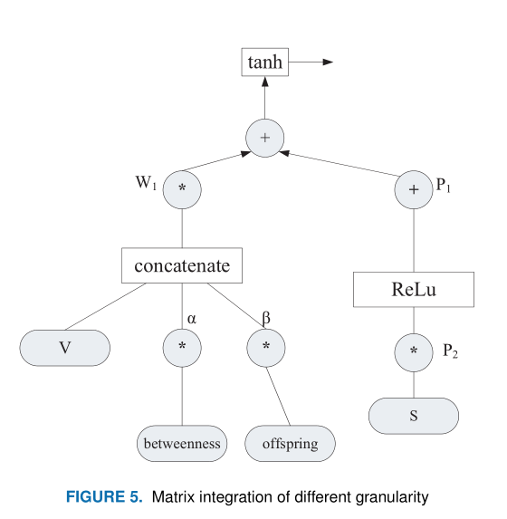

# BEDetector: a Two-channel Encoding Method to Detect Vulnerabilities based on Binary Similarity

> Yu L, Lu Y, Shen Y, et al. Bedetector: A two-channel encoding method to detect vulnerabilities based on binary similarity[J]. IEEE Access, 2021, 9: 51631-51645.

* 检索收录情况：SCI
* 中科院 JCR 分区:JCR-3
* 当前被引用数:5

## Summary

本文提出了一个用于二进制相似性检测的框架：**BEDetector**。BEDetector使用**自然语言处理技术**和**图神经网络**来提取二进制代码的语义和结构特征。BEDetector主要提取三个粒度的特征：**指令粒度**、**基本块粒度**和**函数粒度**。指令粒度就是对指令序列使用**skip-thought**模型进行编码，基本块特征主要是提取基本快的中间介数和后代特征，函数粒度就是使用图神经网络进行嵌入

## Research Objective(s)

主要解决先前研究中的两个问题
1. 先前的研究大多提取二进制代码的语法或结构特征，并以基本块作为最小分析单元，相对粗糙。
2. 二进制函数的结构特征通常用依赖图来表示。在嵌入过程中，只能获得节点的邻居信息，忽略图的全局信息。

## Background / Problem Statement

### 研究背景和意义

1. Synopsys 2020开源安全与风险分析报告发现：2019年审计的代码库中有99%包含开源徐建，75%的审计代码库至少包含一个漏洞

### 研究现状

- 早期研究
1. 符号执行+定理证明的方法[9][10]：不可扩展
2. 一组代码作为execution tracelet，计算两个tracelet之间的重写距离[12]

- 机器学习
1. genius：使用ACFG
2. Gemini：使用深度神经网络进行图嵌入
3. vulseeker：利用LSFG，标记语义流图+DNN
4. Redmond 等人 [22] 探索跨架构的二进制指令嵌入。他们将二进制代码转换为中间语言，并将输入/输出记录为签名以进行比较
5. Li等人[27]旨在通过神经网络比较崩溃的执行轨迹和正常轨迹，以基本块粒度定位漏洞。他们的工作基于fuzzing
6. Hu等人[28]也关注动态执行特征提取

## Method(s)

       

1. 预处理
    1. 反汇编+提取CFG
2. 特征提取
    1. 语义特征提取
    2. 结构特征提取
3. 特征集成和相似度计算
    1. 将生成的特征输入全连接层

### 1. 预处理

1. 将二进制函数进行反汇编，提取控制流图，获取汇编指令序列和函数表

### 2. 进行特征提取和嵌入

分为三个粒度进行提取：**指令粒度**、**基本块粒度**和**函数粒度**

#### 2.1 指令语义特征提取

          

对反汇编的指令序列进行归一化，避免OOV问题，然后使用**skip-thoughts模型**对指令序列进行编码

- skio-thoughts模型

                

    - 基于skip-gram的句子向量
    - 是一个encoder-decoder模型
    - 基本单元与GRU相同，由更新门$z_t$和重置门$r_t$组成，$z_t$：将哪个前一状态信息带到当前状态，$r_t$：控制将前一状态信息转移多少到当前候选集$h_t$。
    - GRU将解决了RNN中的长依赖问题
    - skip-thought 模型可以重建编码段落的周围句子。该方法可以克服传统自然语言处理方法只关注句子之间的相关性而忽略复杂语义关系的缺点

- OOV问题
    1. 将立即数分为三个不同的区间：
        1. `IMM1`：表示小于 0x100 的立即数。
        2. `IMM2`：0x101 和 0x200 之间的值
        3. `IMM`：大于 0x200的立即数

    2. 保留寄存器，但是用`MEM`替换基地址

- 指令嵌入
    1. 使用skip-thoughts模型的编码器进行向量编码，编码器由GRU单元组成
    2. GRU单元以基本块中的指令为最小输入单元。因此，每个隐藏状态$h^N_i$代表一个基本块中的指令序列
    3. 公式           

            

#### 2.2 结构特征提取

##### 基本块特征提取
- 基本块特征提取：只提取反应CFG中顶点结构的数字特征
    1. 中介性（betweenness）：节点对整个图的影响力
    2.  后代（offspring）：连通的基本快的数量
##### 图嵌入

        

- graph embedding：基于**图自动编码器（GAE）**
- GAE：由编码器和解码器
    - 编码器：使用图卷积网络将函数进行嵌入
    - 解码器：使用编码器生成的矩阵进行重建图
    - 训练GAE模型：将原始图与解码器的图比对
    - 生成图embedding时，仅仅使用编码器
- 编码：有图G=(V,E)，记录邻接矩阵A和degree矩阵（度矩阵）D。维度为n*d的矩阵X记录图的节点数n和特征数d，最后编码成矩阵Z
    - 一个两层的图卷积网络       

            

    - A'：对称归一化邻接矩阵

- decoding
    - 重建邻接矩阵A0，计算两个顶点之间存在边的概率，与矩阵A比较

### 特征集成与相似度计算

#### 特征集成
> 基本上是基于**MLP**

   

- 指令粒度特征矩阵V，维度为N*d1
- 函数粒度矩阵S，维度为N*d2
- 基本快粒度：介数和后代数

#### 相似性模型训练

> 主要是基于Siamese网络

         

- 输出矩阵D，结构矩阵S

## Evaluation
> 和Gemini进行比对
### 数据集
分为三个数据集
1. Dataset I：用于训练神经网络并评估训练模型的效率
    - 编译器：gcc 5.4.0
    - 架构：x86、x64、MIPS32、MIPS64、ARM32和ARM64
    - 编译优化选项：O0-O3
    - 软件：OpenSSL（v1.0.1f和v1.0.1u）和BusyBox（v1.27.2）
2. Dataset II：来自 Genius [17] 的固件映像
3. 漏洞数据集，包含CVE函数和相关信息

### 时间效率

- 主要是关注基本块小于20的函数

### 实验结果

- 验证集上相比：
    - AUC：分别为 0.9 和 0.82

- 相同源代码在不同架构和编译级别下编译的二进制代码   

      

- 实际固件中的漏洞检测
    - BEDetector-S:取消结构特征
        

## Conclusion

- 在本文中，研究了一种基于自然语言处理和图神经网络的双通道特征编码器方法来进行二进制代码相似性检测
    - 将特征提取分为三个粒度，并更加关注指令粒度

## Tags

2021, JCR-3, BSCD
