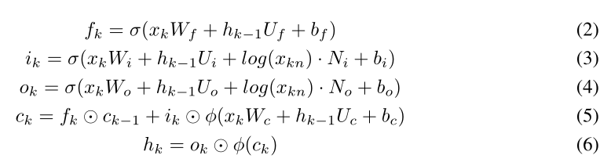
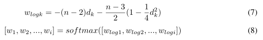
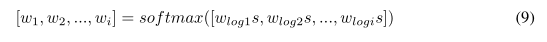
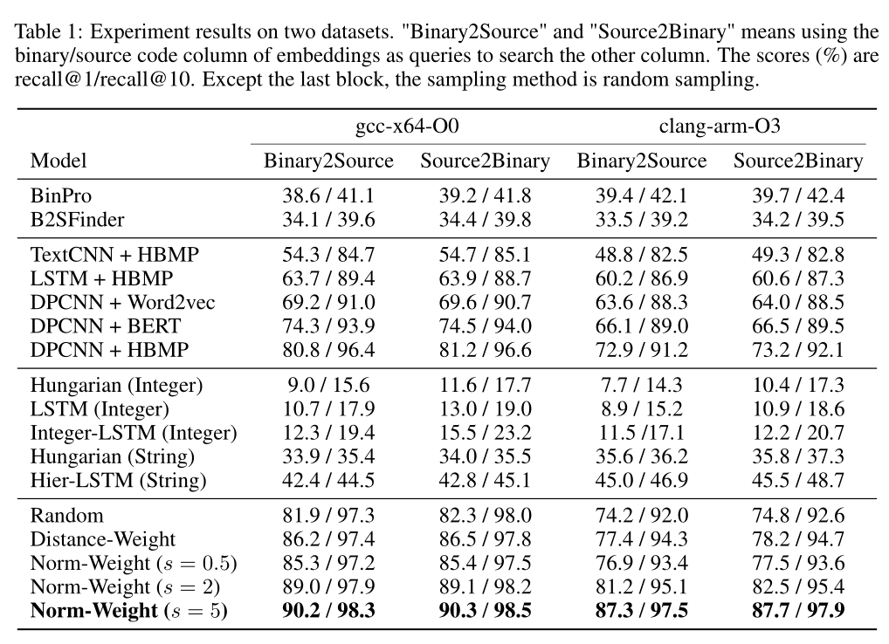

# CodeCMR: Cross-Modal Retrieval For Function-Level Binary Source Code Matching

> Yu Z, Zheng W, Wang J, et al. Codecmr: Cross-modal retrieval for function-level binary source code matching[J]. Advances in Neural Information Processing Systems, 2020, 33: 3872-3883.

* 人工智能顶会
* 当前被引用数:39

## Summary

CodeCMR提出了一个框架用于**二进制源代码的跨模态匹配**。每一个模态都提取**语义特征**、**整数特征**和**字符串特征**。
- 源代码的语义特征通过**DPCNN**在字符级源码上进行提取
- 二进制代码的语义特征通过CFG提取
    - **HBMP**实现节点embedding
    - **GGNN**实现消息传递
    - **set2set**实现图级别的embedding。
- 整数特征通过**整数LSTM**提取
- 字符串特征通过**分层LSTM**提取。
- 最后使用**triplet loss**进行训练，并采用了**范式加权采样**方法

- 有仓库链接，但是没有代码什么：https://github.com/binaryai

## Research Objective(s)

- 进行二进制源码跨模态匹配

## Background / Problem Statement

- 目前大部分研究都集中二进制到源码的匹配
    - 代码克隆检测
    - 开源代码宠用识别
    - 逆向工程
- 源码到二进制的匹配也很重要（例如有漏洞代码的时候，找到对应的二进制）
    - 现有的方法缺点：
        1. 精度低
        2. 需要专家知识进行特诊工程
        3. 之前的比对是基于library-level的，而不是function-level的
- 跨模态检索任务：两种模态放入特定模态的编码器中并计算成两个向量，然后在各自的任务中设计不同的负采样方法和不同的损失函数
    - 例如：图像到文本的匹配、文本-音频的匹配
## Method(s)

         

- 源代码
    - 语义输入：字符及源代码
        - 使用DPCNN和全局平均池化
    - 字符串特征
    - 整数特征
- 二进制代码
    - 语义输入：CFG
        - HBMP实现节点embedding、GGNN实现消息传递，set2set实现图级别的embedding
    - 字符串特征
    - 整数特征
- 损失函数：triplet loss(三元组损失)
### 代码的语义特征    

            

#### 源代码
1. 预处理
    - 将代码转化成一个长的字符串序列
2. embedding层
    - 计算字符的embedding
3. 内核大小为1的卷积层
    - 匹配embedding层和残差层的维度
4. DPCNN块
    - 两个残差卷积层和下采用池化层    
5. 全局池化层
    - 等到最终表示
    - 与源码的顺序无关

#### 二进制代码

1. 提取CFG作为输入
2. HBMP
    - 用于节点embedding
3. GGNN
    - 通过多次迭代传递相邻节点信息（相当于边信息）
4. set2set
    - 计算最终的CFG
    - Set2Set的图池化于顺序无关

### 整数嵌入
- 考虑以下集中情况
    - i<=5  <=> i<6
    - x*16 <=> x<<4
    - 不同平台整数表示不同
- integer-LSTM
1. 对sequence进行排序
2. 输入：整数的token、整数的值
3. integer-lstm            

          

- $x_k$：整数token embedding
- $h_k$：隐藏状态
- $x_{kn}$：整数值

### 字符串嵌入
1. 使用**分层LSTM模型**分别计算每个字符串的embedding
2. 使用求和pool的方法得到整个字符串集的embedding

### Norm weighted sampling（正态加权采样）

- triplet loss存在负样本采样问题：不同的负样本会导致不同的结果
    - hard triplets会在训练早期导致局部最小解
    - semi-hard triplets：在开始时会收敛很快，但是在某个point上回停止
- Norm weighted sampling：在距离加权采样的基础下，加了一个超参数
    
    - 距离加权采样算法       

        
    
    - Norm weighted sampling
    

## Evaluation

### 数据集

- 编译器
    - gccx64-O0 和 clang-arm-O3
### 实现

- 训练过程
    - epoch：gcc-64-O0为64，clang-arm-O3为128
    - learning rate：0.001
    - batch size：32
    - triplets margin：0.5
    - optimizer：Adam
- 源代码
    - 字符序列长度为：4096
    - embedding层维度：64
    - 卷积层维度：128
    - 残差块的重复数量：7
- 二进制代码
    - 节点embedding维度：128
    - 图embedding维度：128
    - GGNN迭代次数：5
    - set2set迭代次数：5
- 字符串和整数
    - embedding层维度：64
    - LSTM隐藏层维度：64

### 实验结果

        

1. 源代码和二进制代码之间的潜在语义特征对于匹配比代码文字更重要

## Conclusion

- 提出了一个总体框架。对于源代码和二进制代码，提取潜在的语义特征和代码文字，将它们合并到嵌入中，然后使用三元组损失来学习关系。
    - 在字符级源代码上采用 DPCNN
    - 在二进制代码上使用 GNN 模型
    - 整数：整数 LSTM 
    - 字符串：分层 LSTM
    - 范数加权采样方法

## References(optional) 

- triplet loss[35]
> [35]Schroff F, Kalenichenko D, Philbin J. Facenet: A unified embedding for face recognition and clustering[C]//Proceedings of the IEEE conference on computer vision and pattern recognition. 2015: 815-823.

- 损失函数和采样方法：Circle loss[44] 和 Cross-batch memory[45]
> [44]Sun Y , Cheng C, Zhang Y , et al Circle loss: A unified perspective of pair similarity optimization[C]//Proceedings of the IEEE/CVF Conference on Computer Vision and Pattern Recognition. 2020: 6398-6407.          

> [45] Wang X, Zhang H, Huang W, et al Cross-Batch Memory for Embedding Learning[C]//Proceedings of the IEEE/CVF Conference on Computer Vision and Pattern Recognition. 2020: 6388-6397.

## Tags

2020, 二进制源码跨模态