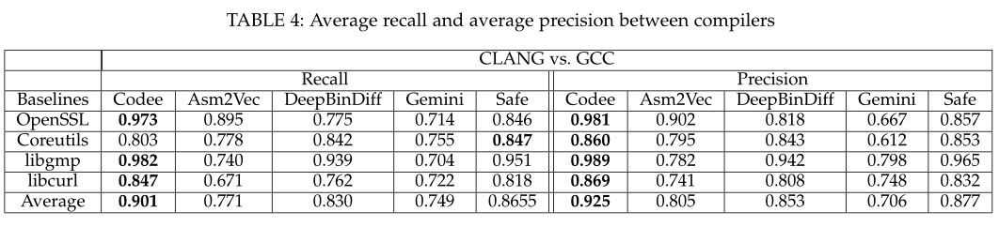

# Codee: A tensor embedding scheme for binary code search

> Yang J, Fu C, Liu X Y, et al. Codee: A tensor embedding scheme for binary code search[J]. IEEE Transactions on Software Engineering, 2021, 48(7): 2224-2244.

* 软件工程的顶刊
* 当前被引用数:20

## Summary

说实话，这一篇论文有很多公式的推导，所以我只能大致看一下。   
整个框架就是语义（负采样的skip-gram模型）+结构（网络嵌入框架）。特别的是，引入张量奇异值分解（tSVD）算法处理所有二进制程序的特征embedding，以学习函数的相关性并提取函数的主要特征。

开源代码： https://github.com/ycachy/Codee
## Research Objective(s)

- 二进制代码搜索
    - 专注于二进制相似性问题的**跨平台和交叉优化**级别

## Background / Problem Statement

### 研究现状
1. 基于**深度学习**
    1. Gemini [9]、CDLH [13] 和 EKLA VYA [14] 深度神经网络模型
        1. 需要收集大量高质量的训练数据，可能遇到过拟合问题
        2. 通用模型效果不佳，特定任务模型需要迭代训练
        3. 基本块特征向量仅通过手动提取指令的统计特征来生成，会丢失一些语义信息
    2. CDLH [13]：针对源码
    3. Safe [15]基于自注意力神经网络生成函数嵌入
        1. 丢失了二进制函数的结构信息
    4. Massarelli[16]将Gemini的手动提取部分改进为基于NLP的无监督特征学习方法，保留了与Gemini相同的Structure2V ec深度学习部分
2. 基于NLP
    1. Asm2Vec：将函数视为文档
    2. InnerEye [11]：将基本块视为句子，使用神经机器翻译（NMT）来训练模型
    3. DeepBinDiff [17]：不支持跨架构的二进制代码搜索。此外，需要确定许多超参数才能最大化模型性能
    4. Order Matters：参数很多，需要很大的计算能力

### 基础知识

- 局部敏感哈希（locality sensitive hash，LSH）
    - 用来搜索相似的汇编函数

- 张量奇异值分解（tensor singular value decomposition，tSVD）
    - 生成函数embedding
## Method(s)

          

1. 生成token embedding
    1. 使用负采样的skip-gram模型+程序的过程间控制流图（Inter-procedural Control-flow Graph，ICFG）生成token嵌入
2. 生成基本块的embedding
    1. 根据token embedding和CFG的结构信息来生成基本块的embedding
3. 基于张量生成函数的embedding
    1. 使用张量分解算法进一步同时生成所有函数嵌入
4. 搜索
    1. 使用 LSH 在存储库中搜索前 K 个相似函数

### 1. token embedding

         

> 基于程序级ICFG的无监督NLP方法：**负采样的skip-gram算法**

1. 输入：ICFG
2. 使用**node2vecWalk随机游走**方法生成token序列
3. 规范化token序列
    1. 立即数 -> `imm`
    2. 内存地址 -> `mem`
    3. 寄存器 -> 根据长度重命名
    4. 指针 -> `ptr`
4. 通过负采样训练skip-gram模型以获得token embedding            

              

    - $Z_i$:
                   

### 2. 基本块embedding

1. 操作码embedding与操作数embedding的**平均特征向量**作为指令嵌入
2. 将基本区块内的所有指令嵌入**相加**，计算出基本区块的特征向量
3. 使用自己设计了一种基本块嵌入生成算法（基于网络嵌入框架 AANE [21] 和 LINE [22]）

#### 2.1 损失函数

1. 将前面步骤生成的CFG内的每个基本块特征向量作为基本块特征向量矩阵$B$的一行
2. 生成基本块特征向量的关联矩阵/相似度矩阵（affinity matrix）$S$
    1. S中的每个元素可以计算为两个基本块特征向量之间的余弦相似度，$s_{ij} = cosine(B_i, B_j)$
    2. B的第i列$B_i$是基本块i的特征向量
    3. 元素$s_{ij}$表示函数中两个基本块特征向量之间的相似度
        - 它近似于生成的基本块嵌入 $C_i$ 和 $C^H_j$ 的乘积，$C_i$ 和 $C_j$ 是 C 的第 i 个和第 j 个基本块嵌入
        - 所以$S$一个对称矩阵，可以分解为$C^HC$
3. 损失函数         

    -       

    - $S_i$是S的第i列，$S_i$表示CFG中第i个基本块特征向量与其他基本块特征向量之间的相似度值

4. second-order proximity(二阶相似度，来源于LINE)：节点 i 利用 Ci 和 Cj 生成节点 j 的条件概率，表示从节点 i 随机跳转到节点 j 的概率
    - 节点 i 和 j 之间二阶相似度的经验概率定义为$a_{ij}/o_i$
    ，$a_{ij}$是边(i,j)的权重，$o_i$是节点i的出度，根据邻接矩阵，我们知道$a_{ij} = 0$或$a_{ij} = 1$
5. 对于有向边 (i, j)，节点转移概率定义如下:
              
6. 使用以下损失函数，最小化有向边的经验概率与 CFG 中其条件概率之间的 KL-发散距离，然后简化损失函数
            
7. 最终的损失函数       

        

#### 2.2 提出的ADMM 算法

1. 标量λ：表示CFG的结构信息的贡献和基本块的语义信息的贡献之间的权衡。 λ越小，基本块嵌入向量Ci中考虑CFG拓扑的影响权重越小。在这项工作中，我们选择 λ = 1，这样 CFG 拓扑和基本块特征在 C 中具有相同的影响

2.  C = H的情况下，上述损失函数可以改写为      

       

3. 受ADMM [27]的启发，使用增强拉格朗日来计算公式(6)    

      

Z1, Z2, ..., Zn ∈ Rd 是对偶变量，ρ > 0 是惩罚参数

4. 为了最小化 L，将其转换以找到鞍点，从而找到最优的H和C。迭代t + 1时每个基本块i的相应优化问题可表述为   

        

5. 导数如下

          

6. 令公式(10)等于0。我们得到了 $C^{t+1}_i$ 的更新方程。由于公式 (6) 是凸的，如果 $C^t_i = C^{t+1}_i$ ，$C_i$ 就是最优解。当这两个向量足够接近时，我们停止迭代    

     

7. 令公式(11)等于0。我们得到$H^{t+1}_i$ 的更新方程。 $H_i$（方程（13））遵循 $C_i$ 规则       

8. 整体算法     

    

    1. 使用等式(12)和等式(13)计算T次迭代后的最终基本块嵌入矩阵C
    2. 将 C 输入到张量中，并执行张量奇异值分解（tSVD）
    3. 总时间复杂度为O(n^2)

### 3. 函数embedding生成

> 将所有函数特征向量输入一个张量 F，然后使用 tSVD [28]对 F 进行压缩，以提取每个函数的主特征      

       

1. $\hat{F}$：沿F的三维进行 fft() 运算得到
2. 对$\hat{F}$的每个frontal slice matrix（前沿切片矩阵）进行TruncatedSVD    
            
3. 选择$\hat{U}^(i)$的前四列     
        

4. 沿$\bar{U}$的第三维运行 ifft() 运算来构建正交张量 U
5. 最后，我们使用 U 来压缩张量 F

#### 3.1 张量表示

1. 张量可以表示为 $F∈ R^{n1×n2×n3}$，张量维数 n1、n2 和 n3 分别表示函数特征向量的长度、程序数和程序中函数的个数
2. 一个程序包含多个二进制函数，那么程序特征可以用矩阵 $F∈R^{n1×n3}$ 表示
3. $F = [F1 F2 ... Fn3]$，F 的一列 $F_i$是程序的函数特征向量。
4. F 中函数特征向量的顺序基于 IDA Pro提取的汇编函数序列号的顺序。
5. 不同的函数有不同数量的基本块。提取n1个基本块。如果基本块的数量小于n1，我们在函数特征向量的尾部补0
6. 不同的程序有不同数量的函数，也是补0

#### 3.2 张量压缩

- 使用 tSVD 压缩所有函数特征向量，这样就能解决函数错位问题，提取主要函数特征

           

1. 建立张量$F$
2. 对F进行tSVD，得到张量$U$
3. 过计算R = U † ∗ F得到压缩张量R。$U ∈ R^{n4×n1×n3}$，$R ∈ R^{n4×n2×n3}$，且 $n4 < min (n1, n2)$，$n4$是压缩函数嵌入向量的大小

#### 3.3 顺序问题
> 展示基于张量的函数嵌入生成方法可以处理函数特征的顺序问题的原因

##### 错位函数的相似性计算
- 在 tSVD 算法中，Circ(-) 运算和 fft 算法是循环卷积计算，可以捕捉函数特征向量的错位相关性

##### 主要函数特征提取
- SVD算法是针对高维数据压缩而提出的，能够抓住主要特征并忽略噪声信息。如果两个函数特征向量具有大部分相似的值，则它们将被压缩为相似的值

#### 3.4 动态张量压缩

> 用于增量生成函数嵌入，在 tSVD 分解过程的基础上，提出了动态张量压缩算法，该算法避免了重新计算整个张量，只需计算新增加的部分

        

1. 得到傅里叶域中每个frontal slice的先前 SVD 张量分解结果，$\hat{U}^{(i)}$、$\hat{M}^{(i)}$ 和 $\hat{V}^{(i)}$
2. 根据新提取的加性函数特征，得到每个frontal slice矩阵的加法张量$F'^{(i)}$ ，为加性张量的第i个函数特征向量程序
    
3. 新的张量记为$F'$。在tSVD张量分解[23][31]中，第i个新的对角块矩阵如下
          

4. 使用增量截断矩阵 SVD 分解法 [32] [33]，得到算法 4 中所示的新正交张量 U' 的每个正面切片矩阵
5. 利用 U' 得到新的函数嵌入张量 R'

## Evaluation

> 跨架构、交叉编译器和交叉优化级别

### 数据集

- 数据集
    1. 四个软件
    2. 三种架构：x86-64、ARM 和 MIPS
    3. 两种编译器：GCC5.4.0 和 CLANG3.8.0
    4. 四个优化选项：O0-O3
- Ground Truth
    - 使用二进制函数的调试符号信息来指示两个二进制函数在经验上是否匹配
- 分类
    1. 混合 OpenSSL 数据集：跨架构和编译选项
    2. x86-64CrossOptimizations 数据集：仅仅跨编译选项

### 性能指标

1. ROC
2. F1 score-precision
3. K-Recall
4. 张量压缩指标：函数$F^{n1xn2xn3}$
    1. 特征压缩比p, 1 ≤ $n_4$  ≤ $min(n_1, n_2)$:
        
    2. 重建误差比e：
            
5. 函数特征生成时间和搜索时间        

### 针对混合二进制函数的代码搜索

- 随机选择 3000 个函数作为测试集 Y，OpenSSL 数据集中的其余函数作为搜索基础

          

- Codee 比其他最先进的方法具有更高的准确性
    - Gemini 使用的人工提取特征可能会丢失函数中基本模块之间的一些语义信息
    - Safe 的神经网络非常复杂，而且严重依赖高质量的数据集

### 跨优化级别的代码搜索

- 召回率和准确率
          

    - 在 O0 和 O3 之间搜索二进制代码比较困难
- top-k和ROC曲线
            
    - 对于大多数 K，Codee 的性能远远优于 Asm2Vec、Order Matters 和 Safe
- F1-scores
            

### 跨 CPU 架构的代码搜索

- 召回率和准确率
            
- f1-score
        

### 跨编译器的代码搜索

- 召回率和准确率
            

### 跨版本代码搜索
- f1-score
    
- 召回率
    
    - 大多数情况下，Codee 的性能优于 Gemini 和 Asm2Vec
### 效率

- 训练时间
    - 共需要大约 24 小时才能完成三种不同指令集（例如 ARM、MIPS、x86-24）的整个训练过程
- 张量压缩
          
    - 张量压缩的运行时间随着函数数量的增加而线性增加
    - 随着特征压缩比的增加，重构错误率降低
- 基本块嵌入生成时间
            
    - Codee的函数特征生成时间包括函数特征提取时间和张量压缩时间，其中函数特征提取时间占总时间的95%，张量压缩时间占函数总时间的5%
    - 当基本块数量小于1000时，Codee花费的时间较少.由此可见，Codee 的运行速度平均比 Gemini 快 5 倍，平均比 Asm2V ec 快 10 倍
- 搜索时间
    - Codee 需要 0.043 秒
    - Gemini 需要 0.1764 秒（100 个 epoch）和 0.058 秒（5 个 epoch）
    - Asm2V ec 需要 2 秒
    - DeepBinDiff 完成函数搜索平均需要 42 秒。
## Conclusion

与现有的基于嵌入的方案相比，Codee的方案具有以下几个优点：
1. 不需要复杂的训练
    1. 不需要标记大量数据
2. 更高的准确度
    1. 生成的基本块嵌入不仅捕获基本块的句法信息和语义信息，而且还从CFG结构中学习上下文信息
    2. 张量奇异值分解（tSVD）算法处理所有二进制程序的特征embedding，以学习函数的相关性并提取函数的主要特征。
3. embedding生成更迅速
    1. tSVD 张量分解能进行并行处理

局限性
1. 如果控制流图发生较大变化，会影响Codee搜索代码的准确性
2. Codee 很容易受到完全改变 CFG 的混淆技术的影响
## Notes(optional) 

不在以上列表中，但需要特别记录的笔记。例如英文书写模板，精美绘图所使用到的工具软件等。

## References(optional) 

列出相关性高的文献，以便之后可以继续 track 下去。

## Origin

给出指向你个人论文仓库的本篇论文阅读笔记原文链接。

## Tags

逗号分隔本文的所有标签，标签使用规范参见以下 `GitLab Issue 标签使用规范` 。

2021, SCI, SCI-1, CyberRange, Playbook, Ansible, Scenario, CTF

------ 以下内容仅为解释说明，请在提交时删除 ------

### GitLab Issue 标签使用规范

* 在不影响语义理解的前提下，标签关键词要尽可能短
* 优先选择已有标签，确实没有的情况下再 `新建标签`

#### 建议的标签列表

* 文献发表年份。例如 2021
* 检索收录情况：EI, SCI 
* 中科院 JCR 分区（针对 SCI 收录文献才需要标记）：SCI-1, SCI-2, SCI-3, SCI-4
* 关联实验室内项目简称（最近更新 2021-05-22）：Fuzz, CyberRange, osint4sn, SoftFP, MTD
    * 物联网漏洞挖掘：Fuzz
    * 靶场：CyberRange
    * 开源社区情报分析：osint4sn
    * SoftFP：软件指纹
    * 欺骗式防御：MTD
* 研究对象（不超过3个）。例如：IoT, 源代码 等
* 研究方法（不超过3个）。例如：综述, 动态分析, 静态分析, CNN 等
* 数据集（不超过3个）。例如： NB-15，MalwareZoo, VulDeePecker, LAVA-M 等

