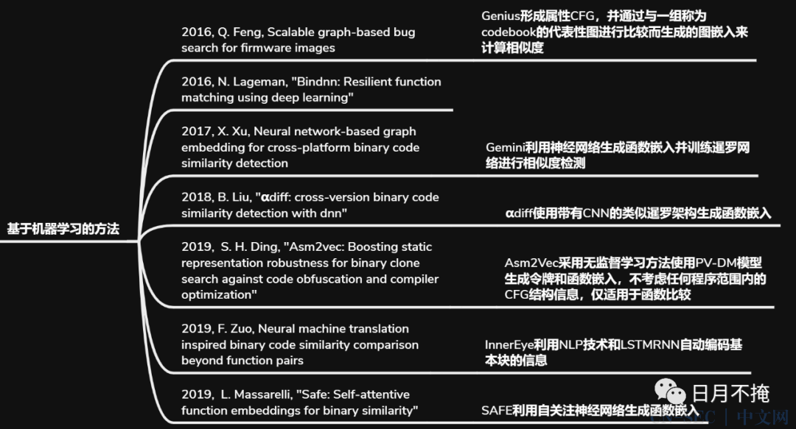
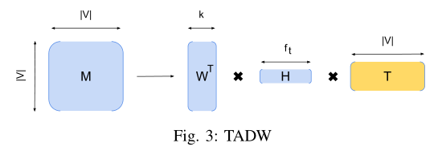

# Deepbindiff: Learning program-wide code representations for binary diffing

> Deepbindiff: 通过学习程序的代码表示进行二进制差分分析
> Duan Y, Li X, Wang J, et al. Deepbindiff: Learning program-wide code representations for binary diffing[C]//Network and Distributed System Security Symposium. 2020.

* 信息安全四大顶会：NDSS2020
* 当前被引用数：84

## Summary

- DeepBinDiff实现了一种基于无监督学习的程序范围的代码差分技术。DeepBinDiff首先提取ICFG和基本块信息，利用随机游走序列化指令，然后利用CBOW（Continuous Bag-of-Words）模型生成token embedding。随后通过TASW算法从合并的ICFG中提取结构信息，生成基本块embedding。最后使用k-hop贪婪算法来寻找基本块的最优匹配。
- DEEPBINDIFF能够处理多种常见的优化技术，能够同时考虑控制流信息和上下文语义信息，实现了多版本和多优化级别的二进制相似性比较。但是它不能对编译器为减少分支错误预测而合并的块进行正确的分类处理；控制流优化的大幅度改变也会影响有效性；**不支持跨架构相似性比较**。

--- 
- [开源代码以及数据集](https://github.com/deepbindiff/DeepBinDiff)
## Research Objective(s)

- 提出一种无监督的程序粒度上的代码表示学习的技术用来进行二进制差分分析
- 进一步划分成两个子问题
    - 定量度量两个基本块之间的相似性`sim(mi)`
    2. 找到两组基本块`M(p1,p2)`

## Background / Problem Statement

- Binary Code Differential Analysis
    - 定量度量两个给定二进制代码之间的相似性，并生成细粒度的基本块匹配。不仅仅给出精确的、细粒度的和定量的结果，而且还明确揭示代码如何再不同版本或者优化级别上演变
- 定义
    - 给定两个二进制程序$p1=(B1，E1)$和$p2=(B2，E2)$，二进制差分的目的是找到使p1和p2之间的相似性最大化的最佳基本块匹配        

                
    - B1={b1，b2，...，bn}和B2={b1'，b2'，...，bm'}是p1和p2中包含所有基本块的两组集合；
    - $E⊆B×B$中的每个元素e相当于两个基本块之间的*控制流依赖*;
    - 在M(p1，p2)中的每个元素mi表示bi和bi'之间的匹配对;
    > 应该是bi和bj更加合适
    - sim(mi)定义了两个匹配的基本块之间的定量相似度得分
- 应用
    - 更改部件定位、恶意软件分析、安全补丁分析、二进制代码剽窃检测、基于补丁的利用生成

- 现在基于程序分析和机器学期的技术存在一些问题
    - 精度低、可扩展性差、粒度粗、或者需要大量标记的训练数据

## Method(s)

### 研究现状

#### 传统方法

- BinDiff
    - 在CG和CFG上进行多对多图同构检测，并且利用启发式（函数名、graph edge MD index）来匹配函数和基本块

         

#### 基于学习的方法
- 利用图表示学习技术并将代码信息合并到嵌入(高维数值向量)
- InnerEye和Asm2Vec依靠NLP技术自动提取语义信息并生成用于区分的嵌入      

      

---

- 优势
    - 精度高、更好的扩展性、GPU加快学习
- 局限性
    1. 目前大多数技术是在「函数」粒度上执行diff，除了InnerEye是在基本块粒度。**粒度不够细**
    2. 同时考虑程序范围内的依赖信息（过程间控制流图(ICFG)）和基本块语义信息
        - InnerEye只考虑局部控制依赖信息
        - Asm2Vec仅在函数内生成随机游走
    3. 大多数是建立在「监督学习」上，性能取决于训练数据的质量。监督学习还有过拟合问题
        - InnerEye将整体指令视为一个单词，可能会导致out-of-vocabulary问题

### 方法框架 

          

- 输入：两个二进制级
- 输出：基本块级别的diff结果
- 主要解决问题的技术
    1. 计算基本块相似性的$sim(mi)$。采用无监督学习方法生成嵌入，然后计算基本块之间的相似性分数 
    2. 使用k-hop贪婪匹配算法生成匹配M(p1,p2)
- 主要流程
    1. 预处理： ICFG(过程间控制流图)生成和基本块的特征向量生成
    2. embedding生成：根据ICFG和特征向量来为每个基本块生成包含了图上下文信息的embedding。
    3. 代码比较：使用k-hop贪心算法来进行匹配

### 1. 预处理

#### A. CFG生成

- 使用IDA Pro提取基本块信息，CFG，并生成 inter-procedural CFG(ICFG)
> ICFG：在不同的上下文中区分语义相似的基本块

#### B. 特征向量生成
> 这一部分主要包括两个子任务：token embedding 生成和 basic block的特征向量生成          

         

- **随机游走**：序列化ICFG，从而获取上下文信息
    1. 每个基本块至少包含在两个随机游走序列中
    2. 每条随机游走路径长度包含5个基本块
    - 将随机游走组合在一起，生成一个完整的训练指令序列

- **标准化**
    1. 所有数值常量替换成字符串`im`
    2. 所有通用寄存器按照其长度重命名
    3. 指针替换为字符串`ptr`

- **模型训练**
    - 将正则化后的随机游走路径作为训练样本，输入CBOW（Continuous Bag-of-Words）模型。
    - token：操作数或操作码
    - 使用每条指令的前一条、后一条指令中的词条作为上下文，来对每个词条进行建模。
- **特征向量生成**
    - 计算「操作数」的平均数（一条指令操作数可能有多个），与操作码的embeding连接，来生成该条指令的mebedding，最后将这个基本块中的所有的指令embedding求和来形成基本块的特征向量
    - 因为每条指令可能具有不一样的重要性，所以作者对操作码的embedding乘以TF-IDF权值
    - 公式如下      
               
    - 其中$in_i$为一条指令,$pi$为操作码，集合$Set_{ti}$为指令$in_i$的操作数的集合，个数为$k$，$FV_b$为此基本块的特征向量
> DEEPBINDIFF的token embedding生成模型与Asm2Vec有一些相似之处，Asm2Vec也使用围绕目标token的指令作为上下文。DEEPBINDIFF通过程序范围的随机游走学习token embedding，而Asm2Vec同时学习函数和token嵌入，而且**只在函数内**。因此，DEEPBINDIFF修改Word2Vec的CBOW模型，而Asm2Vec利用PV-DM模型

### 2. EmBedding 生成
- 目标：基于前面生成的ICFG和特征向量，生成基本块embedding，使相似的基本块与相似的嵌入相关联    
- 方法
    1. 先将两个ICFG合并为一个图
    2. 将问题建模成一个网络的表示学习问题，使用**TADW（Text-associated DeepWalk）算法**来生成基本块的嵌入表示
#### A. TADW algorithm
> TADW是一种无监督图嵌入学习算法，对DeepWalk的改进。DeepWalk擅长从图中学习上下文信息，但是在分析过程中不考虑节点特征。TADW顶点的特征合并到网络表示学习过程
- DeepWalk等价于分解一个矩阵$M \in R^{|v|\times|v|}$，其中每个实体$M_ij$是节点$v_i$随机游走到节点$v_j$的平均对数概率。
- 基于此思想，TADW算法的流程描绘如下图所示：     

        

- 矩阵$M$分解到三个矩阵的乘积的形式：$M \in R^{k \times |v|}$，$H \in R^{k \times f}$和文本特征$T \in R^{f \times |v|}$。然后$W$可以和$HT$串接起来形式$2k$维度的节点embedding。

#### B. 图合并
- 为什么不对两个ICFG分别运行两次TADW
    1. 分解两次矩阵是低效的
    2. 单独的生成embedding可能会丢失某些重要的相似性判别指标。例如下图两个图，都有fread调用喝引用字符串hello，a和1、d和3可能匹配       

- 此方法中的图合并示意图如图4所示：     
           
1. 先提取每个基本块中的字符串引用和库函数调用，并为其添加一个虚拟节点
2. 将相同的引用、调用节点之间添加边，这样具有相同引用、调用的节点之间至少有一个相同的邻居
> 由于只合并终端节点，所以原有的图结构保持不变
#### C. 基本块Embeddings
- 将合并后的图和基本块特征向量输入TADW进行多次迭代优化     
- 该算法使用交替最小二乘(ALS)算法将矩阵M分解成三个矩阵，使用公式4中描述的损失函数。当损失收敛或经过固定的n次迭代后，它停止。        

           
> λ是一个调和因子
### 3. 代码差分        
- 例如INNEREYE中所采用的方式是**线性比较**，即每个基本块都和其他基本块生成一个相似性分数，这样效率太低
- 为此，作者采用了两段式比较的方法：先生成函数级别的embeddings，来匹配函数。然后在对匹配上的函数使用基本块比较的方法。
> 可能会被改变函数边界(如函数内联)的编译器优化严重阻碍

#### A. k-Hop贪婪匹配
- 利用ICFG上下文信息，根据从已经匹配的k-hop邻居的基本块嵌入计算的相似度，找到匹配的基本块

- 算法的整个流程如下图所示:         

           

1. 先使用虚拟节点（字符串引用和库函数调用）生成最初的匹配集合$Set_{initial}$（例如图四中的a和1就是一对）
2. 开始循环。得到当前匹配节点的`k hop`邻居
3. 在这些邻居中寻找**相似度最大**的且过阈值t(t=0.6)的**未匹配**的节点对，加入到当前节点集中。
4. 直到匹配对的所有k-hop邻居都已经匹配过
5. 对那些从未匹配过的节点使用线性方法（匈牙利算法）进行匹配。
6. 最后$Set_i$为插入的基本块，$Set_d$为删除的基本块。（当二进制文件的两个不同版本之间存在差异时，可能会发生插入和删除操作）
 
## Evaluation

- 实验环境
    - Ubuntu 18.04LTS
    - Intel Core i7 CPU,
    - 16GB memory and no GPU
- 针对**跨版本**和**跨优化级别**
### 数据集
- 软件：
    - Coreutils（5个版本）， Diffutils（4个版本）和Findutils（3个版本）
    - github开源项目：LSHBOX（4个二进制程序） 和 indicators（6个二进制程序），每个项目选择三个主要版本

- 数量：113
- 编译器：GCC v5.4
- 优化级别：4个
    - O0、O1、O2、O3
### Baseline
- Asm2Vec(ASM2VEC+k-HOP)[23]和BinDiff[10]
-  DEEPBINDIFF-CTX:没有上下文信息的DEEPBINDIFF
- INNEREYE + k-HOP
### Ground Truth Collection（真值收集）
- 首先从二进制文件中提取源文件名，并使用Myers算法对源代码进行基于文本的匹配，以获得行号匹配
### 评估指标            
              
- $M_c$：正确匹配。$M_c = M ∩ G $
- $M_u$：未知匹配。没有在`ground truth`中出现，不知道匹配是否正确  
- $M - M_c - M_u$：不准确的配对  

- 精度          

            

- 召回率          

           

### 实验结果    

- Cross-version Diffing           

        

>  DEEPBINDIFF的全部优于DEEPBINDIF-FCTX、ASM2VEC+k-HOP和BinDiff，特别是在两个不同版本之间存在较大差距的情况下
- Cross-optimization-level Diffing.              
           

> DEEPBINDIFF在召回率和精确度方面的大多数设置优于DEEPBINDIFFCTX、ASM2VEC+k-HOP和BinDiff
- 二进制大小和精度
    - 无论二进制文件大小如何，DEEPBINDIFF都可以相当稳定地执行
- 参数选择
    - hops `k`
    - 阈值 `t`    
              
- 效率
    - 训练时间：16个小时
    - 预处理时间：少于100ms
    - embedding 生成：平均来说，需要591秒
    - 匹配时间：平均需要42秒
    - 二进制大小和运行时开销之间的关系是线性的
    
## Conclusion

- 针对编译优化做的设计      
             
- 局限
    - 两个二进制文件的块数可以改变。在这种情况下，DEEPBINDIFF可能会错误地将一些块分类为插入或删除
    - DEEPBINDIFF很容易受到完全改变CFG的混淆技术的影响（现有的基于学习的技术不能做得更好，因为它们都依赖于控制流信息）
    - 两个待比较二进制需要是同一架构.DEEPBINDIFF支持x86二进制文件，可以通过中间表示（IR）进行处理跨架构问题

## References(optional) 

列出相关性高的文献，以便之后可以继续 track 下去。
- TADW算法
> [56]C. Yang, Z. Liu, D. Zhao, M. Sun, and E. Y . Chang, “Network
representation learning with rich text information.” in IJCAI, 2015, pp.
2111–2117.
- INNEREYE
> [58]F. Zuo, X. Li, Z. Zhang, P . Y oung, L. Luo, and Q. Zeng, “Neural machine translation inspired binary code similarity comparison beyond function pairs,” in NDSS, 2019.       
>  https://nmt4binaries.github.io//, 2019.
- Asm2Vec
> [23] S. H. Ding, B. C. Fung, and P . Charland, “Asm2vec: Boosting static representation robustness for binary clone search against code obfuscation and compiler optimization,” in Security and Privacy (SP), 2019 IEEE Symposium on. IEEE, 2019.
- BinDiff
> [10] “zynamics BinDiff,” https://www.zynamics.com/bindiff.html, 2019.

## Tags

2020，NDSS2020，二进制相似性

## 参考资料

- [DeepBinDiff中文参考](https://yunlongs.cn/2020/07/09/DeepBinDiff/)
- [DeepBinDiff中文全文参考](https://cn-sec.com/archives/690694.html)
- [DeepBinDiff中文参考](https://e0hyl.github.io/BLOG-OF-E0/DeepBinDiff/#%E9%97%AE%E9%A2%98%E5%AE%9A%E4%B9%89)
- [一文详解Softmax函数](https://zhuanlan.zhihu.com/p/105722023)
- [图嵌入表示TADW：当DeepWalk加上外部文本信息](https://cloud.tencent.com/developer/article/1783301)