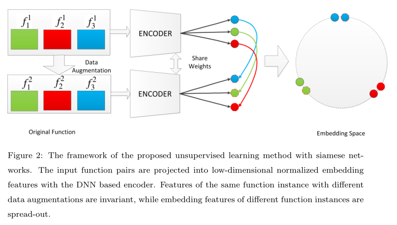

# Fun2Vec: a Contrastive Learning Framework of Function-level Representation for Binary
Fun2Vec：二进制函数级表示的对比学习框架
> RuiJin S, ShiZe G, JinHong G, et al. Fun2Vec: a Contrastive Learning Framework of Function-level Representation for Binary[J]. arXiv preprint arXiv:2209.02442, 2022.

* 检索收录情况：arXiv
* 当前被引用数:0

## Summary

写完笔记之后最后填，概述文章的内容，以后查阅笔记的时候先看这一段。

> 注：写文章summary切记需要通过自己的思考，用自己的语言描述。忌讳直接Ctrl + C原文。

> https://github.com/fun2vec
## Research Objective(s)

- 与前人工作不同，本文采用无监督学习的方法获取函数级二进制代码的表示，避免因为标注不准确导致的过度训练

## Background / Problem Statement

- 目前的难点
    1. 采用的监督学习模型，会遇到标记困难。
        - 任何两个函数之间的互信息都不可能为1，recv()和read()两个函数之间被标记为-1，但事实上连个函数非常相似
    2. 一些模型会存在退化问题
- 研究现状
    - 基于特征 
        1. 最早的二进制文件相似度比较工具名为 EXEDIFF [2]。主要是使用基于字符串的检测方法，使用字符串或者字符串的编辑距离进行查找
        2. 基于n-grams
        3. 基于图：PDG和CFG
    - 基于嵌入
        1. asm2vec：PV-DM模型
        2. 神经网络+ACFG
        3. SAFE:word2vec+GRU
        4. 基于transformer
        5. 基于bert

## Method(s)
> 使用的编码器为预训练模型trex的编码器

          
> 具有不同数据增强的同一函数实例的特征是不变的，而不同函数实例的嵌入特征是分散的。
**架构组成**：
1. 数据集X和样本增强模块Trans(·)。
    - 给定原始数据集 X 中的函数$x_i$，将原始 $x_i$ 传递给数据增强模块Trans(·) 来生成增强数据，从而两个增强二进制函数$x^1_i$和$x^2_i$ 
2. 二进制函数表示学习模块f(·)。
    - $z^1_i$ = $f(x^1_i)$ 和 $z^2_i$ = $f(x^2_i)$ 

3. 第三，比较学习模块，由距离函数d(·)和损失函数‘(·)组成。
### 数学符号

- x：指原始数据集 X 中的元素或二元函数
- f(·)：是基于 DNN 的编码器（trex）,微调 f(·) 以使函数表示更加鲁棒
-  Trans(·) ：是数据增强函数。
-  z：是函数 x 的嵌入
- τ：是temperature parameter(温度参数)。 
- d(·)：是距离函数
- l(·)：是损失函数。

## Evaluation

作者如何评估自己的方法？实验的setup是什么样的？感兴趣实验数据和结果有哪些？有没有问题或者可以借鉴的地方？

## Conclusion

作者给出了哪些结论？哪些是 `strong conclusions`, 哪些又是 `weak conclusions`（即作者并没有通过实验提供 `evidence`，只在 `discussion` 中提到；或实验的数据并没有给出充分的 `evidence`）?

## Notes(optional) 

不在以上列表中，但需要特别记录的笔记。例如英文书写模板，精美绘图所使用到的工具软件等。

## References(optional) 

列出相关性高的文献，以便之后可以继续 track 下去。

## Origin

给出指向你个人论文仓库的本篇论文阅读笔记原文链接。

## Tags

逗号分隔本文的所有标签，标签使用规范参见以下 `GitLab Issue 标签使用规范` 。

2021, SCI, SCI-1, CyberRange, Playbook, Ansible, Scenario, CTF

------ 以下内容仅为解释说明，请在提交时删除 ------

### GitLab Issue 标签使用规范

* 在不影响语义理解的前提下，标签关键词要尽可能短
* 优先选择已有标签，确实没有的情况下再 `新建标签`

#### 建议的标签列表

* 文献发表年份。例如 2021
* 检索收录情况：EI, SCI 
* 中科院 JCR 分区（针对 SCI 收录文献才需要标记）：SCI-1, SCI-2, SCI-3, SCI-4
* 关联实验室内项目简称（最近更新 2021-05-22）：Fuzz, CyberRange, osint4sn, SoftFP, MTD
    * 物联网漏洞挖掘：Fuzz
    * 靶场：CyberRange
    * 开源社区情报分析：osint4sn
    * SoftFP：软件指纹
    * 欺骗式防御：MTD
* 研究对象（不超过3个）。例如：IoT, 源代码 等
* 研究方法（不超过3个）。例如：综述, 动态分析, 静态分析, CNN 等
* 数据集（不超过3个）。例如： NB-15，MalwareZoo, VulDeePecker, LAVA-M 等

