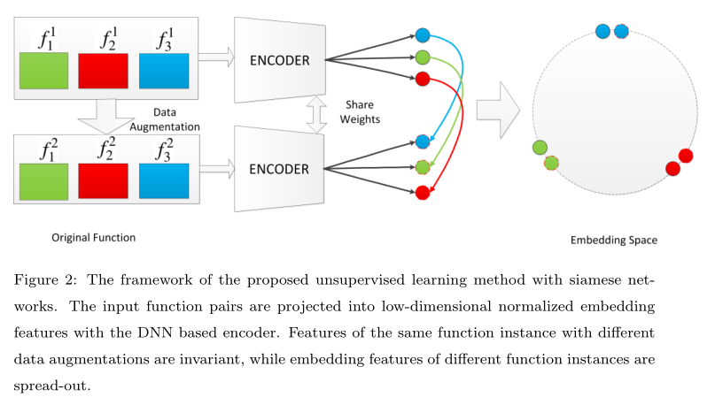
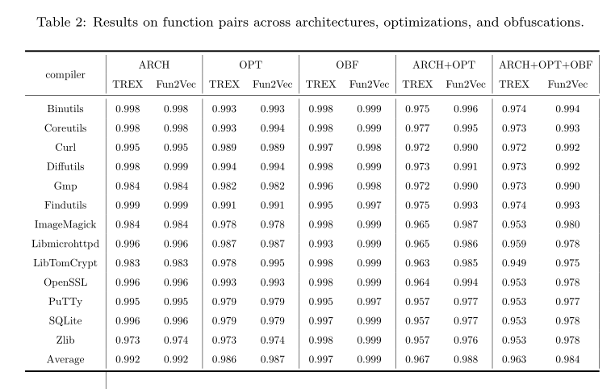

# Fun2Vec: a Contrastive Learning Framework of Function-level Representation for Binary
Fun2Vec：二进制函数级表示的对比学习框架
> RuiJin S, ShiZe G, JinHong G, et al. Fun2Vec: a Contrastive Learning Framework of Function-level Representation for Binary[J]. arXiv preprint arXiv:2209.02442, 2022.

* 检索收录情况：arXiv
* 当前被引用数:0

## Summary

本文提出了一个框架Fun2Vec，与其他人不同，他使用了对比学习的算法，编码器使用的trex编码器，弥补其他算法面临数据集打标签困难的问题。同时，在小数据上，表现良好

> https://github.com/fun2vec
## Research Objective(s)

- 与前人工作不同，本文采用无监督学习的方法获取函数级二进制代码的表示，避免因为标注不准确导致的过度训练

## Background / Problem Statement

- 目前的难点
    1. 采用的监督学习模型，会遇到标记困难。
        - 任何两个函数之间的互信息都不可能为1，recv()和read()两个函数之间被标记为-1，但事实上连个函数非常相似
    2. 一些模型会存在退化问题
- 研究现状
    - 基于特征 
        1. 最早的二进制文件相似度比较工具名为 EXEDIFF [2]。主要是使用基于字符串的检测方法，使用字符串或者字符串的编辑距离进行查找
        2. 基于n-grams
        3. 基于图：PDG和CFG
    - 基于嵌入
        1. asm2vec：PV-DM模型
        2. 神经网络+ACFG
        3. SAFE:word2vec+GRU
        4. 基于transformer
        5. 基于bert

## Method(s)
> 使用的编码器为预训练模型trex的编码器

          
> 具有不同数据增强的同一函数实例的特征是不变的，而不同函数实例的嵌入特征是分散的。
**架构组成**：
1. 数据集X和样本增强模块Trans(·)。
    - 给定原始数据集 X 中的函数$x_i$，将原始 $x_i$ 传递给数据增强模块Trans(·) 来生成增强数据，从而两个增强二进制函数$x^1_i$和$x^2_i$ 
2. 二进制函数表示学习模块f(·)。
    - $z^1_i$ = $f(x^1_i)$ 和 $z^2_i$ = $f(x^2_i)$ 

3. 第三，比较学习模块，由距离函数d(·)和损失函数‘(·)组成。
### 数学符号

- x：指原始数据集 X 中的元素或二元函数
- f(·)：是基于 DNN 的编码器（trex）,微调 f(·) 以使函数表示更加鲁棒
-  Trans(·) ：是数据增强函数。
-  z：是函数 x 的嵌入
- τ：是temperature parameter(温度参数)。 
- d(·)：是距离函数
- l(·)：是损失函数。

### 1. 数据增强

选择三种增强策略：
1. 跨架构：x86-32, x86-64,arm-32,arm-64, mips-32 and mips-64
2. 跨优化：O0、O1、O2 和 O3
3. 跨混淆：Hikari中包含的伪控制流、指令替换、基本快分割

### 2. 函数表示学习模块

- 使用trex的编码器

### 3. 对比学习

> 对比学习由距离函数和损失函数组成

- 余弦距离sim()：判断函数对的相似程度
- 函数对：$x_1$和$x_2$，对应的嵌入向量：$z_1=f(x_1)，z_2=f(x_2)$，两个函数之间的相似距离为        

           

- L2归一化（最小二乘误差）
    - 有n个不同的函数，通过L2归一化蹭，强制`||z||=1`
- 任意一个embedding z属于第i个函数的概率表示为    
    - $P(z_i|z)$表示 z 属于类别 i 的概率     

              

    - 然后进一步引入温度参数τ     

            

- 损失函数：NT-Xent（归一化温度尺度交叉熵损失）    

         

## Evaluation

- 微调模型
    1. 总epoch：40
    2. 温度参数：0.007
    3. 输出embedding的维度：768
    4. 学习率：0.00001
    5. 优化器：Adam
    6. 最大输入长度：512
    7. batch size：32

### 1. 汇编代码的统计规律
> 解决：汇编代码如何分布以及基于预训练模型的模型是否存在表达式折叠（expression collapse）的问题
> 在自然语言处理（NLP）中，expression collapse问题指的是将一个句子或短语中的多个表达方式折叠成一个标准表达方式的任务。这个问题的主要目标是减少语言变体和拟合多样的表达方式，以便更有效地进行文本处理和分析。举例来说，假设我们要处理一段文本中的日期表达，其中可能出现"2022年1月1日"、“2022-01-01"和"1/1/2022"等多种表达方式。为了解决expression collapse问题，我们可能希望将这些不同的日期表达方式统一转换为一个标准的格式，比如"2022-01-01”。
- 在汇编代码中就是
    - 高频词出现的频率较高，低频词出现的频率较低，导致优化过程中低频词的梯度下降较少。高频词得到更多的梯度下降。结果，高频词的嵌入似乎陷入了角落
- 汇编代码的分布也接近zipf分布

    

- 仅仅使用trex的模型，使用最后一层每个token嵌入的平均池化当作函数表示，但是几乎所有函数对的相似度得分都在0.6-1.0之间   

         

- Fun2Vec 对模型进行微调后，成功消除了模型的各向异性(anisotropy)        
> 各向异性就有个问题，那就是最后学到的向量都挤在一起，彼此之间计算余弦相似度都很高，并不是一个很好的表示。
           

### 2. 模型的准确性

- 与SAFE模型比较

       

     

- 与trex模型比较      

            

- 漏洞搜索

Fun2Vec在所有查询的前k个结果中找到了所有k个存在漏洞的函数。对于 k = 10，SAFE达到 84% 的召回率，而 Gemini 达到 55% 的召回率

### 3. Projection Head,投影头和消融实验
> 是在自监督学习中常用的技术，是指在预训练模型的最后一层添加一个投影头，用于将模型的高维隐藏表示投影到低维空间中。通过这种方式，将原始输入数据转化成更为紧凑、更具有语义信息的表示。投影头的设计通常包括一个线性变换和一个非线性激活函数，它们帮助模型从原始数据中提取有用的特征。投影头的输出可以用于各种下游任务，如分类、聚类或者生成等

- 投影头：g(h), z 作为下游任务的表示

         

- 投影头结果
    
           

    - 与没有微调的模型相比，使用投影头g(h)训练模型时，模型的AUC分数略有上升（平均3%）
    - 带投影头的模型的AUC得分远低于不带投影头的模型

- 预训练模型
    - 预训练模块的作用至关重要,模型的 AUC 分数平均上升了 10%

- 仅微调投影头
    - 仅微调投影头，AUC 分数略有下降

### 4. Performance under Few-shot Settings（少样本学习）

        

在仅提供 512 个样本的情况下对基线进行显着改进。当训练样本增加到2048时，我们的方法基本上可以达到与在完整数据集上训练的模型相当的结果

## Conclusion

提出了 Fun2Vec，一种自监督对比学习框架，用于将二进制函数转换为下游任务的嵌入。该框架不需要任何额外的复杂结构，并且可以使用任何编码器来实现

## Tags

2022, BCSD，对比学习，自监督学习

## 参考资料

- [NLP名词解释：各向异性(Anisotropic)](https://zhuanlan.zhihu.com/p/468922604)