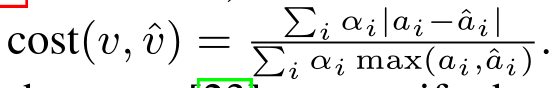

# Genius: Scalable graph-based bug search for firmware images
> 基于图的可扩展固件映像Bug搜索
> Feng Q, Zhou R, Xu C, et al. Scalable graph-based bug search for firmware images[C]//Proceedings of the 2016 ACM SIGSAC Conference on Computer and Communications Security. 2016: 480-491.

- ACM CSS
- 被引次数：318

## Summary

- 此片文章提出并实现一个固件漏洞搜索系统：`Genius`。` Genius`的核心思想是提取`ACFG`，借鉴「图像搜索」的思想，没有直接进行图匹配，而是将图转化成高维向量，进行高维向量的匹配搜索。
- `Genius`首先提取`ACFG`，然后通过「二部图匹配算法」得到两个图之间的相似度，随后将相似度转化成「核矩阵」进行「核化谱聚类」，由质心生成码本，最后根据码本对图进行特征编码用于后续搜索

## Research Objective(s)

- 研究一种算法，能够实现「快速且准确」对**固件**进行漏洞搜素

## Background / Problem Statement

- 从物联网中发现漏洞至关重要，但是由于IoT设备的CPU和内存配置，PC和移动设备上的防御机制无法进行有效的迁移

## Method(s)

作者解决问题的方法/算法是什么？是否基于前人的方法？基于了哪些？

- 将计算机图像视觉中的算法进行迁移（文中指出，**关键问题不在图匹配上，而是在于搜索技术**）

### 1. 原始字节提取
- 提取二进制代码的ACFG（带有属性的控制流图）
- ACFG主要提取*统计特征*和*结构特征*
    - 结构特征：字符串常量、数量常量、转移指令数量、调用指令数目、指令数目、算数指令数目
    - 结构特征：子节点数目、介数中心数
    > 介数中心数：代表着对图信息流影响程度大小
    - 使用IDA Pro进行提取
### 2. 生成CodeBook
- 首先通过无监督学习通过原始特征集中学习——有限的离散码本`C={c1,c2,...,ck}`
- 码本生成包括**相似性度量计算**和**聚类**两个阶段
1. 原始字节相似性计算
    - 使用**二部图匹配**来量化ACFG的相似度
        - 因为ACFG中包含结构特征，所以能够补全二部图匹配对图的结构不可知的缺陷
        - 将两个ACFG G1,G2合并成一个 二部图G=(V,E) ，V为G1,G2的并集，E是G1中顶点到G2中顶点的边的集合，eij代表着顶点vi与vj的匹配
        - 二部图匹配能够选择G1到G2一对一映射的最小成本
        - 边所代表的cost或者说权重如下：       

                          
            - a:代表顶点v
            - | ai -ai' | ：如果是常数，就是正常减法计算；如果特征是一个集合就采用Jaccard算法
            - Alpha：每个特征的权重

    - 二部图匹配的输出是两个图的最小成本，通常情况下是大于1，需要进行**归一化**
        - 将ACFG与「空ACFG」，得到最大匹配代价
        - cost(gi, gj)：两个图之间最佳二部匹配的代价（比如说最小匹配）
        - 归一化：            
             

    - 每个特征的权重确定：
        - 使用GALib遗传算法
        - 使用高斯变异器（Gaussian mutator）执行了100次算数交叉

2. 聚类
    - 一组ACFG的聚类过程，其中每个聚类由许多相似的ACFG组成
    - 使用**谱聚类**作为无监督学习算法
    - 谱聚类算法将训练集划分成n部分Sn，ci是Si的质心。质心节点定义为与Si中所有其他ACFG最小的ACFG，所有质心节点的集合构成一个**code book**
    - **核化谱聚类**的输入是一个「核矩阵」，而不是数值向量。
        - 通过上一步中的相似分数生成
        1. 核矩阵为M, M中的每一项都是两个对应acfg的相似度分数
    - 训练集的抽取：
        - 采取分层抽样。按照ACFG的大小进行分层

### 3. 特征编码
- 学习一个分类器`q: G -> Rn`
    - G是所有ACFG的集合。Rn是n维实数空间
    - NN(gi)：码本中最近的质心邻居
- 学习方法1：**Bag-of-feature编码**
    > Bag of Feature 是一种图像特征提取方法，它借鉴了文本分类的思路（Bag of Words），从图像抽象出很多具有代表性的「关键词」，形成一个字典，再统计每张图片中出现的「关键词」数量，得到图片的特征向量       

          

    - `1(.)`：括号里为真，函数值为1，反之为0 
    > 总而言之，码本相当于「关键词」，每个图用「码本」对应频率进行表示
- 学习方法2：**VLAD encoding**
    > 对于每幅图像中的特征找到最近的码本聚类中心，随后所有特征与聚类中心的差值做累加，得到一个`k*d`的vlad矩阵，其中k是聚类中心个数，d是特征维数(如sift是128维),随后将该矩阵扩展为一个 `(k*d)`维的向量，并对其L2归一化，所得到的向量即为VLAD       
            
    - 在编码后的特征质心上增加了相似度信息

### 4. 在线搜索
- 使用`LSH(Locality-sensitive hashing，局部敏感哈希)`进行搜索
- 投影函数：   

          
    - q(g):已编码的特征
    - w:the number of quantized bin？？？？
    - v：随机选择的向量
    - b:0~w的随机变量
    - 编码后特征：lsh(g)=[h1(q(g)), ..., hw(q(g))]

## Evaluation

作者如何评估自己的方法？实验的setup是什么样的？感兴趣实验数据和结果有哪些？有没有问题或者可以借鉴的地方？

### 数据集

- 数据集1：基准评估
    - BusyBox（v1.21和v1.20）、OpenSSL（v1.0.1f和v1.0.1a）和coreutils（v6.5和v6.7）
    - 使用三个编译器版本（gcc v4.6.2/v4.8.1和clang v3.0）
    - 启用了四个优化级别（O0-O3）
- 数据集2：公共数据集
    - J. Pewny, B. Garmany, R. Gawlik, C. Rossow, and T. Holz.Cross-architecture bug search in binary executables. InOakland, 2015. 中使用的
- 数据集3：固件镜像数据集
- 数据集4：漏洞数据库
    - 是CVE编号和实际引入漏洞的相应函数之间的映射
### 评估标准
- 召回率和假阳性率      
    - 查询q，函数总数量L，m个匹配函数，取前K个
    - 正确匹配的函数总数`μ`是真阳性，而前`K`个函数的剩余数量，即`K-μ`，是假阳性
    - 召回率：`recall(q) = µ/m`
    - 假阳性：`FPR(q) = (K−µ)/(L−m) `
### 横向比对
- discover vre、Multi-MH和Multi-k-MH和基于质心的搜索          
        
- 搜索效率也更高

### 参数选择
- 距离度量和结构特征
    - 包含结构特征优于不包含结构特征
    - 余弦距离优于欧氏距离
- 码本大小
    - 码本的大小似乎对Genius的准确性没有显著的影响
- 训练集大小
    - 用于训练的样本越多，Genius的表现就越好，但当训练数据足够大时(在我们的例子中达到10万个函数)，精确度的提高就会饱和
- 特征编码方法
    - VALD优于bag-of-feature 
## Conclusion

作者给出了哪些结论？哪些是 `strong conclusions`, 哪些又是 `weak conclusions`（即作者并没有通过实验提供 `evidence`，只在 `discussion` 中提到；或实验的数据并没有给出充分的 `evidence`）?

- 为何最后实验时的落脚点是函数的匹配，而不是整个二进制代码
    - 落脚点是bug搜索，而不是相似度匹配

### 待改进
1. 利用静态分析来提取句法特征，因此不能处理**混淆代码**
2. CFG提取的质量有待提高
3. 会受到函数内联的影响，因为它可能会改变CFG结构
4. 准确性也受到CFG大小的影响。CFG的尺寸越小，发生碰撞的可能性越大。

## References

### 恶意代码转化为图像表示
- Malware  images:  visualization  and  automatic 
classification[C].  The  8th  International  Symposium  on  Visualization  for  Cyber  Security  (Viz Sec).  ACM, 
2011: 1-7. 

- Kancherla  K,  Mukkamala  S.  Image  visualization  based  malware  detection[C].  IEEE  Symposium  on 
Computational Intelligence in Cyber Security (CICS). IEEE, 2013: 40-44. 
- Makandar A, Patrot A. Malware class recognition using image processing techniques[C]. International 
Conference on Data Management, Analytics and Innovation (ICDMAI). IEEE, 2017: 76-80. 

### 动态特征
> 将 API 特征和动态指令特征相结合，并以混合关键指令序列（Mixed Key Instruction Sequence，MKIS）
- Li Y, Wang B, Hu B. Semantically find similar binary codes with mixed key instruction sequence [J]. 
Information and Software Technology, 2020, 125:1-9. 

### 二进制代码漏洞搜索其他方法

- 执行序列作为代码相似性检查的特征，能够避免CFG的变化，但是不适应跨架构的情况       
> Y . David and E. Yahav. Tracelet-based code search inexecutables. In Proceedings of the 35th ACM SIGPLANConference on Programming Language Design andImplementation, 2014.
- 将操作码上的kgrams 作为特征
> G. Myles and C. Collberg. K-gram based softwarebirthmarks. In Proceedings of the 2005 ACM symposium onApplied computing, 2005.
- 基本块的表达树来捕捉语义
> J. Pewny, F. Schuster, L. Bernhard, T. Holz, and C. Rossow.Leveraging semantic signatures for bug search in binaryprograms. In ACSAC, 2014.

## Tags

2016，ACM CSS，相似度，IoT，漏洞搜索

## 参考资料
- [ACFG](https://www.cnblogs.com/welkinchan/p/16668588.html)