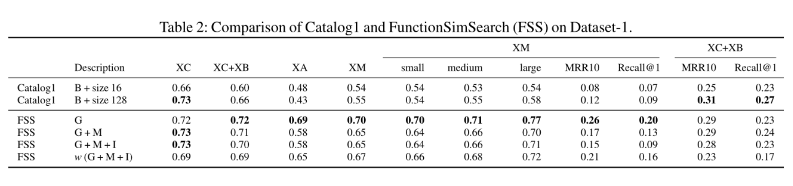

# How Machine Learning Is Solving the Binary Function Similarity Problem 
> 机器学习如何解决二级制代码相似性问题

> Marcelli A, Graziano M, Ugarte-Pedrero X, et al. How machine learning is solving the binary function similarity problem[C]//31st USENIX Security Symposium (USENIX Security 22). 2022: 2099-2116.

* 网安四大顶会之一
* 当前被引用数：4

## Summary

- 这是一篇发表在2022的顶会综述，针对现在机器学习在二进制代码相似检测的研究方向，选取10个典型方法，使用相同的框架，旨在更加公平清楚看到每个算法是否真正意义上进行了现状改善。

## Milestones of this field

- Asm2Vec：代码嵌入，基于word2vec
> [14]Steven H. H. Ding, Benjamin C. M. Fung, and Philippe Charland. Asm2V ec: Boosting Static Representation Robustness for Binary Clone Search against Code Obfuscation and Compiler Optimization. In 2019 IEEE Symposium on Security and Privacy (SP), pages 472–489, San Francisco, CA, USA, May 2019. IEEE.

- 另一篇基于word2vec的代码嵌入
> [64]Kimberly Redmond, Lannan Luo, and Qiang Zeng. A cross-architecture instruction embedding model for natural language processing-inspired binary code analysis. In NDSS Workshop on Binary Analysis Research (BAR), 2019.

- 和`word2vec`相关的两篇论文
> [52] Tomas Mikolov, Kai Chen, Greg Corrado, and Jeffrey Dean. Efficient estimation of word representations in vector space. 2013.     
[53] Tomas Mikolov, Ilya Sutskever, Kai Chen, Greg S Corrado, and Jeff Dean. Distributed representations of words and phrases and their compositionality. Advances in neural information processing systems, 26:3111–3119, 2013.

-  `Sequence to sequence encoder-decoder`模型
> [69]Ilya Sutskever, Oriol Vinyals, and Quoc V Le. Sequence to sequence learning with neural networks. In Advances in neural information processing systems, pages 3104–3112, 2014.

- 使用`Sequence to sequence encoder-decoder`模型的论文
> [49] Luca Massarelli, Giuseppe Antonio Di Luna, Fabio Petroni, Leonardo Querzoni, and Roberto Baldoni. Safe: Self-attentive function embeddings for binary similarity. In Proceedings of Conference on Detection of Intrusions and Malware & Vulnerability Assessment (DIMVA), 2019.
[80] Xiaochuan Zhang, Wenjie Sun, Jianmin Pang, Fudong Liu, and Zhen Ma. Similarity Metric Method for Binary Basic Blocks of Cross-Instruction Set Architecture. In Proceedings 2020 Workshop on Binary Analysis Research, San Diego, CA, 2020. Internet Society.
[82] Fei Zuo, Xiaopeng Li, Patrick Y oung, Lannan Luo, Qiang Zeng, and Zhexin Zhang. Neural Machine Translation Inspired Binary Code Similarity Comparison beyond Function Pairs. Proceedings 2019 Network and Distributed System Security Symposium, 2019. arXiv: 1808.04706.

- `BERT`
> [12] Jacob Devlin, Ming-Wei Chang, Kenton Lee, and Kristina Toutanova. BERT: Pre-training of Deep Bidirectional Transformers for Language Understanding. In Proceedings of the 2019 Conference of the North American Chapter of the Association for Computational Linguistics: Human Language Technologies, V olume 1 (Long and Short Papers), pages 4171–4186. Association for Computational Linguistics, 2019.

- `OrderMatters`：使用在四个任务上预训练的BERT模型来生成基本块嵌入
> [78] Zeping Y u, Rui Cao, Qiyi Tang, Sen Nie, Junzhou ouang, and Shi Wu. Order Matters: Semantic-Aware Neural Networks for Binary Code Similarity Detection. Proceedings of the AAAI Conference on Artificial Intelligence, 34(01):1145–1152, April 2020.
- `Trex`：使用**分层变换器**和**屏蔽语言模型任务**来学习近似的程序执行语义，然后将学到的知识用于识别语义相似的功能
> [60] Kexin Pei, Zhou Xuan, Junfeng Yang, Suman Jana, and Baishakhi Ray. Trex: Learning execution semantics from micro-traces for binary similarity. arXiv preprint arXiv:2012.08680, 2020.

- 图神经网络变体（GMN）
>[40] Yujia Li, Chenjie Gu, Thomas Dullien, Oriol Vinyals, and Pushmeet Kohli. Graph matching networks for learning the similarity of graph structured objects. In International conference on machine learning, pages 3835–3845. PMLR, 2019.
[43] Xiang Ling, Lingfei Wu, Saizhuo Wang, Tengfei Ma, Fangli Xu, Alex X Liu, Chunming Wu, and Shouling Ji. Hierarchical graph matching networks for deep graph similarity learning. arXiv preprint arXiv:2007.04395, 2020.

- 使用`CG`
> [44] Bingchang Liu, Wei Huo, Chao Zhang, Wenchao Li, Feng Li, Aihua Piao, and Wei Zou. αdiff: cross-version binary code similarity detection with dnn. In Proceedings of the 33rd ACM/IEEE International Conference on Automated Software Engineering, pages 667–678, 2018.
[48] Luca Massarelli. Code for the paper Investigating Graph EmbeddingNeural Networks with Unsupervised Features Extraction for BinaryAnalysis. https://github.com/lucamassarelli/Unsupervised
-Features-Learning-For-Binary-Similarity.

- Vulseeker：通过数据流进行分析
> [25] Jian Gao, Xin Yang, Ying Fu, Y u Jiang, and Jiaguang Sun. VulSeeker: a semantic learning based vulnerability seeker for cross-platform binary. In Proceedings of the 33rd ACM/IEEE International Conference on Automated Software Engineering - ASE 2018, pages 896–899, Montpellier, France, 2018. ACM Press.

- [Gemini](https://dl.acm.org/doi/abs/10.1145/3133956.3134018)：第一个利用具有Siamese体系结构的GNN来学习函数相似性的方法
> [76]Xiaojun Xu, Chang Liu, Qian Feng, Heng Yin, Le Song, and Dawn Song. Neural network-based graph embedding for cross-platform binary code similarity detection. In Proceedings of the 2017 ACM SIGSAC Conference on Computer and Communications Security, CCS ’17, page 363–376, New Y ork, NY , USA, 2017. Association for Computing Machinery.

### 10个具有代表性的方法如下：
1. [Bytes fuzzy hashing：Catalog1](https://www.xorpd.net/pages/fcatalog.html):基于MinHash局部敏感哈希
> [74]  xorpd. FCatalog. https://www.xorpd.net/pages/fcatalog.htm

2. [CFG fuzzy hashing: FunctionSimSearch](https://googleprojectzero.blogspot.com/2018/12/searching-statically-linked-vulnerable.html)：该哈希结合了从CFG、助记符和程序集代码中提取的`graphlets（最小链接、非同构等）`
> [18] Thomas Dullien. Searching statically-linked vulnerable libraryfunctions in executable code . https://googleprojectzero.blogspot.com/2018/12/searching-statically-linked-vulnerable.html.
3. [Attributed CFG and GNN: Gemini](https://dl.acm.org/doi/abs/10.1145/3133956.3134018)：第一个利用具有Siamese体系结构的GNN来学习函数相似性的方法
> [76] Xiaojun Xu, Chang Liu, Qian Feng, Heng Yin, Le Song, and Dawn Song. Neural network-based graph embedding for cross-platform binary code similarity detection. In Proceedings of the 2017 ACM SIGSAC Conference on Computer and Communications Security, CCS ’17, page 363–376, New Y ork, NY , USA, 2017. Association for Computing Machinery.
4. [Attributed CFG, GNN, and GMN: Li et al. 2019](http://proceedings.mlr.press/v97/li19d.html)
> [40] Yujia Li, Chenjie Gu, Thomas Dullien, Oriol Vinyals, and Pushmeet Kohli. Graph matching networks for learning the similarity of graph structured objects. In International conference on machine learning, pages 3835–3845. PMLR, 2019.
5. [IR, data flowanalysis and neural network: Zeek](https://dl.acm.org/doi/abs/10.1145/3264820.3264821)
> [67] Noam Shalev and Nimrod Partush. Binary Similarity Detection Using Machine Learning. In Proceedings of the 13th Workshop on Programming Languages and Analysis for Security - PLAS ’18, pages 42–47, Toronto, Canada, 2018. ACM Press.
6. [Assembly code embedding: Asm2Vec](https://ieeexplore.ieee.org/abstract/document/8835340/)：完全无监督、在**单一体系结构**实验中获得了最先进的结果
> [14] Steven H. H. Ding, Benjamin C. M. Fung, and Philippe Charland. Asm2V ec: Boosting Static Representation Robustness for Binary Clone Search against Code Obfuscation and Compiler Optimization. In 2019 IEEE Symposium on Security and Privacy (SP), pages 472–489, San Francisco, CA, USA, May 2019. IEEE.
7. [Assembly code embedding and self-attentive encoder:SAFE](https://link.springer.com/chapter/10.1007/978-3-030-22038-9_15)：**seq2seq模型**的代表
> [49] Luca Massarelli, Giuseppe Antonio Di Luna, Fabio Petroni, Leonardo Querzoni, and Roberto Baldoni. Safe: Self-attentive function embeddings for binary similarity. In Proceedings of Conference on Detection of Intrusions and Malware & Vulnerability Assessment (DIMVA), 2019.
8. [Assembly code embedding, CFG and GNN: Massarelli et al., 2019](https://rev.fish/bar2019/pdfs/bar2019-paper20.pdf)
> [45] Luca Massarelli, Giuseppe A. Di Luna, Fabio Petroni, Leonardo Querzoni, and Roberto Baldoni. Investigating Graph Embedding Neural Networks with Unsupervised Features Extraction for Binary Analysis. In Proceedings 2019 Workshop on Binary Analysis Research, San Diego, CA, 2019. Internet Society.
9. [CodeCMR](https://proceedings.neurips.cc/paper/2020/hash/285f89b802bcb2651801455c86d78f2a-Abstract.html)/[BinaryAI](https://github.com/binaryai/sdk)
> [79] Zeping Y u, Wenxin Zheng, Jiaqi Wang, Qiyi Tang, Sen Nie, and Shi Wu. Codecmr: Cross-modal retrieval for function-level binary source code matching. Advances in Neural Information Processing Systems, 33, 2020.
> [70] Tencent. BinaryAI Python SDK. https://github.com/binaryai/ sdk.
10. [Trex](https://arxiv.org/abs/2012.08680):构建在**转换器(NLP中最先进的深度学习模型)**之上
> [60] Kexin Pei, Zhou Xuan, Junfeng Yang, Suman Jana, and Baishakhi Ray. Trex: Learning execution semantics from micro-traces for binary similarity. arXiv preprint arXiv:2012.08680, 2020.
## Research Objective(s) of this field
- 相似：由相同的源代码编译的，与编译器、版本、体系架构等无关
- 相似的粒度
    - 整个程序
    - 函数
    - 基本块
- 相似性方法
    - Fuzzy hashes and embeddings.
    - Code embeddings
    - Graph embeddings
## Background / Problem Statement of this field

- 研究背景研究意义
    1. 逆向工程中处理静态链接、没有符号的二进制，利用二进制代码相似性将位置函数与向前数据库中标记的函数进行匹配，从而节省资源
    2. 检测和修补漏洞
- 待解决问题
    1. 在使用相同数据集、相同度量的情况下，如何进行方法的比较
    2. 与模糊哈下相比，机器学习的主要贡献是什么
    3. 不同的特征集的作用
    4. 不同任务中，不同的方法是否更加有效
    5. 跨体系结构的比较是否更加复杂
- 挑战
    1. 已有研究结果可用性差、可重复性差
    2. 评估结果不透明

## Method(s) of this field

###  函数相似性度量
- Direct vs. indirect 比较
    - Direct：通过「原始输入数据」或者「提取的特征」直接进行比较。
        - 当这些特征无法直接使用简单度量方法时，使用机器学习来判断，例如使用朴素贝叶斯、卷积神经网络、图匹配网络(GMN)、正则前馈神经网络或它们的组合等
    - indirect：将`特征`映射到一个低维向量，进行距离比较，如欧氏距离或者余弦距离
- Fuzzy hashes and embeddings
    - 使用哈希思想，如模糊哈希进行度量。但是不太适合函数相似性。有更适合的算法FunctionSimSearch进行比较
    > Thomas Dullien. Searching statically-linked vulnerable library functions in executable code . https://googleprojectzero.blogspot.com/2018/12/searching-statically-linked-vulnerable.html.
    - embeddings：一个**低维**空间
        - 机器学习模型的目标是**学习如何生成嵌入**，使相似函数之间的相似性最大化，并使不同函数之间的相似性最小化。
- Code embeddings：将汇编代码视为文本来解决二进制函数相似性问题
    - 主要采用`NLP`相关技术。利用`NLP`技术处理`streams of tokens`（标识流，如指令、助记符、操作数、规范化指令）
    - 每个代码块输出一个embeddings，为每条指令输出一个embeddings，或者both
    - 受到它们可以处理的不同指令数量(所谓的*词汇表不足问题*(OOV))和可作为模型输入的指令的最大数量的影响
    1. 基于**word2vec**
        - asm2vec[2019]
        - 可以同时在不同的指令集上训练，学习不同语言的语法（**但不能跨语言映射语义**），或者它们可以应用在**中间语言**之上
    2. 基于**seq2seq encoder-decoder**模型
        - 将**不同架构的语义映射到同一嵌入空间**，从而学习跨架构的相似性 
    3. 基于`BERT`  
        - NLP中最先进的基于变换器的预训练模型
        - OrderMatters和Trex
- Graph embeddings：进行图嵌入的计算的方式
    - 使用图神经网络
    - 图神经网络变体（GMN）
### 函数的表示
> 按照抽象级别排序
1. 原始字节。
    - Catalog1
2. 反汇编
    - 汇编指令:Asm2Vec和Trex
    - 增加额外计算度量
        - 算术汇编指令的数量
3. 正则化后的汇编    
    - 汇编规范化。减少词汇量，将统一操作的所有可能的变化汇聚成一个单一的表示
4. 函数的中间表示
    - LLVM，VEX， IDA microcode
5. 结构特征
    - CFG、ACFG、tracelets (CFG中连续基本块的序列)
    - 寄存器流图
    - 调用图
6. 数据流分析
    - 数据流的依赖关系计算程序切片，然后规范化
    - Vulseeker
7. 动态分析
8. 符号执行

### 选取典型算法
- 选择标准
    - 可扩展性和现实世界的适用性
    - 代表性的方法而不是论文
    - 覆盖不同的研究面
    - 最新趋势
### 系统性总结

- 标志解析
    - [PL]：编程语言
    - [ML]：机器学习
    - [SE]：软件工程
    - [Mono]：单一架构
    - [Cross]：跨架构

- Y轴为发表时间，X轴显示不同类型的输入，不同颜色代表相似度度量不同的分类（模糊哈希、图嵌入和代码嵌入）

            

- 按照团体分块，边代表两边进行了结果的比较

            

### 评估过程
- 实验环境
    - Ubuntu 18.04
    - Intel Xeon Gold 6230(80虚拟核，2.10 GHz)
    - 128GB DDR4 RAM
    - Nvidia RTX2080 Ti GPU (1350MHz, 11GB GDDR6, 13.45 TFLOPS FP32)
- 特征提取工具：IDA Pro 7.3，Capstone和NetworkX
- 神经网络模型
    - Tensorflow 1.14
    - Trex：构建在Fairseq上
    - Gensim实现Asm2Vec并运行指令嵌入模型
- 六种不同类型的任务：

    - (1) XO：函数对有不同的优化，但编译器、编译器版本和架构相同。
    - (2) XC：函数对有不同的编译器、编译器版本和优化，但架构和位数相同。
    - (3) XC+XB：函数对有不同的编译器、编译器版本、优化和位数，但架构相同。
    - (4) XA：函数对具有不同的架构和位数，但相同的编译器、编译器版本和优化。
    - (5) XA+XO：函数对具有不同的架构、位数和优化，但编译器和编译器版本相同。
    - (6) XM：函数对来自任意架构、位数、编译器、编译器版本和优化。
### 数据集

- Dataset-1. ClamAV, Curl, Nmap, OpenSSL, Unrar, Z3, Zlib
- Dataset-2：Binutils, Coreutils, Diffutils, Findutils, GMP, ImageMagick, Libmicrohttpd, LibTomCrypt, PuTTy, SQLite
- 针对测试集，作者还考虑了不同的编译器、不同的编译优化选项、不同的架构的影响，根据这些配置来进行了多组测试样例的生成。
- 使用datasset-1来训练机器学习模型，并使用两个数据集来测试评估的方法。

### Fuzzy-hashing Comparison
- 对比`Catalog1`和`FunctionSimSearch`             

          

- B:原始字节
- size 16/size 128：签名大小
- G：graphlets
- M：mnemonics 助记符
- I：immediates 即时数

### Machine-learning Models Comparison

- 在针对使用的机器学习模型的评估中， Graph Matching Networks (GMN) 效果最优：

          

           
   
- **Comparing Trex**:
    - 在XO任务上，Trex与Asm2Vec以及其他word2vec变体具有相同的AUC和相似的MRR10和recall@1，略低于GNN和GMN
    - Trex在XA和XA+XO任务(跨架构)中也保持了相同的性能
- Comparing different GNNs：
    - Li等人的GNN变体在所有任务中都比Gemini使用的GNN (s2v)有显著的改进
- Comparing different feature set in GNN (s2v)：
    - 更复杂和更难提取的特征不一定优于更基本的表示
- 文本编码器建模功能
    - SAFE需要面对词汇量不足(OOV)的挑战
- Asm2Vec and other paragraph2vec models
    - 结果受到指令词汇表的大小、随机行走的次数等因素强烈影响
- 效率比较
    - 在推理时间中，SAFE速度最快   
    - NLP模型中，Trex有较长推理时间、Asm2Vec最慢
- CodeCMR/BinaryAI evaluation.       
                 
               

    - CodeCMR/BinaryA效率普遍由于GNN
### 漏洞挖掘
- 具有操作码特性的GMN模型是性能最好的
- Trex和Li等人的GNN变体提供了第二好的结果

## General Workflow(s) of this field

> 本领域解决典型问题的基本流程，流程图或流程示意图是推荐的综述手段。

## Evaluation

### 评估方法
- ROC&AUC
- 平均倒数排名(MRR)
- 不同K阈值下的召回率(Recall@K)
### 开源代码
> Zeek和Asm2Vec这两种方法已经被完全重新实现
[17] Thomas Dullien. FunctionSimSearch. https://github.com/googleprojectzero/functionsimsearch.
[21] Yujia Li, Chenjie Gu, Thomas Dullien, Oriol Vinyals, Pushmeet Kohli. Graph Matching Networks for Learning the Similarity of Graph Structured Objects. ICML 2019
[48] Investigating Graph Embedding Neural Networks with Unsupervised Features Extraction for Binary Analysis. https://github.com/lucamassarelli/Unsupervised-Features-Learning-For-Binary-Similarity.
[50] Luca Massarelli and Giuseppe Antonio Di Luna. Code for the paper SAFE: Self-Attentive Function Embeddings for binary similarity.https://github.com/gadiluna/SAFE.
[59] Kexin Pei, Zhou Xuan, Junfeng Yang, Suman Jana, and Baishakhi Ray.Code for the paper TREX: Learning Execution Semantics from Micro-
Traces for Binary Similarity. https://github.com/CUMLSec/trex.
[74] xorpd. FCatalog. https://www.xorpd.net/pages/fcatalog.html.
[75] Gimini.Xiaojun Xu. DNN Binary Code Similarity Detection. https://github.com/xiaojunxu/dnn-binary-code-similarity.

## Future Works

- Li等人的GNN，在六个评估任务中优于所有其他变体，实现了类似于可扩展性较低的GMN版本的性能。
- Zeek 在large functions上有较高的AUC
- Asm2Vec的性能并不比其他模型好多少
- 当多个编译变量同时更改时，模糊哈希方法是无效的
---
- 与更简单的模糊哈希方法相比，新的机器学习解决方案的主要贡献是什么?
    - 与模糊哈希方法不同的是，即使在多个编译变量同时发生变化时，机器学习模型也能实现较高的精度，而且它们受益于构建在编译选项定义的可靠基础真理之上的大型训练数据集的优势。
    - Siamese体系结构与基于边际损失的方法结合使用，结果得到显著改善
    - GNN是一种有效的函数编码器，可以与其他指令级编码器结合使用
- 不同的特征集的作用是什么?
    - **模型的选择**、**损失函数**与**输入的特征**都非常重要    
    - 使用**基本块状特征(如ACFG)** 可以提供更好的结果
- 在不同的任务中，不同的方法是否更有效?特别是，跨体系结构的比较是否比单一体系结构更加困难?
    - 使用最通用的任务数据(XM)可以使每个任务的性能总体上接近最佳
    - Catalog1，Asm2Vec和the two paragraph2vec模型仅限于相同的体系结构比较。
- **在设计新技术的未来方向上，有没有更有前途的研究方向?**
    - GNN与汇编指令编码器的结合是一个方向
    - 结合中间表征和数据流信息的效果也必须加以研究
    - 训练策略和损失函数也会影响性能

## Tags

- 2022，网安四大顶会，综述，二进制代码相似性

## 参考资料

- [chencwx的阅读笔记](http://git.a101e.lab:20080/chencwx/papers/-/blob/master/%E8%AE%BA%E6%96%87%E9%98%85%E8%AF%BB/How%20Machine%20Learning%20Is%20Solving%20the%20Binary%20Function%20Similarity%20Problem/notes-Binary%20Function%20Similarity%20Problem.md)
- [原文工具和技术信息、数据集等，对应引文47](https://github.com/Cisco-Talos/binary_function_similarity)