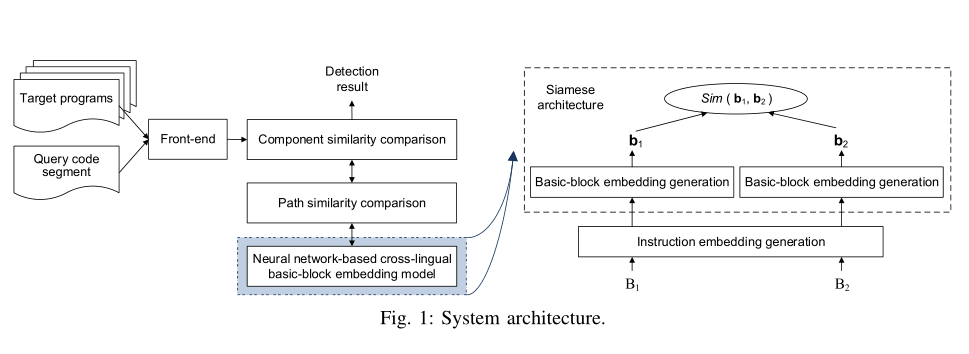
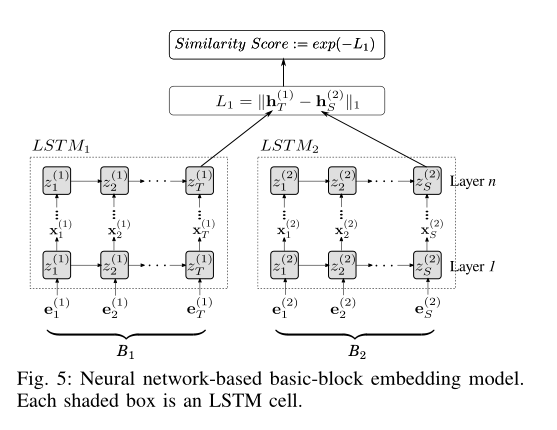
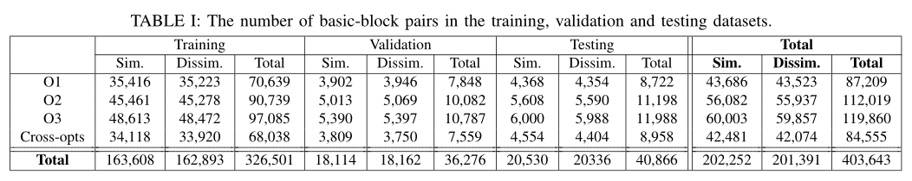
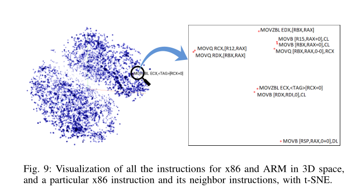
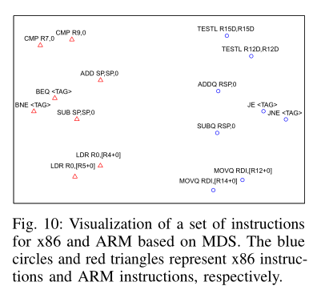
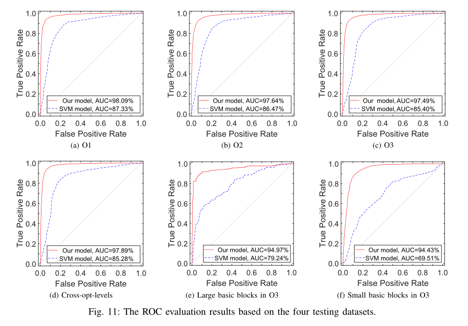
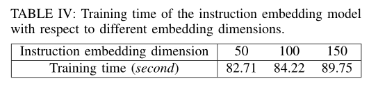

# 2019-Neural Machine Translation Inspired Binary Code Similarity Comparison beyond Function Pairs（受神经机器翻译启发的函数间二进制代码相似性比较）

> Zuo F, Li X, Young P, et al. Neural Machine Translation Inspired Binary Code Similarity Comparison beyond Function Pairs[C]//Network and Distributed Systems Security (NDSS) Symposium 2019. 2019.

* NDSS 四大网安顶会
* 当前被引用数：153
* 数据集，模型，评估结果：https://nmt4binaries.github.io

## Summary

- 以不同的观点来看待跨平台二进制代码相似性检测问题，指出以前的方法都是以函数级别来进行检测的，不能任意挑一代码段进行检测。
- 提出了跨体系结构代码【包含】问题的**第一个**解决方案
  - Genius和Gemini只能解决函数相似性问题，对于一部分代码包含在另一部分的函数中，或者是代码跨函边界时，就无法检测

- 这两个问题的解决方案有很多应用，例如跨架构漏洞发现和代码剽窃检测。

## Research Objective(s)

> 作者的研究目标是什么？

## Background / Problem Statement

> 研究的背景以及问题陈述：作者需要解决的问题是什么？

- 以不同的观点来看待跨平台二进制代码相似性检测问题，指出以前的方法都是以函数级别来进行检测的，不能任意挑一代码段进行检测。
- 为此，作者将跨平台二进制代码相似性检测问题分解为两个问题：
   - Problem Ⅰ：给一对不同指令集平台下的二进制基本块，判断其语义是否相似（等价问题）。
   - Problem Ⅱ：给定关键代码的片段，看它是包含在不同指令集的其他片段中出现（包含问题）。
- 针对第二个问题，给定一个代码组件，可以是函数的一部分也可以是一个函数集，来判断是否被包含在一个程序中，这是一个代码包含问题。现有针对该问题的方法只能解决相同的指令集架构，所以解决跨架构的代码包含问题是目前急需解决的问题。

## Method(s)

> 作者解决问题的方法/算法是什么？是否基于前人的方法？基于了哪些？

### 1 核心思想

- 利用NLP中Neural MachineTranslation (NMT)的思想将代码中的一条条指令看作单词，一个个基本块看作句子，将检测不同架构下两个基本块的语义相似性的任务转化为检测不同语言中两个句子语义的相似性。
- 利用Word2vec将指令嵌入，利用LSTM将基本块进行向量嵌入，可以学习到指令的特征和基本块间指令的依赖关系，通过测量两个基本块之间的嵌入距离来检测他们的相似度。
- 嵌入不仅可以对基本块语义进行编码，而且还可以捕获架构之间的语义关系。

### 2 总体流程图

- 如上图，分别在三层分析语义信息：基本块、CFG路径、代码。
- 模型的输入： 要查询的代码段和被查询的程序集合。
- Front-end： 反汇编二进制程序和构建控制流图CFG
- basic block embedding模块： Neural network-based cross-lingual model 来对每个basic block进行embedding，所有的embedding存在LSH(局部敏感哈希)数据库中。其中embedding分为 instruction embedding and a block embedding两个层次。
- Path Similarity comparison： 利用LCS (最长公共子序列)算法来比较两条Path的语义相似性。
- Componet similarity comparison: 探索多条路径所共同计算出的相似性得分。
- 相似性检测模块： 利用LSTM和Siamese生成相似性分数(0-1)，越接近1越相似。

### 3 Instruction Embedding Generation

- 提出了在进行Instruction embedding时面临的挑战：在机器翻译中，我们只需要使用大规模的语料训练一次就可以得到词嵌入，然后直接被其他人用。但是在这里，我们必须自己训练一个instruction embedding。还有像常量、字符串之类缺失词的嵌入生成。
- 定义block级别的指令流，其中bi为基本块B中指令
- 预处理训练数据： 为了解决缺失词的问题，对训练数据做如下处理：
（1）负号保留，但数字常量全替换成0
（2）字符串替换成 `<STR>`
（3）函数名替换成`<FOO>`
（4）其他符号常量全替换成`<TAG>`
- 然后使用word2vec里的skip-gram训练词向量。

### 4 Block embedding Generation

- 因为指令在不同的平台下具有不同的embedding，所以我们不能对其简单的累加获得block embedding。
- 为此搭建了如下的LSTM+Siamese网络来学习block embedding。

  

- 其中Siamese的网络输入为两个基本块B1和B2的instruction的embedding，而LSTM网络可以通过instruction embedding学习到block embedding。
- 但其中存在的困难如下： Siamese网络需要大量的训练数据对，但不同于Gemini所采用的针对函数级别做标签，这里要对基本块做标签。其难度体现为如下：1.没有可以暗示是否相似的基本块命名可以使用。2.即使两个基本块有两段代码编译而成，它们也可能相似或者不相似。

### 5 Path/Code Component Similarity Comparison

- 将CFG分解成许多的路径，在于目标程序的路径利用LCS(最长公共子序列)进行比较相似性分数。
- 一旦 Q 和目标 T 的起始 block 是一样的，那么我们就可以用 DFS 算法来寻找线性独立路径的集合。
  > 线性独立路径(linearly independent path): 指程序的一个执行路径(即有向图中初始节点到终止节点的一条路径)，并且至少拥有一条以上其它线性独立路径中没有的边。

### 6 Component Similarity Comparison

- 在这方面遇到的挑战是：如何正确的在target program中找到Query的起始block。解决方法如下：
  1. 首先所有基本块的embedding都存在LSH数据库中供我们查询。
  2. 我们从Query代码段的第一个基本块开始，在数据库中寻找target program中的语义相等基本块。
  3. 如果我们找到一个或多个语义相等基本块，我们就从此基本块开始发现路径。否则我们选择Query的第二个基本块作为起始块。
- Component similarity score：根据选择出的线性独立路径计算出相似性分数，并根据每个路径的query path的长度分配一个权重，最后的得分就是加权平均分。

## Evaluation

> 作者如何评估自己的方法？实验的setup是什么样的？感兴趣实验数据和结果有哪些？有没有问题或者可以借鉴的地方？

- 数据源使用Openssl等软件，并使用不同的平台、编译器、优化选项编译得来。具有标签。
  
  
- Instruction embedding 的定量分析：使用t-SNE对x86和ARM平台下的embedding做了可视化，结果显示有相同平台编译得到的embedding聚在一起。
  
  

- 相似的指令也聚类到了一起
  
  

- Accuracy of INNEREYE-BB ：使用DatasetⅠ来进行评估。并且与Gemini手动提取的特征作为对比，并使用SVM分类器进行分类，结果显示此方法提取特征的准确率更高，手动提取特征可能导致大量的语义信息丢失。

  

- Efficiency of INNEREYE-BB：使用具有6,199,651个指令的数据集Ⅰ做Instruction Embedding，可以看出花费时间很短。

  

## Conclusion

> 作者给出了哪些结论？哪些是 `strong conclusions`, 哪些又是 `weak conclusions`（即作者并没有通过实验提供 `evidence`，只在 `discussion` 中提到；或实验的数据并没有给出充分的 `evidence`）?「论文作者」自己指出的本文不足之处、`Future Works` 请记录在本小节。

## Cons

> 「当前论文笔记作者」指出的本文不足之处、`Future Works` 请记录在本小节。请从日后写综述、研究选题依据的角度，指出本文的不足之处，目的是为了给自己和实验室其他同学今后在当前研究方向继续深入指明一些可能的深入研究方向或改进思路。

> 对于综述类论文，本小节是可选的。

## Pros(optional)

> 通常本文的优点已经被论文作者自己在论文中讲清楚了，所以在上述论文笔记摘要中已写过的优点就不必在此重复。「当前论文笔记作者」认为被论文作者自己忽视的优点、贡献，可以在本小节记录。

## Notes(optional) 

> 不在以上列表中，但需要特别记录的笔记。例如英文书写模板，精美绘图所使用到的工具软件等。

## References(optional) 

> 列出相关性高的文献，以便之后可以继续 track 下去。

## Origin

> 给出指向你个人论文仓库的本篇论文阅读笔记原文链接。

## Tags

> 逗号分隔本文的所有标签，标签使用规范参见以下 `GitLab Issue 标签使用规范` 。

------ 以下内容仅为解释说明，请在提交时删除 ------

### GitLab Issue 标签使用规范

* 在不影响语义理解的前提下，标签关键词要尽可能短
* 优先选择已有标签，确实没有的情况下再 `新建标签`

#### 建议的标签列表

* 文献发表年份。例如 2021
* 检索收录情况：EI, SCI 
* 中科院 JCR 分区（针对 SCI 收录文献才需要标记）：SCI-1, SCI-2, SCI-3, SCI-4
* 关联实验室内项目简称（最近更新 2021-05-22）：Fuzz, CyberRange, osint4sn, SoftFP, MTD
    * 物联网漏洞挖掘：Fuzz
    * 靶场：CyberRange
    * 开源社区情报分析：osint4sn
    * SoftFP：软件指纹
    * 欺骗式防御：MTD
* 研究对象（不超过3个）。例如：IoT, 源代码 等
* 研究方法（不超过3个）。例如：综述, 动态分析, 静态分析, CNN 等
* 数据集（不超过3个）。例如： NB-15，MalwareZoo, VulDeePecker, LAVA-M 等

