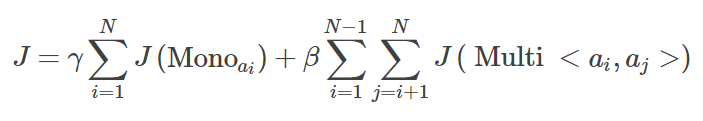
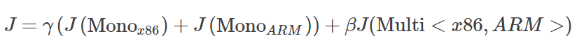
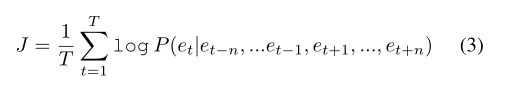
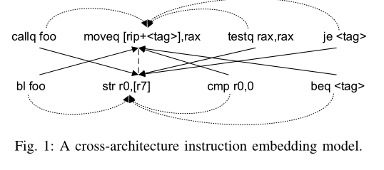
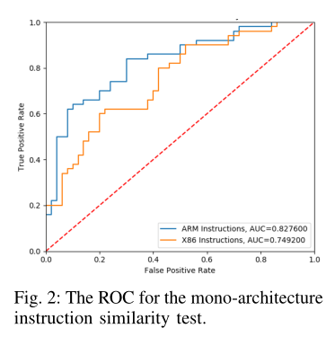
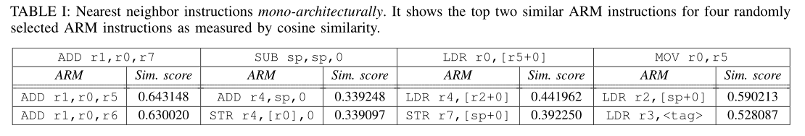
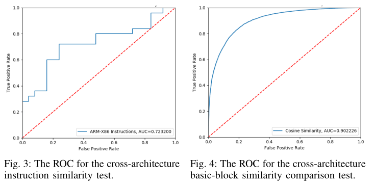

# A Cross-Architecture Instruction Embedding Model for Natural Language Processing-Inspired Binary Code Analysis（基于自然语言处理的二进制代码分析的跨体系结构指令嵌入模型）

> Redmond K, Luo L, Zeng Q. A Cross-Architecture Instruction Embedding Model for Natural Language Processing-Inspired Binary Code Analysis[C]//NDSS Workshop on Binary Analysis Research (BAR). 2019.

* 检索收录情况：SCI/EI
* 中科院 JCR 分区
* 当前被引用数：32
* 期刊：NDSS19 BAR workshop
* github开源地址：https://github.com/nlp-code-analysis/cross-arch-instr-model

## Summary

- 这篇文章算是INNEREYE-BB的续作，但是主要的提升点在于跨架构的指令嵌入。利用指令序列的上下文信息来学习同架构下指令的相似性，使用语义等价的指令序列对来学习跨机构下指令的相似性。

## Research Objective(s)

- 构建指令嵌入模型需要实现两个目标：单架构相似性目标，和跨架构语义相似性目标。
  - **单架构相似性**指的就是同一指令集内语义相近的指令在向量空间中的表征也相近。
  - **跨架构相似性**是指不同指令集之间语义相近的指令其在向量空间中的表征也相近。

## Background / Problem Statement

> 研究的背景以及问题陈述：作者需要解决的问题是什么？
- SG模型将每个单词作为输入，并预测与该单词对应的上下文，而CBOW模型将每个词的上下文作为输入，预测与该上下文对应的单词。

## Method(s)

> 作者解决问题的方法/算法是什么？是否基于前人的方法？基于了哪些？

## 概述

- 作者使用的跨架构指令嵌入方法借鉴了”Bilingual word representations with monolingual quality in mind”这篇文章中的联合学习方法，其主要包括单架构成分和多架构成分。
  - 单架构部分利用相同架构下输入指令序列的上下文共现信息；
  - 多架构部分从不同架构的指令序列对中学习语义等价的信息。
- 联合目标函数
  
  

- 在上式中，每个单架构成分Mono ai 为针对架构ai来捕捉其指令的聚类属性。J为目标函数。多架构成分Multi<ai,aj>被使用来学习多架构间的语义关系。超参数γ和β用来平衡这两个之间的影响。
- 例如，如果只考虑两个结构的目标函数的话，x86和arm，上面的联合目标函数就为
   
   

  >此工作中的指令序列是一个基本块，因为我们把指令看作单词，基本块看作句子。这里不采用函数为基本单位的原因是，函数中的指令并不是顺序执行的。
- 对指令进行预处理：
  - （1）将数值常量值替换为0，并保留负号。
  - （2） 字符串文字替换为＜STR＞。
  - （3） 函数名替换为FOO。
  - （4） 其他符号常量替换为<TAG>。

## 单架构部分目标函数

- 在处理单架构指令嵌入的目标函数时，作者利用了CBOW的训练方法，这里设当前指令et的上下文为其前n个和后n个指令， 那么根据CBOW模型， 我们所需要的目标函数就为

  

- 其中T为指令序列的长度，n为滑动窗口的大小。

## 多架构部分目标函数

- 这一部分作者仍然使用CBOW来进行学习，但是对CBOW进行了一些扩展。

  

- 如上图展示了跨机构指令嵌入模型的工作方法。首先输入一对分别在x86和arm编译下语义相等的基本块指令序列，为了能够进行跨架构的指令预测，作者使用一个架构下的上下文来预测另一个架构下的指令。
- 比如说上图，我们知道`moveq [rip+<tag>],rax`在arm下对等的指令为`str r0,[r7]`，我们使用arm下`str r0,[r7]`的上下文`bl foo and cmp r0,0`来预测`moveq [rip+<tag>],rax`。
- 但是这又同样引出了另一个问题:怎么样找到不同架构之间指令序列的对等关系呢？ 这里给出两种解决方案： 
  （1）假设不同架构的指令序列是一种线性对齐关系的，因此，在序列M中第i个位置上的指令对应的是序列N中第i×|N|/|M|个指令。 （2）通过指令中包含的操作码来确定指令间的对齐关系。
但是在此方法中，作者只采用了第一种方法。

## Evaluation

> 作者如何评估自己的方法？实验的setup是什么样的？感兴趣实验数据和结果有哪些？有没有问题或者可以借鉴的地方？

### 单架构指令相似性任务

- **指令相似性测试**： 作者手工创建了一些指令对，来测试这些指令对之间的相似性，并随机选择了50个相似、50个不相似对，其ROC曲线如图：

  

- **最近邻指令：**

  

### 跨架构指令相似性任务

  

## Conclusion

> 作者给出了哪些结论？哪些是 `strong conclusions`, 哪些又是 `weak conclusions`（即作者并没有通过实验提供 `evidence`，只在 `discussion` 中提到；或实验的数据并没有给出充分的 `evidence`）?「论文作者」自己指出的本文不足之处、`Future Works` 请记录在本小节。

## Cons

> 「当前论文笔记作者」指出的本文不足之处、`Future Works` 请记录在本小节。请从日后写综述、研究选题依据的角度，指出本文的不足之处，目的是为了给自己和实验室其他同学今后在当前研究方向继续深入指明一些可能的深入研究方向或改进思路。

> 对于综述类论文，本小节是可选的。

## Pros(optional)

> 通常本文的优点已经被论文作者自己在论文中讲清楚了，所以在上述论文笔记摘要中已写过的优点就不必在此重复。「当前论文笔记作者」认为被论文作者自己忽视的优点、贡献，可以在本小节记录。

## Notes(optional) 

> 不在以上列表中，但需要特别记录的笔记。例如英文书写模板，精美绘图所使用到的工具软件等。

## References(optional) 

> 列出相关性高的文献，以便之后可以继续 track 下去。

## Origin

> 给出指向你个人论文仓库的本篇论文阅读笔记原文链接。

## Tags

> 逗号分隔本文的所有标签，标签使用规范参见以下 `GitLab Issue 标签使用规范` 。

------ 以下内容仅为解释说明，请在提交时删除 ------

### GitLab Issue 标签使用规范

* 在不影响语义理解的前提下，标签关键词要尽可能短
* 优先选择已有标签，确实没有的情况下再 `新建标签`

#### 建议的标签列表

* 文献发表年份。例如 2021
* 检索收录情况：EI, SCI 
* 中科院 JCR 分区（针对 SCI 收录文献才需要标记）：SCI-1, SCI-2, SCI-3, SCI-4
* 关联实验室内项目简称（最近更新 2021-05-22）：Fuzz, CyberRange, osint4sn, SoftFP, MTD
    * 物联网漏洞挖掘：Fuzz
    * 靶场：CyberRange
    * 开源社区情报分析：osint4sn
    * SoftFP：软件指纹
    * 欺骗式防御：MTD
* 研究对象（不超过3个）。例如：IoT, 源代码 等
* 研究方法（不超过3个）。例如：综述, 动态分析, 静态分析, CNN 等
* 数据集（不超过3个）。例如： NB-15，MalwareZoo, VulDeePecker, LAVA-M 等

