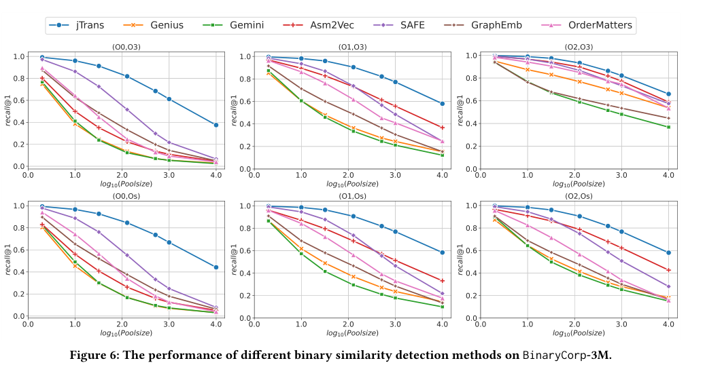

# Jtrans: Jump-aware transformer for binary code similarity detection

> Wang H, Qu W, Katz G, et al. Jtrans: Jump-aware transformer for binary code similarity detection[C]//Proceedings of the 31st ACM SIGSOFT International Symposium on Software Testing and Analysis. 2022: 1-13.

* 当前被引用数：10

## Summary

本片论文提出一个模型：Jtrans，主要是基于bert进行修改，在bert的基础上加上了**位置跳转信息**，以及将LSP任务替换为JTP（Jump Target Prediction）任务

**开源项目和数据集**：https://github.com/vul337/jTrans
## Research Objective(s)

- BSCD

## Background / Problem Statement

### 研究背景

- 传统的基于特征的方法
    - 基于动态特征：BinDiff [16]、BinHunt [23]、iBinHunt [46]
    - 基于CG/CFG图同构：genius
    - 通过I/O值：BinGo [5]、Blex [17] 和 Multi-MH [49]
    - 操作数分类或指令：BinClone、ILine [34]、MutantX-S [31]、BinSign [47] 和 Kam1n0 [13] 
    - 指令之间的编辑距离：Tracelet [11]和BinSequence [33]
    - 树/图的编辑距离：TEDEM [50] 和 XMATCH [20] 
    - 准确率低
- 基于机器学习的
    - 基于NLP的：asm2vec，safe
        - 仅仅考虑指令之间的顺序以及指令之间的关系，未考虑程序实际执行的信息
    - 基于GNN的：genius、Gemini
        - 仅仅依赖CFG，会忽略基本块中指令的语义
    - GNN+NLP
- 数据集
    - 现有数据集不够大和多样性
## Method(s)

> 基于bert

           

### 1. 预处理
> 防止oov问题

1. `<str>`替换字符串
2. `<const>`替换厂里
3. `<function>`替换内部函数调用名
4. `<JMP_XXX>`替换源token（跳转的绝对或者相对地址）

### 2. Modeling jump instructions

> 让跳转指令的两部分代码上下文化；token之间的距离越大，通常表示相互影响越弱，然而跳转指令将代码中可能相距甚远的区域结合在一起

- 通过**参数共享**的方式实现跳转指令的上下文链接：
    - 对于每个跳转对，源token的embedding作为目标token的位置embedding

### 3. 预训练

#### 3.1 MLM任务

           

- 80%的mask+10%的随机替换+10%不变  

#### 3.2 Jump Target Prediction
        

### 4. fine-tuning

        

## Evaluation

### 数据集

          

- 基于 ArchLinux [2] 官方存储库和 Arch 用户存储库 [3] 构建数据集
- 源码选择：C++、C
- 自修改版本的gcc、g++、clang、clang++

### BSCD

   
> fine-tuning的提升还蛮多
### Poolsize 对性能的影响

          

随着池大小的增加，所有基线的相对性能都比 jTrans 差，对于非常小的池大小（例如 2），SAFE 和 Asm2Vec 等 SOTA 基线的性能几乎与 jTrans 相同

### 漏洞搜索

        

###  Jump-aware Design

        

## Conclusion

- 目前Jtrans只支持x86架构
- 未来使用 jTrans 来有效检测区块链和智能合约中的漏洞

## References(optional) 

数据集来源：ArchLinux 的官方存储库 [2] 和 Arch 用户存储库 (AUR) [3]
> [2] Archlinux. 2021. Arch linux. Retrieved August 8, 2021 from https://archlinux.org/packages/
> [3] Archlinux. 2021. Arch User Repository. Retrieved August 8, 2021 from https: //aur.archlinux.org/

应用到软件供应链安全分析[27]
> [27] Armijn Hemel, Karl Trygve Kalleberg, Rob Vermaas, and Eelco Dolstra. 2011.Finding software license violations through binary code clone detection. In Proceedings of the 8th Working Conference on Mining Software Repositories. 63–72.

[62]：基于NLP和基于GNN的特征简单组合不能产生最佳结果
> [62] Zeping Yu, Rui Cao, Qiyi Tang, Sen Nie, Junzhou Huang, and Shi Wu. 2020. Order matters: Semantic-aware neural networks for binary code similarity detection. In Proceedings of the AAAI Conference on Artificial Intelligence, Vol. 34. 1145–1152.

## Tags

2022, BSCD, Bert, BinaryCorp(数据集)
