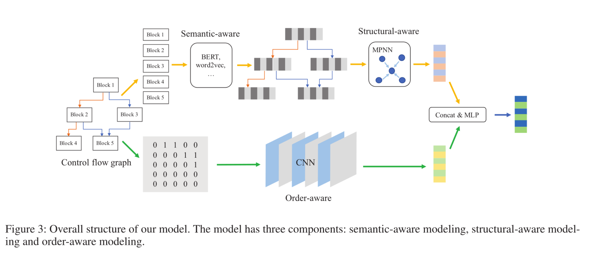
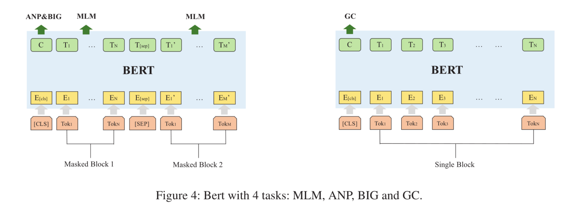
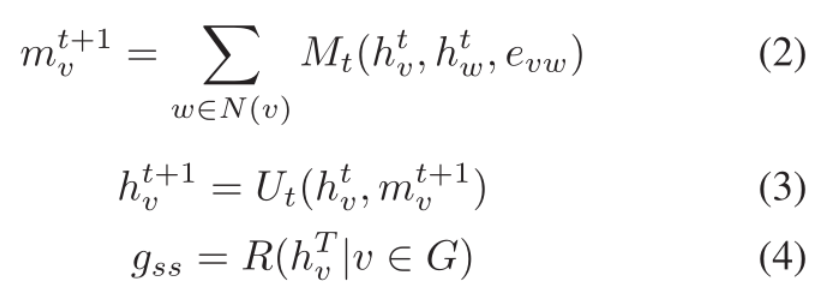
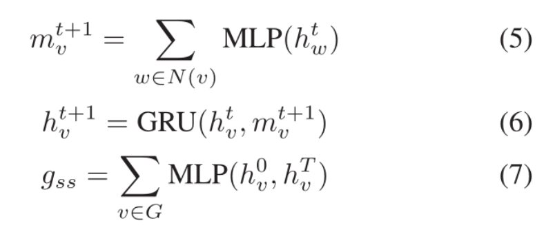
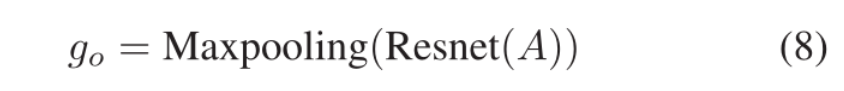
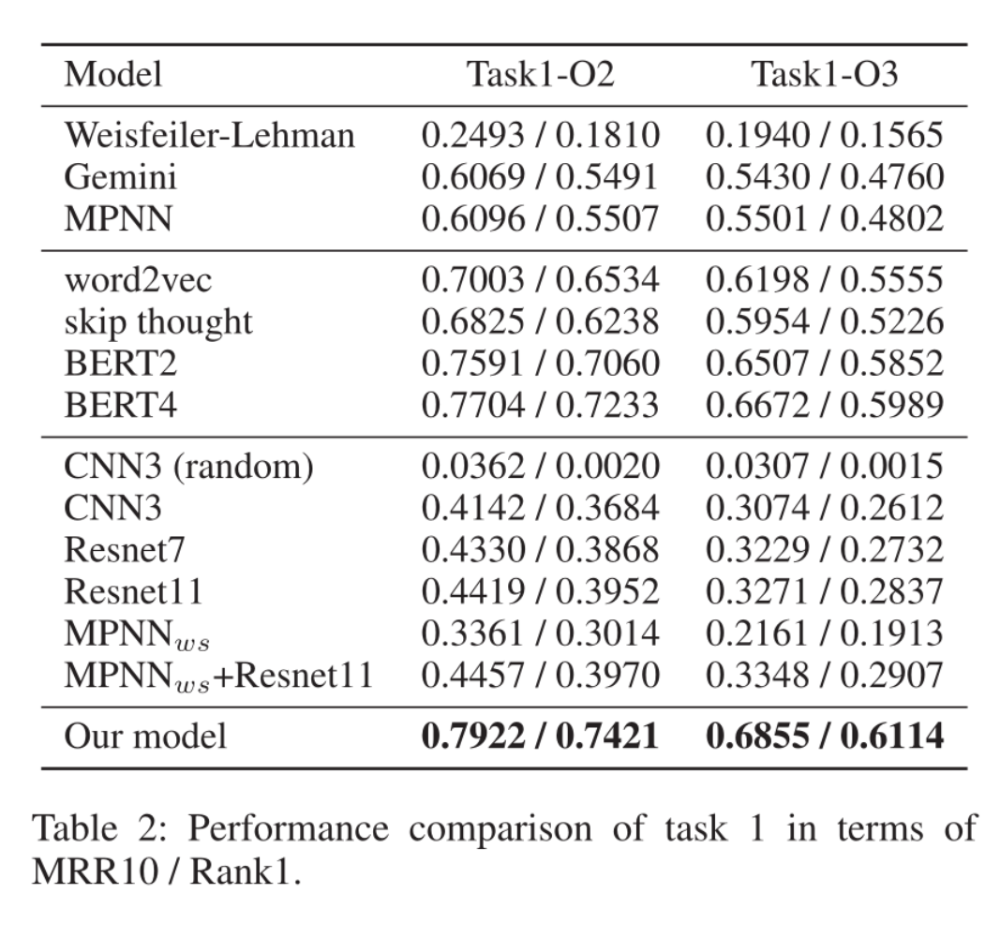
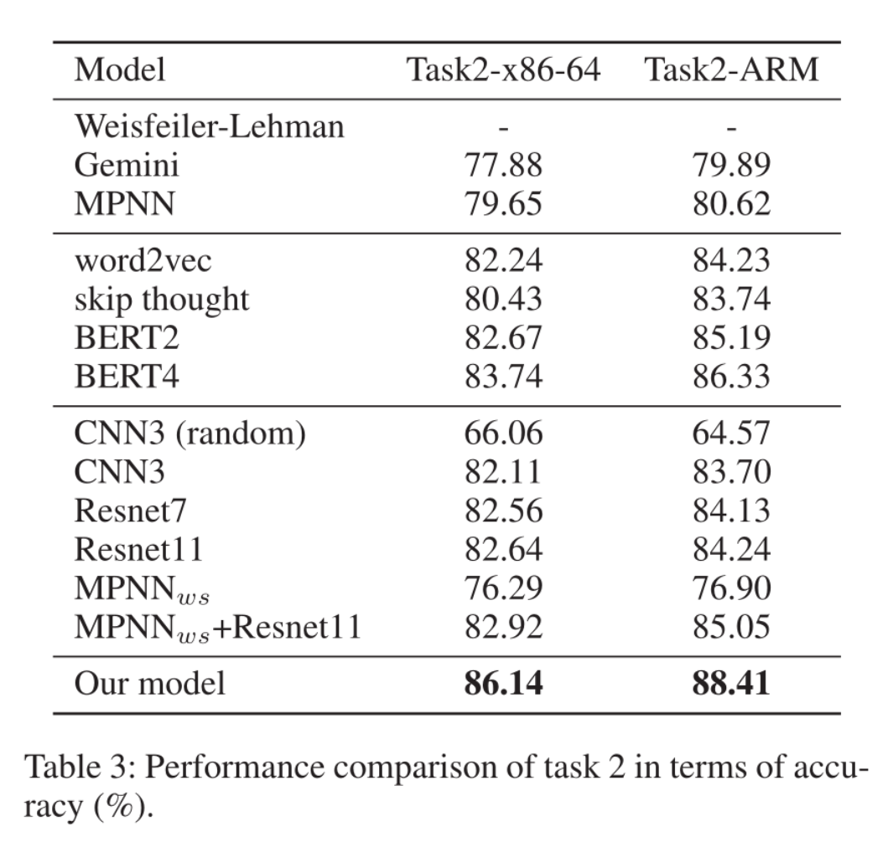

# Order Matters: Semantic-Aware Neural Networks for Binary Code Similarity Detection

> Yu Z, Cao R, Tang Q, et al. Order matters: Semantic-aware neural networks for binary code similarity detection[C]//Proceedings of the AAAI Conference on Artificial Intelligence. 2020, 34(01): 1145-1152.

* CCF A
* 当前被引用数：111

## Summary

本文提出的模型主要分为三个部分：**语义感知模型、结构感知模型、顺序感知模型**。语义感知模型主要是基于Bert，并提出了四个预训练任务：**MLM任务(token level)**、**相邻节点预测任务(block level)**、**图内块任务(graph level)**、**图分类任务((graph level)**。结构感知模型主要是基于**MPNN**。顺序感知模型主要是在**邻接矩阵上应用CNN**。

> 因为对图嵌入相关模型了解不太多，所以有一些疑惑顺序感知模型和结构感知模型之间的功能或者说贡献是否有重复，结构感知模型中获取的信息是否已经包含了顺序信息。通过实验结果来看Resnet11结果为0.4419 / 0.3952，MPNNws+Resnet11的结果为0.4457 / 0.3970，有提高，但是这提高也并不是很明显

## Research Objective(s)

- 基于「语义」信息进行二进制代码相似性检测

## Background / Problem Statement

- 研究现状
  - 基于图匹配：慢且准确率低
  - 基于图神经网络（Gemini）：高效且准确
    - 通过手动选择的特征，将基本块转化成低维向量，会损失语义信息
    - 节点间的顺序也占有重要因素

研究的背景以及问题陈述：作者需要解决的问题是什么？

## Method(s)

### 整体框架

                  

整体框架分为三个部分：

1. 语义感知模型
2. 结构感知模型
3. 舒徐感知模型

#### 语义感知模型

> 基于Bert

                     

语义感知模型是基于Bert模型，并提出了四个预训练任务：MLM, ANP , BIG 和 GC，分别对应着token级别任务、块级别任务和两个图级别任务            

1.  **MLM任务: token level**
2. **ANP(Adjacency node prediction，相邻节点预测): block level**。预测两个块是不是相邻节点
3. **BIG(block inside graph，图内块任务)**：graph level。判断两个节点是否在同一个图上（获取块与图之间的关系，对graph embedding有利处）
4.  **GC(graph classification，图分类)**：graph level。对不同平台、不同架构或不同优化选项中的块进行分类

#### 结构感知模型

> 基于MPNN

MPNN模型函数

                                    

- 消息函数：M
- 更新函数：U
- 更新函数U运行的时间步长：T 
- 读出函数：R

本文使用的模型：              

              

- G:整个图
- v：图中节点
- N(v):节点v的邻居节点
- 消息函数M：使用MLP
- 更新函数U：使用GRU
- 读出函数R：使用求和函数（已证明最佳）

#### 顺序感知模型

> 基于CNN，因为	CNN具有平移不变性

- CFG变化与图片的关系
  - 节点顺序如果没有发生变化：在局部范围内，节点关系没有发生变化（平移不变性）
  - 节点顺序如果发生变化：和图片缩放产生的效果类似（尺度不变性）
  - 使用CNN，无需对图片进行裁剪
- 实际使用模型：Resnet              

                 

## Evaluation

### 数据集

- 跨平台任务
  - 平台：X86-64和arm
  - 编译器：gcc
  - 编译选项：O2,O3
- 图分类任务：
  - 平台：X86-64和arm
  - 编译器：gcc
  - 编译选项：O0~O3

### 实验

- 模型实现：tensorflow，优化器：Adam
- 参数
  - BERT embedding维数：128
  - 整个图的embedding维数：64
  - BERT最大句子长度：128
  - transformer深度：12
  - feed-forward dim：256
  - 学习率：0.0001
  - batch size：10
  - iteration time steps：5

### 评判标准

任务1：寻找相似函数

- Rank1：真正配对的函数对是否具有最高分数
- mean reciprocal rank (平均倒数排名，MRR)：使用第一个正确答案的排名的乘法倒数

任务2：分类任务

- 准确率

	### 实验结果

#### 任务1：相似函数检测

                  

#### 任务2：图分类

            

#### 结果分析

- 基于语义的模型表现效果要好于顺序模型
- Bert效果优于其他语义模型
- graph-level的任务对结果提供了1%-2%的贡献
- 将MPNN和CNN结合使用可以获得更好的结果

## Conclusion

提出了一个新的框架，包括语义感知模型、结构感知模型、顺序感知模型。

- 为了捕捉语义特征，我们提出了对具有两个原始任务MLM和ANP以及两个额外的图级任务BIG和GC的CFG块进行BERT预训练
- 使用MPNN来提取结构信息
- 基于CNN的模型来捕获节点顺序信息

此模型在跨平台相似函数检测和图分类任务上都优于当时的技术

## Tags

2020，CCF A，二进制相似性检测，跨平台
