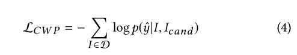
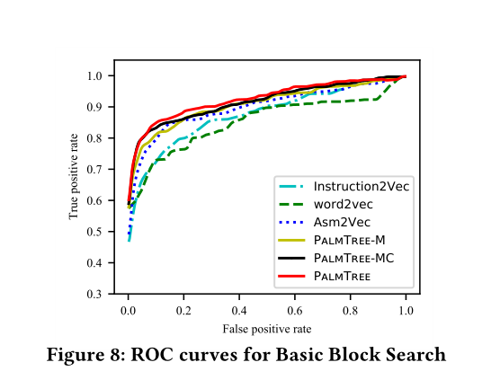

# PalmTree: Learning an Assembly Language Model for Instruction Embedding

> [1] LI X, QU Y, YIN H. PalmTree: Learning an Assembly Language Model for Instruction Embedding[C/OL]//Proceedings of the 2021 ACM SIGSAC Conference on Computer and Communications Security. New York, NY, USA: Association for Computing Machinery, 2021: 3236-3251[2023-01-05]. https://doi.org/10.1145/3460120.3484587. DOI:[10.1145/3460120.3484587](https://doi.org/10.1145/3460120.3484587).

* CCS2021
* 当前被引用数：31
* [开源代码](https://github.com/palmtreemodel/PalmTree)

## Summary

- 文章提出了一个用于生成指令embedding的预训练汇编语言模型——**PalmTree**。PlamTree模型是和Bert一样为12层的transformer的encoder层，只是设计了新的预训练任务：MLM（掩码语言模型）、**CWP（上下文窗口预测）**和 **DUP（def-use预测）**。
- 本文设计了「内在评估」和「外在评估」相关实验进行PalmTree和基线的评估，结果表明PalmTree在内在评估中具有最佳性能，外在评估中能够提高下游应用的性能        
- **PalmTree只支持x86架构**
> 通过这篇文章可知：实验的创新性不一定要局限在「模型」的创新和修改，训练任务的创新，输入的创新都可以带来很好的实验效果

## Research Objective(s)

- 在固定长度向量中表示一条指令

## Background / Problem Statement

### 研究背景

- 深度学习已经在众多二进制分析任务种展示了其优势
	1. [函数边界检测](https://dl.acm.org/doi/10.1145/3359789.3359825)[37]
		- 当在函数边界插入安全机制（控制流缓解、堆栈保护）需要自动检测这些边界
	2. 二进制代码搜索
	3. 函数原型推理（function prototype inference）[5]
		- 函数原型相当于函数的声明和定义
	4. 值集分析（value set analysis）[14]
		-  [VSA](https://blog.csdn.net/weixin_39368364/article/details/124364306)：污点分析的一种技术，是一种静态程序分析技术，它对于程序的各个程序点的数据可能的取值进行一个近似分析，然后用一个值集来表示内存地址的值和数值的集合

- 神经网络的输入
	1. 原始字节：对指令的原始字节进行编码（one-hot encoding）
		- alpha-diff、DeepVSA
		- 优点：简单
		- 缺点：没有任何语义信息
	2. 手动设计的特征：Gemini [40] 和 Instruction2Vec [41]
		- 需要手动设计，需要专业知识，还可能出错
	3. 基于学习的模型：使用某些表示学习模型进行自动学习，将指令表示为向量： 
		- word2vec、 InnerEye 
		- 可以学习更高级特征，而不仅仅是句法特征
- 指令的表示学习
	- Instruction2Vec：手动设计
	- Massarelli、DeepBindiff、InnerEye：word2vec模型
		- 缺点：
			1. 在指令级embedding使用word2vec会丢失指令的内部信息
			2. 在token级别使用 word2vec 可能无法捕获指令级别的语义
			3. 存在OOV问题：使用规范化会导致一些重要信息丢失
- 现有的自动化学习指令表示的缺点和面临的挑战
	1. 指令格式复杂多样
		- 如x86指令架构中，一个指令后面可以有0-3个操作数，操作数可以是CPU寄存器，内存位置的表达式，立即数或者字符串。还有一些指令具有隐式操作数  
		- 有些研究将整个指令视为一个单词，会造成忽略内部相关信息。asm2vec认为指令具有一个操作码和两个操作数。带有表达式的内存操作数被视为一个标记
	2. 嘈杂的指令上下文。
		- 依赖CFG，会受编译器优化的影响：上下文被定义为控制图上指令的前后少量指令
	3. 大多数现有的PTM无法处理超过512个token的序列（transformer XL则需要更多内存），所以无法捕获不同基本块之间可能发生的远程数据依赖
	
## Method(s)
> 基于Bert
                   

- PalmTree组成：指令对采样，序列化，语言模型训练
	1. 指令对采样
		- 根据控制流和def-use关系从二进制文件中采用指令对
	2. token化
		- 指令对进行拆分标记，字符串、内存偏移量等特殊的token进行编码和压缩
	3. 汇编语言模型训练
		- 汇编语言模型主要式基于Bert模型 
		- 三个预训练任务：MLM，上下文窗口预测（CWP），Def-Use Prediction (DUP) 
		- 使用bert倒数第二层的隐藏状态的均值池化作为指令的embedding

### 1. 构造两种指令对

1. 使用[Binary Ninja](https://binary.ninja/)进行反汇编并提取def-use关系
	- 考虑了寄存器、内存位置和函数调用参数之间的依赖关系，以及 EFLAGS 引入的隐式依赖关系

2. 分别从控制流序列和def-use关系中进行采样
	- MLM：需要两种指令对
	- CWP：需要控制流指令对
	- DUP：需要def-use指令对
### 2. tokenization

- 比起asm2vec，选择更细粒度的策略      
	- 例如：“mov rax, qword [rsp+0x58]” -> “mov”、“rax”、“qword”、“[”、“rsp”、“+”、“0x58”、和 ”]”

- 使用规范化策略 ，来缓解OOV问题
	- 字符串用`[str]`代替
	- 十六进制位数 ≥ 5 ：用`[addr]`代替
	- 十六进制位数 <5 ：保留原始数值，使用one-hot进行编码

### 3. 汇编语言模型

#### 模型
- 模型基于Bert，一个多层双向transformer编码器
- 句子：每条指令；单词：每个token（与asm2vec和safe不一样，他们是整个指令为一个token）
- 输入表示（和bert一样）

	          

	- `[CLS]`：标识序列的开始
	- `[SEP]`:分隔没一条指令
	- `Position embedding`：当前token在序列中的位置
	- `Segment embedding`：当前token式第几个指令
- `PalmTree`的损失函数：三个预训练任务的损失函数的组合         

          

#### 训练任务1：Masked Language Model

       

随机选择15%的token进行替换。这些被选中的token，其中80%被`[masked]`替换。10%被其他的token替换（错误的token），10%没有变化

#### 预训练任务2： Context Window Prediction.（上下文窗口预测）
> 捕捉控制流信息

    

- 相比于原始的NSP预测整个后续指令，CWP通过二分类任务预测给定的两个指令是否在「上下文窗口」中同时存在
- 候选指令 $ I_{cand} $ 是指令$I$的上下文指令的概率为       

	         
	
	- $\Theta_{cls}$ ：最后一层transformer的第一个输出
	- `||`·：两个指令串联
- 损失函数         

       

#### 预训练任务3：Def-Use Prediction

> 捕捉跨指令的数据依赖，基于Sentence Ordering Prediction (SOP)任务[19]

               

- 给定指令对$I_1$和$I_2$，$I_1 || I_2$作为正样本，$I_2  || I_1$为负样本，y为模型的预测，$\Theta_{cls}$是最后一层transformer的第一个输出           

        

- 交叉熵损失函数       

         

#### Instruction Representation

- 使用倒数第二层隐藏状态的均值池化来表示整个指令
	- 池化层是利用由transformer的编码信息的好方法
	- BERT的结果表明，对于某些下游任务，最后一层之前的前一层的隐藏状态比最后一层具有更高的泛化能力。

#### Deployment of the model

- 部署palmtree的两种办法
	1. instruction embedding（固定预训练参数）
	2. finetuning（进一步调整预训练参数）

## Evaluation

> 以往的二进制分析任务的实验设计是「端到端」的，生成的指令embedding仅仅用于单个任务，而palmtree专注于评估instruction embedding方案，所以将评估分为「Intrinsic Evaluation（内在评估）」和「Extrinsic Evaluation（外在评估）」

## 评估方法

### 实现

- 下游任务：tensorflow
- 基线模型和PalmTree模型：pythorch
- 基线标准：Instruction2Vec、word2vec 和 Asm2Vec
- 参数
	- 模型的参数：Layers = 12, Head = 8, Hidden_dimension = 128
	-  CWP 和 DUP 中正负对的比例为 1:1
- 数据集
	- 架构：x86-64
	- 软件版本：4类
	- 编译器：clang8和gcc9
	- 优化级别：同优化级别
	- 数量：3,266 个二进制文件和 22.5 亿条指令
- 硬件配置：Ryzen 3900X CPU@3.80GHz×12、一块 GTX 2080Ti GPU、64 GB 内存和 500 GB SSD 的
- PalmTree符号标识
	- PalmTree-M: PalmTree trained with MLM only
	- PalmTree-MC: PalmTree trained with MLM and CWP
	- PalmTree: PalmTree trained with MLM, CWP, and DUP

### Intrinsic Evaluation（内在评估）
> 在NLP中，将生成的嵌入与人类评估进行比较

- 两个内在评估任务
1. 指令异常值检测：基于指令手册中操作码和操作数的语义意义知识
2. 基本块搜索：利用与源代码相关的调试信息

#### 异常值检测
> 用于评估「指令分类」的准确性

- 异常值检测
	1. 随机创建一组指令，其中一个是异常值（不同于这组指令的其余指令）
	2. 计算任意两个指令的embedding的余弦距离，并选择预其余指令最远的那个
	3. 最远的那个指令应该是「异常值」
- 两个异常值检测实验
1. 用于操作码
	- 根据x86汇编语言参考手册，将操作码指令分为12类
	- 准备了 50,000 个指令集。每组包含来自相同操作码类别的四条指令和来自不同类别的一条指令
2. 用于操作数
	- 分为10类
	- 50,000 组指令，每组指令包含来自同一类别的四条指令和来自不同类别的一条指令

- 异常值检测结果表         

         

> word2vec表现非常差，因为其没有考虑指令内部结构；所有三个预训练任务在两个异常值检测实验中都对 PalmTree 有积极贡献

#### 基本块搜索

- 基本块搜索
	1. 基本块中每条指令的平均值作为基本块的embedding
	2. 给定一个基本块，使用embedding之间的余弦距离找到语义等价的基本块
	> ground truth：和deepbindiff一样，依赖程序源代码中的调试信息？？？具体是咋操作的，我也还不明白
- 基本块搜索ROC

          

> 三种 PalmTree 配置的 AUC 优于其他基线，同时观察到连续的性能改进

###  Extrinsic Evaluation
> 以端到端的方式评估嵌入方案以及下游机器学习模型的质量，反映了指令嵌入模型用作下游机器学习算法输入一个或多个特定任务的能力

- 三个外在评估任务
1. Gemini [40] 用于二进制代码相似性检测
2. EKLA VYA [5] 用于函数类型签名推断
3. DeepVSA [14] 用于值集分析

#### 二进制相似性检测：Gemini

           

Instruction2Vec、word2vec、Asm2Vec、PalmTree-M、PalmTree-MC 和 PalmTree 作为输入，然后使用均值池根据相应基本块中的指令embedding生成基本块embedding

- 函数相似性检测结果

	            
	1. Gemini在原始论文中性能非常高（0.971），但是模型不能很好得泛化到新的数据集上
	2. 手动设计特征的 Instruction2Vec 和 one-hot vector 表现不佳，表明手动选择的功能可能仅适用于特定任务。
	3. 测试集和训练集不同，但是PalmTree仍有很好的表现， PalmTree 可以大大提高下游任务的泛化能力
	4. PalmTree-M 和 PalmTree-MC 都没有显示出明显优于其他基线的优势，这表明只有具有三个训练任务的完整 PalmTree 才能在该下游任务中生成比以前的方法更好的嵌入

#### 函数类型推断/恢复：EKLA VYA
> 函数类型签名推断是推断函数参数的数量和原始类型   

           

用one-hot编码、Instruction2Vec、Asm2Vec、PalmTree-M、PalmTree-MC和PalmTree替换了EKLA VYA中原来的word2vec     

- 函数类型推断结果       

          

> PalmTree 和 Asm2Vec都比EKLA VYA使用得word2vec要好；Instruction2Vec 在此评估中表现非常差，这意味着如果做得不正确，手动特征选择可能会干扰和误导下游模型

#### 值集分析：DeepVSA
> DeepVSA：值集分析。 DeepVSA [14] 利用分层 LSTM 网络进行粗粒度值集分析，将内存引用表示为全局、堆、堆栈等区域。它将指令原始字节作为输入提供给多层 LSTM 网络以生成指令嵌入。然后它将生成的指令表示馈送到另一个多层双向 LSTM 网络，该网络应该捕获指令之间的依赖关系并最终预测内存访问区域。

        

使用不同种类的指令embedding来替换 DeepVSA 中原始的指令嵌入生成模型，并在 LSTM 网络之前添加一个嵌入层以进一步调整指令嵌入      

- 值集分析的Precision (P), Recall(R), and F1 scores         

        

> PalmTree 在 Global 和 Heap 中的结果明显优于原始 DeepVSA 和其他基线，在 Stack 和 Other 中的结果略好

### 运行时效率
- embeding大小分别为64、128、256 和 512的PalmTree 与其他基线方法进行运行时效率比较

          

> PalmTree 比 word2vec 和 Asm2Vec等慢得多，因为PalmTree的时一个很深的transformer结构
## Conclusion

- 未来工作
	1. 专注于一种指令架构的汇编语言模型，未来可以考虑更多架构
	2. 除了将一对指令输入PalmTree，还可以输入代码段、基本块或者函数，这样可以更好捕获指令间的长期关系

## Notes(optional) 

### [箱形图/箱线图（Box-plot）](http://git.a101e.lab:20080/GreatLin999/papers/-/commit/19c7789080cff2246bad65af690154dc7334ad6c)

        

## References(optional) 
- 值集分析（value set analysis）
> [14] Wenbo Guo, Dongliang Mu, Xinyu Xing, Min Du, and Dawn Song. 2019.{DEEPVSA}: Facilitating Value-set Analysis with Deep Learning for Postmortem Program Analysis. In 28th {USENIX} Security Symposium ({USENIX} Security 19). 1787–1804.

- 函数原型推理（function prototype inference）
> [5] Zheng Leong Chua, Shiqi Shen, Prateek Saxena, and Zhenkai Liang. 2017. Neural nets can learn function type signatures from binaries. In 26th {USENIX} Security Symposium ({USENIX} Security 17). 99–116.

- 函数边界检测
> [37] Eui Chul Richard Shin, Dawn Song, and Reza Moazzezi. 2015. Recognizing functions in binaries with neural networks. In 24th {USENIX} Security Symposium ({USENIX} Security 15). 611–626.

- 在二进制任务中使用Bert
	- Yu 等人 [42]：以 CFG 作为输入并使用 BERT 预训练令牌嵌入和块嵌入
	> Zeping Yu, Rui Cao, Qiyi Tang, Sen Nie, Junzhou Huang, and Shi Wu. 2020. Order Matters: Semantic-Aware Neural Networks for Binary Code Similarity Detection.In Proceedings of the AAAI Conference on Artificial Intelligence, Vol. 34. 1145–1152.
	- Trex [31]

- Sentence Ordering Prediction (SOP)任务
> [19] Zhenzhong Lan, Mingda Chen, Sebastian Goodman, Kevin Gimpel, Piyush Sharma, and Radu Soricut. 2020. ALBERT: A Lite BERT for Self-supervised Learning of Language Representations. In International Conference on Learning Representations.

## Tags

2021, CCS，指令embedding , 预训练

## 参考资料

- [无监督词嵌入(词向量)的评价方法 - 知乎](https://zhuanlan.zhihu.com/p/152291010)
