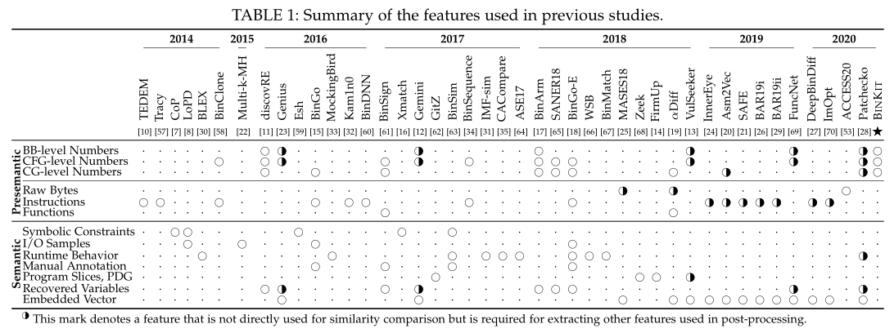
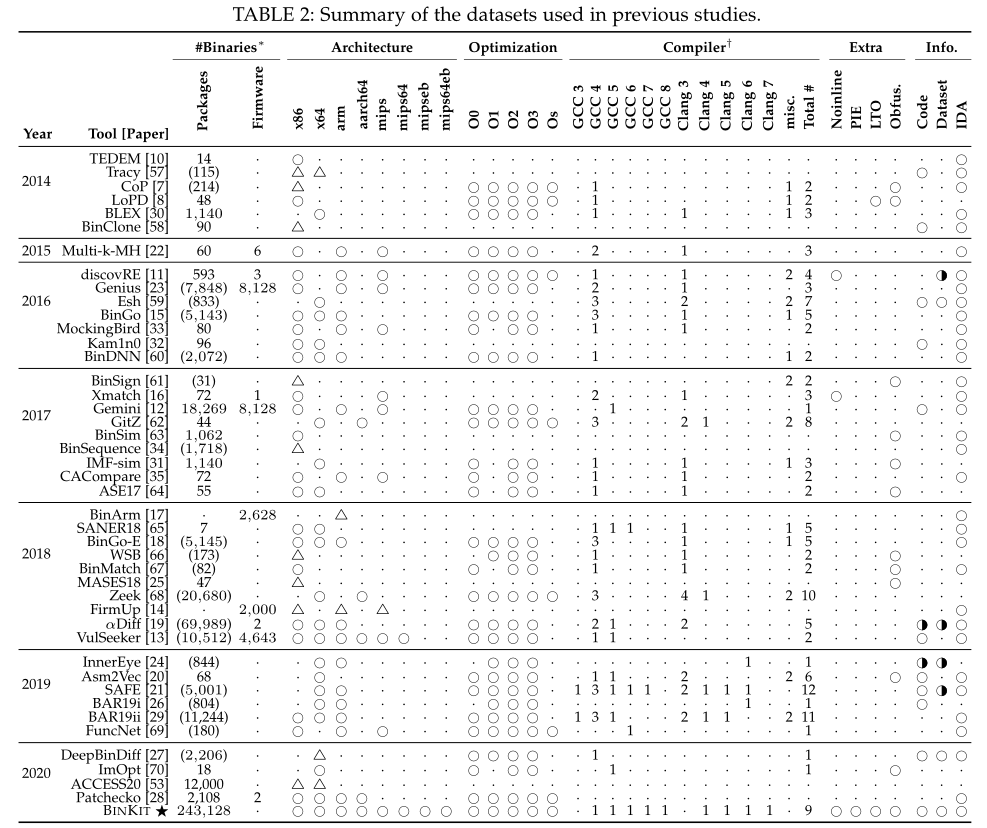
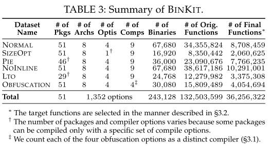
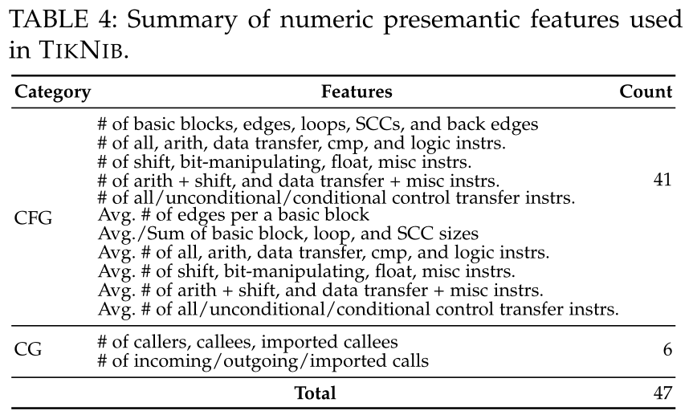
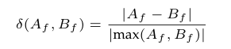
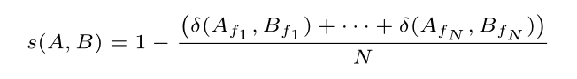
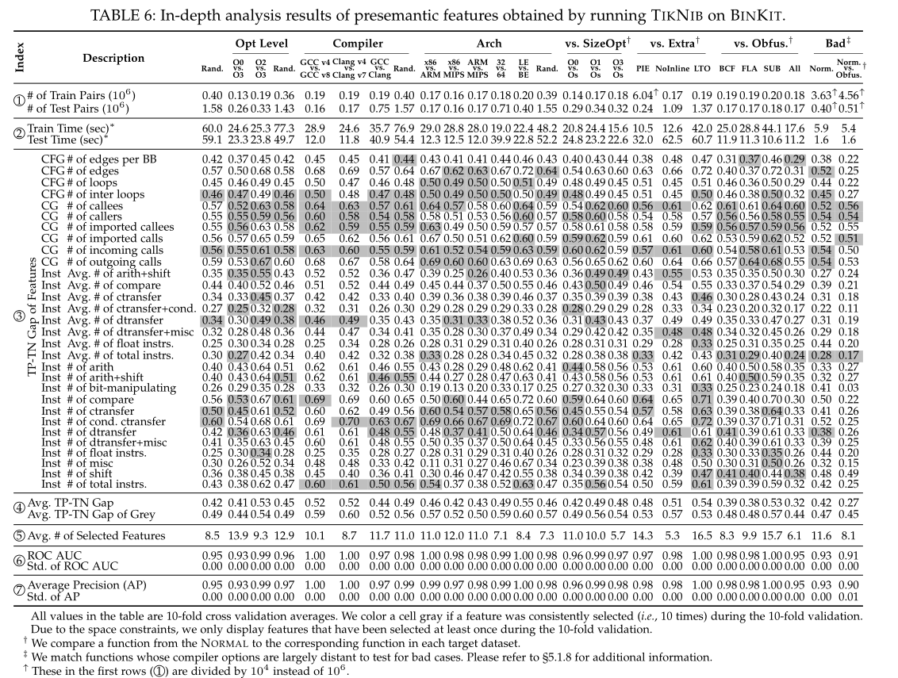

# Revisiting binary code similarity analysis using interpretable feature engineering and lessons learned
使用可解释的特征工程和经验教训重新审视二进制代码相似性分析

> Kim D, Kim E, Cha S K, et al. Revisiting binary code similarity analysis using interpretable feature engineering and lessons learned[J]. IEEE Transactions on Software Engineering, 2022, 49(4): 1661-1682.

* 检索收录情况：SCI
* 中科院 JCR 分区:Q1
* 当前被引用数:33

## Summary

- Binkit的论文，主要时建立了一个大范围的基准。然后从CFG CG的数字语义前特征的去做BSCA
https://github.com/SoftSec-KAIST/binkit
https://github.com/SoftSec-KAIST/tiknib
## Research Objective(s)

1. 从新审视BSCD这一块的研究难点，并进行总结合回顾BSCD这一块的采用的技术，使用精确定义术语并对之前文献中使用的特征进行分类
2. 为BSCD构建一个全面可重复的基准
3. 设计一个可解释的特征工程模型

## Background / Problem Statement

- BSCD的研究难点
    1. 大部分人采用的是带有不可解释性的机器学习技术
    2. 每一篇论文都有自己的基准去进行评估，所以方法之间无法进行相互比较
    3. 研究人员的术语不统一，导致无法正确引用以前的文献

### BINARY CODE SIMILARITY ANALYSIS（BSCA,二进制代码相似性分析）
1. 句法分析
    - 获取二进制代码的中间表示（IR）：反汇编/抽象语法树
2. 结构分析
    - 例如恢复CFG、CG等
3. 语义分析
    - 可以通过对二进制文件进行数据流分析或者符号分析等，找出底层语义
4. 向量化和比较
    - 产生一个0-1之间的相似分数
### 先前工作中使用的特征

          

#### 1. 语义前特征
> 无需语义分析，可以直接到处的特征

1. 数字语义前特征：对特定属性出现的次数进行统计
    1. 从基本快中提取的数字特征：操作码或者对指令进行分组后统计出现频率
    2. 从CFG中提取的数字特征：节点和边的数量、分组指令、介数中心数等
    3. 从CG中提取的数字特征：调用者和被调用者的数量
2. 非数字语义前特征
    1. 函数的原始字节（健壮性不高）
    2. 汇编指令的操作码、操作数，或者其他中间表示
    3. 函数的特征：导入函数的名称等

#### 2. 语义特征
1. 符号约束，可以使用SMT求解器进行比较
2. I/O
3. 运行时行为：比较执行的指令序列、访问的目标函数的CFG边缘、调用的系统/库函数
4. 手动注释程序或者函数的高级语义：通过函数的功能对库函数进行分类
5. 从程序切片中提取特征：通过抽象形式表示数据流语义或者PGD（程序依赖图）
6. 程序变量

### 先前研究中的基准

            

### 研究问题

1. 如何建立大规模的基准和ground truth数据？
2. 语义前特征的有效性是否仅限于所使用的目标架构和编译器选项？
3. 调试信息能否帮助BCSA达到较高的准确率？
4. 我们可以从分析 BCSA 的失败案例中受益吗？

## Method(s)

### Binkit：建立大规模的benchmark    

       
- 数据组成
    1. 51个源代码
    2. 243,128个二进制文件
    3. 1352种编译选项组合（8种不同架构编译、9个不同版本的编译器、5个优化级别、混淆选项）

#### ground truth
1. 等价标准（仅仅包括.text字段函数）
    1. 来源相同源文件且具有相同行号的相同名称的函数
    2. 来自同一个包，并且在二进制种具有相同名称

### TikNib：可解释模型

        

- 由由 CFG 和 CG 级别的数字语义前特征

#### 评分指标

- 两个函数A和B，对应的函数特征为Af和Bf       
- 两个特征值之间的相对差         

        

- 一共有N个特征，函数A和B的相似度得分      

      

- 特征的选择
    - 贪婪的特征选择算法+AUC

### 语义前特征分析

         

1. 优化选项对BSCD影响很大
2. 编译器版本影响较小
3. GCC和Clang具有不同的特征
4. ARM 二进制文件比 MIPS 更接近 x86 二进制文件
5. 更接近的优化级别显示相似的结果
6. 额外选项，如PIE、no-inline和LTO，影响较小
7. Obfuscator-LL VM 不影响 CG 特征

### type信息的优势
1. type信息：参数数量、参数类型和函数的返回类。有利于BSCA的准确率

### 故障案例
> 优化影响最大
1. 二进制分析工具错误
2. 编译器后端差异
3. 特定于体系结构的代码

## Tags

逗号分隔本文的所有标签，标签使用规范参见以下 `GitLab Issue 标签使用规范` 。

2021, SCI, SCI-1, CyberRange, Playbook, Ansible, Scenario, CTF

------ 以下内容仅为解释说明，请在提交时删除 ------

### GitLab Issue 标签使用规范

* 在不影响语义理解的前提下，标签关键词要尽可能短
* 优先选择已有标签，确实没有的情况下再 `新建标签`

#### 建议的标签列表

* 2022，Binkit
