# SAFE: Self-Attentive Function Embeddings for Binary Similarity

> Massarelli L, Luna G A D, Petroni F, et al. Safe: Self-attentive function embeddings for binary similarity[C]//International Conference on Detection of Intrusions and Malware, and Vulnerability Assessment. Springer, Cham, 2019: 309-329.

* 当前被引用数:91

## Summary

- 本文提出了一个不需要提取CFG，直接使用汇编代码的二进制相似性比对框架SAFE。SAFE主要分为两部分：
    1. **assembly instructions embedding(i2v)**。i2v部分使用word2vec模型中的**skip-gram模型**来进行徐连，将汇编指令序列转化为向量序列。

    2. **Self-Attentive Neural Network**。同个一个双向神经网络将向量序列转化成一个摘要向量，通过自注意力机制获取所有摘要向量的加权和为函数的向量表示
- 文中比较特别的一点，就是进行了语义分类，将函数分为了四类。

## Research Objective(s)

- 本文提出一个新的体系结构SAFF用于二进制相似性比较，该框架采用自注意力机制，直接工作在函数的汇编代码，且不需要手动提取特征
    - 能够为数百个二进制快速生成embedding
    - 在多个体系结构(论文中考虑AMD64和ARM)的stripped binaries（没有符号表）

## Background / Problem Statement

- 研究背景
    - 物联网增加了相同程序运行在不同架构的数量，COTS软件组件越来越多集成到闭源软件中
- 二进制相似性问题
    - 其目标是在编译后的代码片段中找到相似的函数
- 研究意义/应用
    - 发现大量软件的已知漏洞、版权纠纷、分析和检测恶意软件等
- 函数语义
    - 函数f为算法的实现，将算法按照类划分，每个类是解决相关问题的一组算法。
    - 本文主要研究四个类{E(加密)、S(排序)、SM(字符串操作)、M(数学)}
    - 如果分类器能够猜出函数f所述的类，那么可以认为该分类器可以识别出函数f的语义

## Method(s)

作者解决问题的方法/算法是什么？是否基于前人的方法？基于了哪些？
- 目前基于embedding的技术
    - 优点：
        1. 计算出embedding后，检验相似度是快速的，线性时间
        2. 计算出的embedding可以作为其他机器学习的输入，进行聚类和分类
    - 缺点：
        1. 手动选择特征，有偏差（比如作者认为从CFG中提取特征是处理成本高但是不能提供明显性能）
        2. 有些依赖动态链接库的调试符号，但是有部分软件是进行静态链接的
        3. 单一架构（Asm2vec）
### SAFE架构     

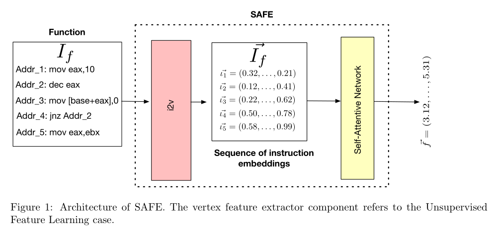              

- SAFE embedding分为两个阶段
    1. **assembly instructions embedding(i2v)**：汇编指令$I_f$序列转化为向量序列.
        - 使用word2vec模型，将每个指令$l \in I_f$转化成一个实数向量$\vec{l}$，最后获得一个向量序列$\vec{I_f}$
    2. **Self-Attentive Neural Network**
        - 对于每个指令向量$\vec{l_i}$，RNN计算一个摘要向量(summary vector )，考虑指令本身和它在$I_f$中的上下文
        - $\vec{I_f}$的最后embedding是所有摘要向量的加权和
        - 权重通过两层全连接神经网络计算的
    > 选择自注意力网络是因为他展示了NLP任务的最先进性能。其次较少遇到经典RNN的；long-memory problem（不能很好地处理非常长的序列）
### 静态分析
- 使用了ANGR框架[27]，radare2[25]和IDA Pro
### Assembly Instructions Embedding (i2v)
- 主要是使用**skip-gram模型**来训练embedding模型。主要思想是通过当前指令预测周围指令
> CBOW是给定上下文预测当前指令
- 一个token包括整条汇编指令（助记符和操作数）
    - 将内存地址替换成MEM
    - 即时数的绝对值大于阈值(t=5000)替换为IMM

### Self-Attentive Network
> 通过指令向量序列$\vec{I_f}:(\vec{l_1},...,\vec{l_m})$得出函数$f$的embedding $\vec{f}$           

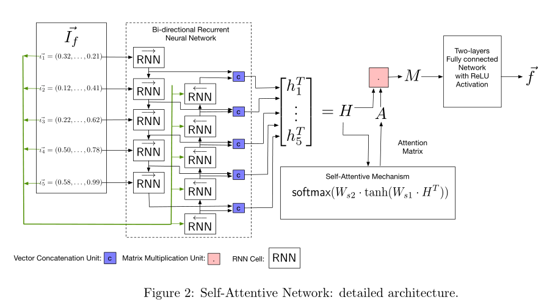       

- $\vec{I_f}:(\vec{l_1},...,\vec{l_m})$输入一个双向神经网络，每个向量$\vec{l_i}$得到一个大小为u的summary向量         

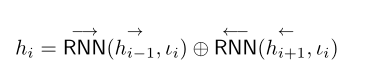         

> $h_i$：双向递归神经网络(RNN)的第i个隐藏状态          
⊕：连接操作数        
每个RNN cell大小为$u \over 2$

- 最后得到的摘要向量，得到一个$m \times u$的矩阵$H$，通过两层神经网络得到一个大小为$r \times m$的注意力矩阵$A$
> m：函数f的数量     
u: 状态$h_i$的维度       
r:attention hop，函数嵌入网络的参数   
$d_a$：模型的attention深度   
$W_{s1}$：注意力机制的$d_a \times u$权重机制          
$W_{s2}$：注意力机制的$r \times d_a$权重机制        

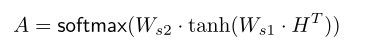            

- 最后得到矩阵B      

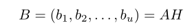          

- 将大小为$r \times u$的矩阵转化成大小为$n$的向量\vec{f}      

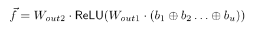              

> $W_{out1}$：大小为$e \times (r+u))$的权重矩阵          
$W_{out2}$：大小为$n \times e$的权重矩阵        
 
- 使用Siamese结构学习参数         

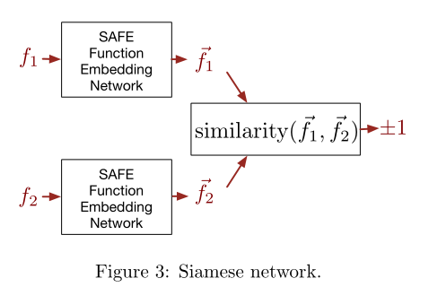      

- $\Phi$：网络的超参数。$\Phi ={W_{s1},W_{s2}},RNN^{->},,RNN^{<-},W_{out1},W_{out2}$
- 将两个相同的函数embedding网络用相似性分数连接起来（我们所说的相同是指这些网络有相同的参数）。
- Siamese结构的最终输出是两个输入图之间的相似度得分。

- 用余弦相似度作为距离度量来比较$<\vec{f_1},\vec{f_2}>$，公式如下    

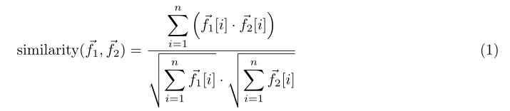         

- 训练网络     
    - 准备K对函数对$<\vec{f_1},\vec{f_2}>$，这些函数对带有真值标签$y_i \in {+1,-1}$,目标函数如下：      
    > 目标函数和损失函数等同      

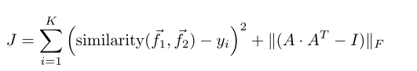            

## Evaluation

作者如何评估自己的方法？实验的setup是什么样的？感兴趣实验数据和结果有哪些？有没有问题或者可以借鉴的地方？
- 实验环境
    - python
    - tensorflow
- 使用与Gemini相同的方法训练SAFE模型，训练了一个单一模型和一个跨平台模型，结果也与之进行比对
- 评价指标
    - ROC、AUC
    - 精确度、召回率
    - 归一化折现累积收益(nDCG)
    - F1-Score
### 数据集
- i2v模型的训练数据集
    - AMD64和ARM两种训练语料库。
        - ADM64:547k 大小不重复的汇编代码，约8600万行
        - ARM：752k大小不重复的汇编代码，约1.04亿行    
---
> SAFF整个模型训练集
- AMD64multipleCompilers Dataset
    - 软件类型：9种
    - 编译器：clang-3.9、gcc-5.4、gcc-3.47
    - 优化选项：O[0-3]
- AMD64ARMOpenSSL Dataset:
    - 软件种类：Openssl两个版本(v1_0_1f-v1_0_1u)
    - 编译器：gcc-5.4
    - 优化选项：4个优化级别(即O[0-3])    
### 单个平台和跨平台检测    
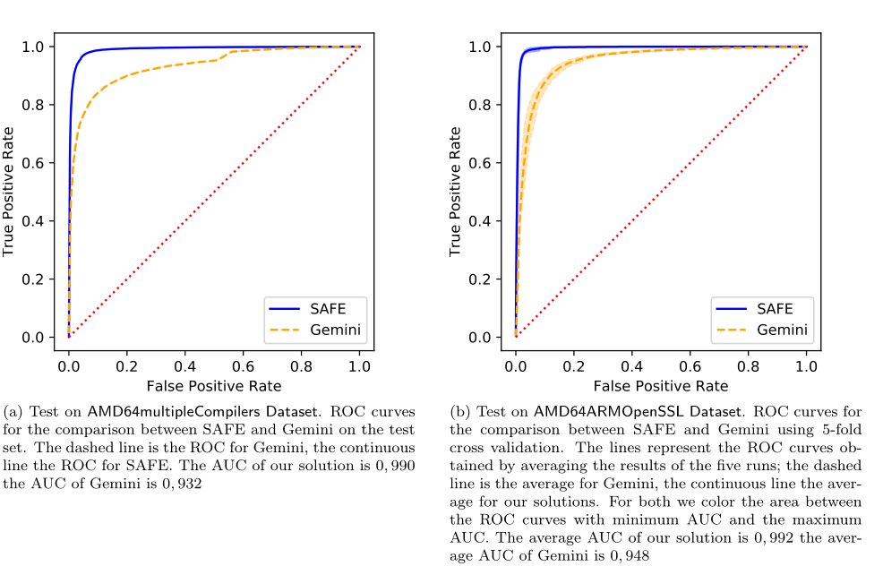         
### 函数搜索    
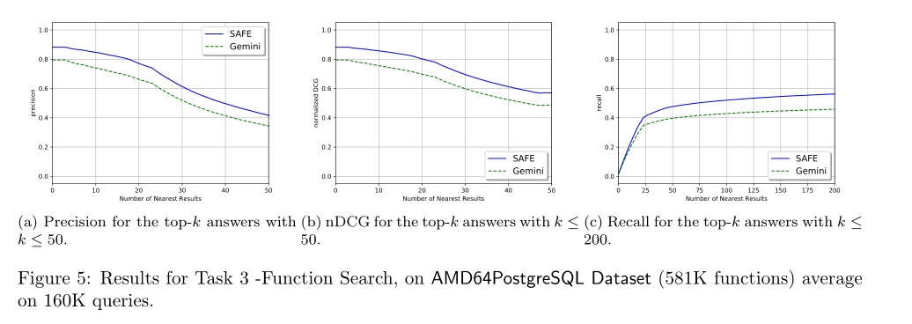
### 漏洞搜素
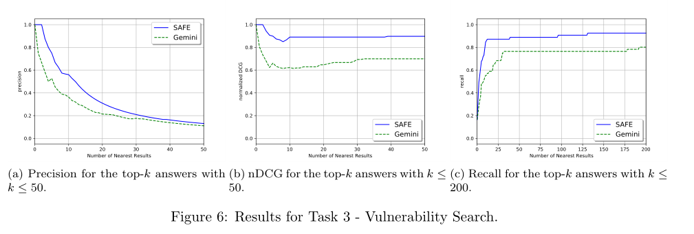        
### 语义分类
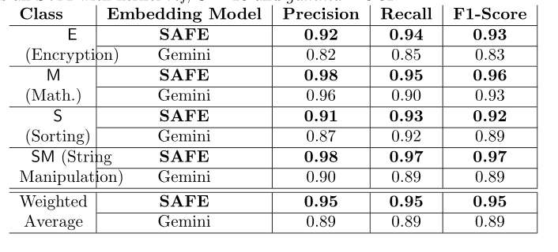        
## Conclusion

- 本文提出一种在不使用调试符号的跨平台情况下计算函数embedding的架构——SAFE。SAFE不需要CFG
- 最终是为是构建与当前可用的图像识别分类器相竞争的二进制分类器

- 未来技术
    - 使用libc调用符号重新训练，支持更细粒度语义分类

## References(optional) 

- 本文基于的论文:Self-Attentive Network
> [20] Z. Lin, M. Feng, C. Nogueira dos Santos, M. Yu, B. Xiang, B. Zhou, and Y. Bengio, “A structured self-attentive sentence embedding,” Arxiv: arXiv:1703.03130, 2017.
- Yahav：不基于CFG，基于tracelets   
> [11] Y. David and E. Yahav, “Tracelet-based code search in executables,” in Proceedings of the 35th ACM SIGPLAN Conference on Programming Language Design and Implementation, (PLDI), 2014, pp. 349–360.
- Khoo等人提出了一种基于基于指令助记符和graphlets计算的n-grams的匹配方法。不能跨平台
> [18] W. M. Khoo, A. Mycroft, and R. Anderson, “Rendezvous: A search engine for binary code,” in Proceedings of the 10th Working Conference on Mining Software Repositories, (MSR), 2013, pp. 329–338.
- Pewny等人提出了一种基于图的方法，即函数的cfg的匹配算法。其思想是将二进制代码转换为**中间表示**
> [23] J. Pewny, B. Garmany, R. Gawlik, C. Rossow, and T. Holz, “Cross-architecture bug search in binary executables,” in Proceedings of the 34th IEEE Symposium on Security and Privacy, (SP), 2015, pp. 709–724.

- Gemini
> [29] X. Xu, C. Liu, Q. Feng, H. Yin, L. Song, and D. Song, “Neural network-based graph embedding for cross-platform binary code similarity detection,” in Proceedings of the 24th ACM SIGSAC Conference on Computer and Communications Security, (CCS), 2017, pp. 363–376
- Gemini的变体
> [4] R. Baldoni, G. A. Di Luna, L. Massarelli, F. Petroni, and L. Querzoni, “Unsupervised features extraction for binary similarity using graph embedding neural networks,” in arXiv preprint arXiv:1810.09683, 2018.

- 使用基于LSTM (Long short-term memory)的递归神经网络来解决二元相似性的子任务
> [30] F. Zuo, X. Li, Z. Zhang, P. Young, L. Luo, and Q. Zeng, “Neural machine translation inspired binary code similarity comparison beyond function pairs,” arXiv preprint arXiv:1808.04706, 2018.

- Skip-Gram 模型
> [22] T. Mikolov, I. Sutskever, K. Chen, G. Corrado, and J. Dean, “Distributed representations of words and phrases and their compositionality,” in Proceedings of the 26th International Conference on Neural Information Processing Systems, (NIPS), 2013, pp. 3111–3119.

## Tags

2019，二进制相似性

## 参考资料

> [理解 Word2Vec 之 Skip-Gram 模型](https://zhuanlan.zhihu.com/p/27234078)
