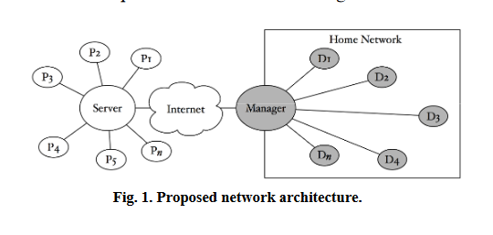
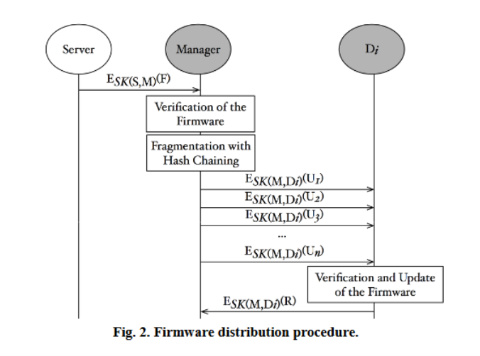
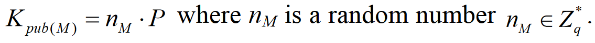
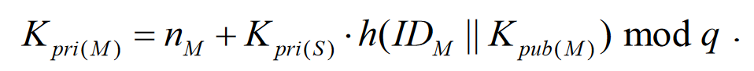
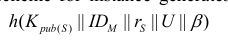

# Secure Firmware Validation and Update  for Consumer Devices in Home Networking

> 在家庭网络中的消费者设备安全固件验证和更新

- 研究对象：`家庭网络中的消费者设备`-> `家用路由器`
- 研究工作：实现固件的完整性验证（防篡改攻击）和更新

## 基本思想

- The proposed scheme utilizes an ID-based mutual authentication and key derivation to securely distribute a firmware image.A firmware fragmentation with hash chaining is also applied to guarantee authenticity of the fragmented firmware image.
> 所提出的方案利用基于ID的相互认证和密钥推导来安全地分配固件镜像。使用带有哈希链的固件碎片也用于保证碎片固件镜像的真实性。

- 验证固件的**完整性**

## INTRODUCTION

> 研究背景和目的、意义

- 固件开发迅速
- 使用第三方库，导致了固件的脆弱性
- 固件（嵌入式系统）安全性并未像想象那么高

## CYBER ATTACKS ON FIRMWARE

> 介绍对于固件进行的篡改攻击和调查结果

### 网络攻击固件实例

- USB
- 网络接口卡（NIC）固件
- 硬盘固件
- 电池固件
- 打印机

- The firmware validation and update may not the panacea for all attacks, but those create a deterrent against most attacks targeting known vulnerabilities.
> 固件验证和更新可能不是所有攻击的灵丹妙药，但它们可以阻止大多数针对已知漏洞的攻击

- For instance, if known vulnerabilities are patched as soon as possible after the patch is available, the attack window is reduced and thereby increasing the defense rate against the attack.
> 例如，如果在补丁可用后尽快修复已知漏洞，则可以减少攻击窗口，从而提高对攻击的防御率。

## PROPOSED FIRMWARE VALIDATION AND UPDATE

### 提出的网络架构

    

- M：家庭网络的固件管理器。位于家庭网关，提供对家庭设备的Internet访问权限。
- D：由M管理的固件。相关信息会在M本地进行注册
- S：维护固件的服务器
	- M会将其收集的设备信息在S上进行注册
	- `固件提供商`将固件交给S,S保留固件，然后根据配置主动或被动地将固件提供给M

### 会话密钥用于固件分发

- 使用的`会话密钥`生成是基于 `ID` 的使用*双线性配对*的加密
	- `双线性配对`：用于身份的密码体制（IBE）、三方一轮密钥协商、BLS签名算法等

#### 以S和M之间固件分发为例
- 基于Schnorr的签名模式
> C. Schnorr, “Efficient signature generation by smart cards,” Journal of Cryptology, vol. 4, no. 3, pp. 161-174, January 1991.


    

1. M为S生成公私钥对   

    
   

- M有自己的公私钥对和S的公钥

2. 会经过一长串的计算与交互，S和M双方会进行身份验证，然后S和M双方能够自己计算生成会话密钥SK(S,M)    

#### M:带有哈希链的固件碎片

>chaining是解决生成hash表时发生碰撞的方法之一。如果不同的key通过hash function得到的相同结果，那么就将他们放在同一个list中

- 由M到Di的固件传输通常是分块传输的，比如，有些设备像是移动手表是移动的，所以也需要保证这些固件镜像的真实性

- M按照哈希链的步骤对固件进行分片，将固件镜像分为n个片段，然后每个片段通过使用散列链进行散列
```python
F={f1,....fn} # 固件片段
C={cn,...,c1} # 哈希链，与固件片段的循序相反

# M随机选取一个ri
if i=n:
  ci=h(ri||fi)
else:
  ci=h(ri||fi||ci+1)
```

- 由于散列链的性质，第一个散列不受完整性保护，而其他散列受到完整性保护。
- M会对c1和固件的基本信息进行签名，然后加密发送；然后再是对f1和c2进行签名加密然后发送

#### D：进行固件验证和更新

- s->M
	- 使用SK(S,K)加密保护固件的机密性
	- 添加随机数和哈希提供了完整性的保证
- M->D
	- 在进行固件更新之前，D使用Kpub(M)验证固件碎片镜像的真实性和完整性
	- 由于Finfo包含在U1中，D2到Dn可以在不查看其余更新消息的情况下验证固件映像。
		- 使用当前固件检查固件 ID 和版本信息。如果从 Finfo 获取的固件版本与当前版本相同或更低，则取消固件更新过程。

## DISCUSSION

- 在本节中，从已知会话密钥安全、完美前向保密、无密钥妥协冒充、无未知密钥共享和无密钥控制方面提供了所提出的固件验证和更新方案的安全分析结果。讨论了对拟议方案的一些考虑
	- 已知密钥安全（ Known-Key security）。一个协议具有已知密钥安全, 是指即使敌手已经知道了除当前会话之外的会话密钥,也不会影响当前会话的安全。
	- 前向安全（전향적 보안성 FS, Forward Secrecy）。粗略地说，如果协议参与者的长期私钥被敌手获得，而敌手不能由此求出参与者在私钥泄露前协商获得的会话密钥的话，则称该协议具有前向安全性。根据会话性质的不同，前向安全性可分为完美前向安全性和弱的完美前向安全性。具体来说，如果长期私钥泄露前的会话受到了敌手的破坏（该攻击者获得了参与者的长期私钥，并为其选择了这次会话的临时私钥），而敌手仍无法获得这次会话的会话密钥，则称该协议具有完美前向安全性；若协议只能保证敌手在获得参与者的长期私钥后，之前的那些未被敌手破坏的会话的会话密钥不能被敌手获得，则称该协议具有弱的完美前向安全性。Krawczyk[7]对协议的前向安全性进行了详细研究，指出基于公钥的两轮的双方认证密钥协商协议都无法实现完美前向安全性，而只能实现弱的完美前向安全性。
	- 抗密钥泄露伪装攻击( Key-Compromise Impersonation）。假设实体A 和B 是协议的两个参与者, 则当A 的长期私钥被敌手获得后, 该敌手显然能够冒充A 与其他协议的参与者(例如B)进行通信。然而,如果该协议抗密钥泄露伪装攻击,则这一密钥泄露不能使得敌手反过来向实体A 冒充为其他参与者(例如B)（密钥泄露冒充攻击是一种已知密钥攻击）
	- 抗未知密钥共享攻击（(UK-S, Unknow Key-Share)）。在某些情况下,敌手未必能得到会话密钥相关的秘密信息,但是可以欺骗实体关于其对等身份的信息。如果敌手能成功对参与者A 和B 之间进行的密钥协商协议进行未知密钥共享攻击,那么参与者A 认为自己与B 之间建立了共享的会话密钥,而参与者B 则认为自己与敌手之间建立了会话密钥。这一攻击可以导致参与者把信息发给错误的实体,或者接收数据并认为它来自一个错误的参与者
	- 密钥控制是指确保某些密钥仅供授权人员使用的各种方法

### A.安全性分析

#### 已知密钥安全
- 会话密钥依赖于单向哈希函数和会话秘密。
- 从单向散列函数导出的一个会话密钥与其他会话密钥没有关系
- 根据随机临时密钥计算出的会话机密也用于生成会话密钥，这样即使某些会话机密被泄露，其他会话机密仍然安全。因此，即使知道先前会话密钥的对手无法在所提出的方案中计算当前会话的会话密钥。

#### 完美前向安全性

- Kpri(S) 和 Kpri(M) 等私钥被泄露，对手也无法计算单向哈希函数的输入。
- 通信实体的两个长期私钥的泄露不会影响先前建立的会话密钥的保密性。此外，即使 Kpri(S) 被泄露，会话密钥仍然是安全的。因此，所提出的方案满足完美前向保密和主密钥前向保密    

  

#### 抗密钥泄露伪装攻击
 
- 它将一次成功攻击仅限于一个实体，即防止多米诺骨牌效应。
- 当一个M的私钥以某种方式被泄露时，不会影响其他M的私钥保密

#### 抗未知密钥共享攻击

- 攻击者需要获取其他客户端的私钥才能进行伪装。

#### 无需密钥控制

- 会话密钥中引入了随机数，两个实体都不能限制使用预定义的值作为会话密钥。

### B.思考

#### 优点

- 所提出的方案足以减少由于没有固件更新而易受攻击的家庭设备的数量。保证固件二进制文件源自设备制造商等信任来源。

#### 缺点

- 固件本身的漏洞无法被避免
- 第三方库的引用，固件的整体安全级别趋于更低
- 没有提供对抗在更高权限区域运行的 rootkit 和恶意软件的方法

## CONCLUSION

- 大多数当前用于消费设备的安全和保护系统都专注于操作系统或应用程序级别。但是现在网络攻击开始集中在固件级别
- 基于这种背景，本文介绍了新的固件验证和更新方案。 如上所述，所提出的方案利用基于ID的相互认证和密钥派生来安全地分配固件镜像。


## 参考资料

- [方程小组恶意软件细节披露 新线索直指美国国家安全局](https://www.aqniu.com/threat-alert/6912.html)
- [硬核 | 双线性对在密码学中的应用（上）](https://www.8btc.com/media/672886)
- [技术 | 双线性对在密码学中的应用（下）](https://www.mytokencap.com/news/185041.html)
- [认证密钥协商(Authentication key agreement)的安全目标](https://blog.csdn.net/weixin_43851783/article/details/112601567)