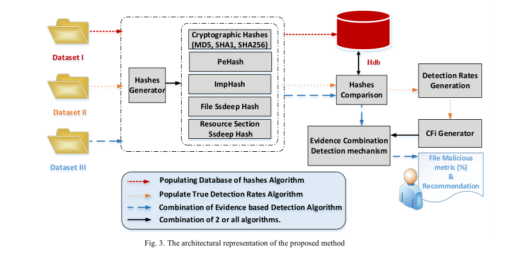
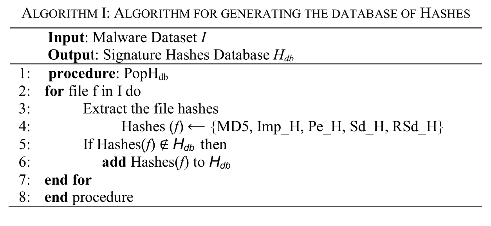
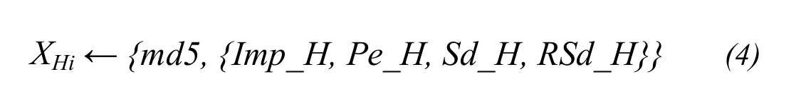
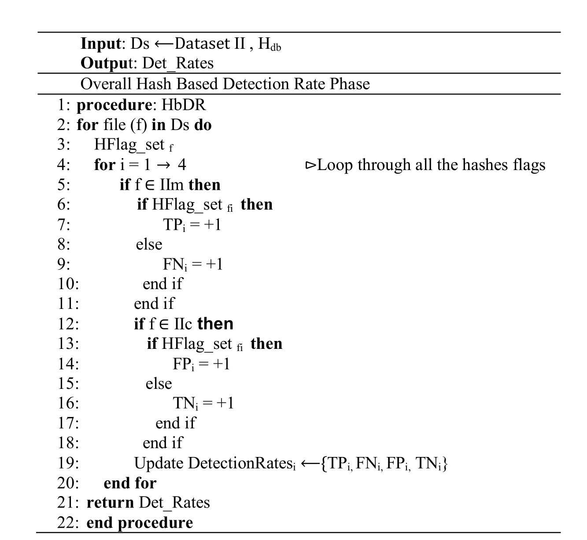
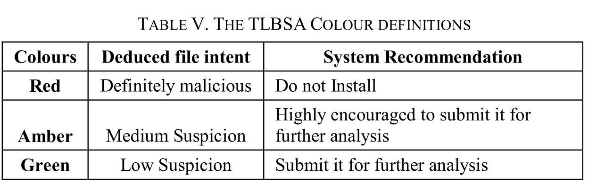
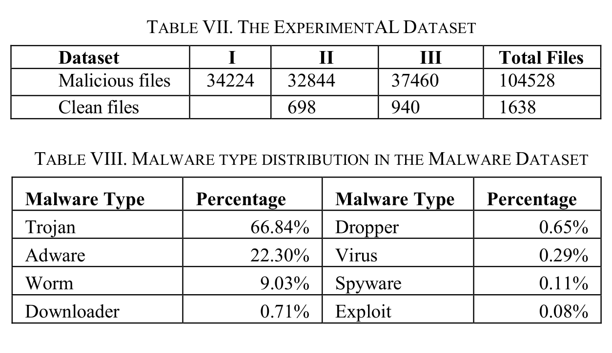
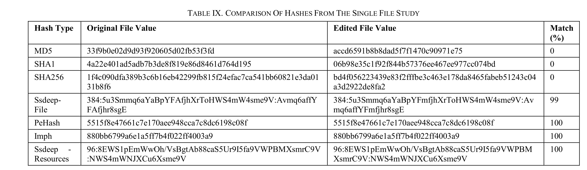
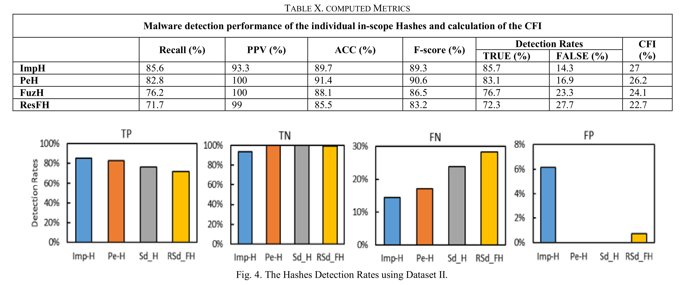
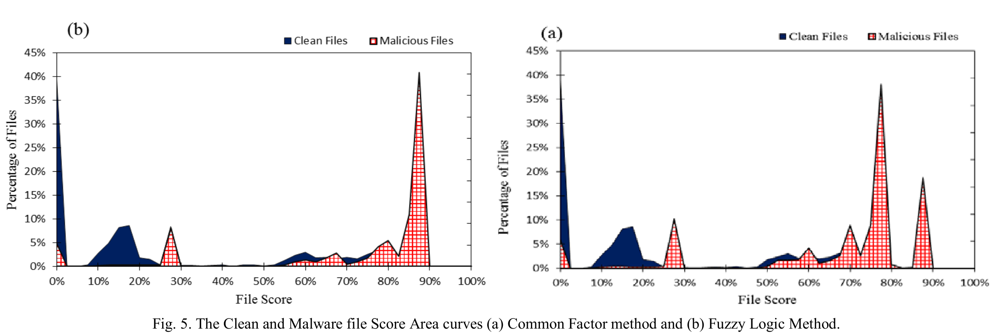

# Similarity hash based scoring of portable executable files for efficient malware detection in IoT

> 基于相似性哈希的便携式可执行文件评分，用于在物联网中进行高效的恶意软件检测

## 摘要

### 研究背景即意义

- 当前恶意攻击的增加表明恶意文件绕过了现有的安全系统
- 相似性哈希已被用于恶意软件分析和检测中的**样本分类**
- 文件相似性用于将恶意软件**聚类**到家族中，以便可以设计它们的共同签名

### 研究内容

> 属于静态检测

- 本文探讨了当前用于**便携式可执行 (PE) 文件**的恶意软件分析的**四种**哈希类型
- 每种 hash 技术单独使用时，他们的误检率很高
- 本文研究了一个核心问题，即**如何组合不同的散列技术以提供定量的恶意软件分数并实现更好的检测率**
- 设计并开发了一种基于散列结果的恶意软件评分新方法
- 所提出的方法通过大量实验进行评估。 评估清楚地表明恶意软件的真实检测率显着提高（> 90%）

## 1. 引言

### 研究背景

- 物联网的规模在不断壮大，但随着物联网的市场、范围和应用领域的增加，它变得更容易受到各种安全漏洞的影响，例如恶意软件、欺骗、干扰等
- 本文重点讨论物联网中的**恶意软件**问题
- 开发新方法来**隔离已知的恶意软件变体文件至关重要**
	- 能缩短分析恶意软件花费的时间
	- 可以检测不同阶段的恶意软件
- 在IoT中动态检测不太可行
	- 物联网设备和其他快速系统中对安全、可信和高性能设备的需求，限制了基于动态分析的检测方法的使用
	- 动态分析需要更多的资源和更多时间来执行和观察文件的行为。

### 研究对象

- Microsoft 可移植可执行文件 (PE)文件
	- 目前世界上 90% 的计算机用户使用 Windows 操作系统
	- 随着 Windows 系统用于物联网设备或与物联网设备交互，PE 文件预计将继续成为可能的威胁媒介

### 研究内容

- 提出了一种新方法：该方法综合**不同的散列技术**以提供定量的恶意软件分数并实现更好的检测率

###  主要贡献

1. **集成**了几乎所有自动静态分析工具中提供的**相似性匹配哈希算法**
2. 所提出的方法是**可扩展的**，可以根据恶意软件分析师的需求进行定制
3. 将不同的哈希值视为文件属性，减少系统所需的存储容量

### 文章结构

- 第 2 节：相关工作
- 第 3 节：概述了研究中使用的哈希、组合方法和评估方法等背景
- 第 4 节：描述了所提出方法的设计和建模
- 第 5 节：介绍了评估和结果
- 第 6 节：总结

## 2. 相关工作
- 反恶意软件研究大多数都集中在 *行为分析* 和 *动态启发式分析* 上，基于静态分析的研究有限
	- 启发式分析是一种通过检查代码的可疑属性来检测病毒的方法
	- 启发式算法：一个基于直观或经验的构造的算法，对优化问题的实例能给出可接受的计算成本（计算时间、占用空间等）内，给出一个近似最优解，

- 围绕**相似性匹配哈希函数**的现有研究工作仅限于**恶意软件聚类**
- 在恶意软件检测中，模糊哈希优于加密散列

### 只使用一个哈希
- DigitalNinjas：使用 *模糊哈希相似性* 来检测恶意软件
	- 使用 ssdeep 哈希来检测不同的恶意软件家族，可信度达到67%
- French and Casey：使用不同的模糊哈希方法来检测恶意软件
- Mandiant： 首次引入了一种使用基于 *Impash* 的相似性检查对恶意软件进行聚类的方法，这种方法现在称为 *FireEye*
	- Imphash：检测其PE文件导入表（Imports）

### 多个特征

- 启发式引擎中应用基于多个特征的决策
- 与旧的基于签名的检测方法不同，启发式利用恶意软件中的不同特征，并且已被证明在未知恶意软件检测方面更胜一筹
---
- “Valkyrie”文件判定系统：文件特征和文件关系进行组合
- Kolter & Maloof：通过一种简单的基于启发式的文本分类技术（称为 n-gram）来检查各种分类器对恶意软件检测的结果
- MaTR：方法结合了静态启发式文件功能和决策树机学习算法来设计一种提高恶意软件检测的方法。
- Xinjian：将动态特征和静态相结合
- Y. Du：在检测 android 恶意软件时使用证据组合方法组合特征
---

### 将恶意分数附加到文件

- MAEC 项目采用 CVSS（通用漏洞评分系统）的方法，引入了**恶意软件威胁评分系统**的概念
	- 使用预定义的类别将威胁评分附加到文件
- EMC 的安全部门 RSA 推出了 RSA 安全分析恶意软件分析评分类别
- Kumar：将启发式分数附加到 PE 文件，该分数基于从 PE 文件本身提取的特征

### 本文工作重点

- 本文的工作重点是通过组合不同的散列技术（例如，**加密散列、ImpHash、SSDEP、PeHash**）来计算恶意文件分数，用于恶意软件检测
- 探索植根于不确定性推理的数学理论
	- 从不确定的初始证据出发，通过运用不确定性的知识，最终推出一个具有一定程度不确定性但合理的结论的思维过程
	- 常见的不确定性是随机性，另一种是模糊性（医生根据症状做出判断）
- 研究将哈希作为启发式特征，并研究了相似性哈希值对恶意软件检测的影响

## 3. 研究中使用的哈希、组合方法和评估方法等背景

### A. 哈希算法

#### 加密哈希

- 通常包括`MD5`,`SHA1`和`SHA256`
- 主要用于文件完整性检查。用于相似性匹配有限制，因为文件中的次要变化可能对整个摘要产生负面影响。
- 然而，这些哈希在初始识别和分类阶段的恶意软件分析中是有用的，如果立即匹配意味着该文件是已知恶意文件的精确副本。

#### Ssdeep Hash

- 它用于检测文件中的相似性，通常称为上下文触发的分段散列（CTPH)或**模糊哈希**，有提供函数比较两个模糊哈希之间的相似度
- 最初用于反垃圾邮件研究（称为Spamsum）
- 是一个非加密哈希，基于分段哈希（Fowler/Noll/Vo –FNV 哈希）和滚动哈希
- **相似度 50分**通常作为一个阈值，认为两个模糊哈希相似

#### Imphash

- 分三个步骤：
	1. 提取PE文件的结构
	2. 按 {API、Function （dll 或 sys 或 ocx）} 的顺序填充
	3. 返回填充字符串的MD5摘要
- 根据可执行文件导入表的内容和顺序对恶意软件进行聚类
- 易受导入表顺序的变化，由于恶意软件有时可以共享一些常见的系统交互行为，因此 Imphash 仍然在恶意软件群集中发挥作用

#### PeHash

- 一种与可执行文件的**结构相关**的二进制加密哈希
- 除了文件的结构之外，PeHash 算法使用 bzip2 压缩比作为 Kolmogorov 复杂度的近似值来获取文件部分中的混淆数据

### B. Evidence Combinational Methods
> 证据组合：将几组独立的证据融合，得到一组新的证据
#### 模糊逻辑

- **沙堆理论**
	- 拿走一粒沙子他还会是沙堆吗？一直拿走呢？
- 用于确定性数据不可用的情况。 它指出最终结果的准确性或真实性取决于支持证据的准确性
- 得出的是一个** (0,1) **的值，而不是一个非黑即白的判断

#### 确定性因素模型

- 该模型用于基于规则的系统
- 在这个模型中，假设的整体可信度是通过考虑规则中的不确定性和单个公因子来计算的

### C. 评估方法

|      | 恶意 |  良性 |
| ----------- | ----------- | ----------- |
| 恶意      | TP       | FN       |
| 良性   | FP        | FP        |

## IV. 所提出方法的设计

### A. 哈希算法的选择  

- PE 文件的资源部分 (rsrc) 包含嵌入资源的任何名称和类型
- 通过 4 个不同的哈希值，表示文件样本的各个方面
- 总体得分用于表示 文件与**已知**恶意软件样本 的相似性   

| hash类型      | 理由 |
| ----------- | ----------- |
| PeHash      | 抵抗恶意软件混淆      |
| Imphash   |  通过API进行分类        |
| File Ssdeep Hash   |  整体文件相似性 |
| Resource section Ssdeep Hash   |  PE资源部分文件相似度 |

### B. 架构

    

#### 第一步：对单个文件进行研究
- 分析原始文件并计算不同散列
- 
编辑文件并重新计算文件哈希
- 两个文件的哈希值
#### 第二步：收集数据集

- 收集恶意和良性样本
- 恶意分为三部分（3个子数据集I、IIm和IIIm），良性分为两部分（2个子数据集IIc和IIIc）
	- I：填充哈希数据库
	- II⟵{IIm, IIc}：计算哈希和对应的CFI（Common Factor Index of an attribute i）的真实检测率
	- III ⟵{IIIm, IIIc}:验证提出的方法

#### 第3步：填充哈希签名数据库

- 根据 *数据集 I* 中的恶意软件样本计算得出的初始签名填入哈希数据库(Hdb)    

     

- 不重复得填充hash库
- `Hashes (f) ⟵ {MD5, Imp_H, Pe_H, Sd_H, RSd_H}`
	- Imp_H：导入库hash
	- Pe_H：PeHash
	- Sd_H：文件的Ssdeep
	- RSd_H：文件资源部分的SSDeep哈希

##### 第 4 步：基于标准因子指数 (CFI,Criteria Factor Index) 公式的散列相似性

###### 确定与恶意软件检测相关的各个哈希的性能
- 设定 HFlag_set（设置hash类型的函数，4种函数有有具体对应的位置） 将 数据集 II 中的文件的哈希值与 Hdb 进行比较  
- 对于数据集 II 中的每个文件，分别计算五个哈希值。 针对数据库运行四种不同的查询。 每个查询返回一组元组        
	
    

- PeHash和Imphash比较时，只从数据库中获取与计算的hash相同的类型hash，如果集合 Xhi 是 Ø（空），则对应于类型 i 的散列的 HFlag_set 位置 不是一个集合，否则是一个集合
- 对于资源 Ssdeep hash 和文件 Ssdeep hash，与数据库中的hash进行比对，如果计算出的最大相似度百分比大于**零**，则设置类型i的hash对应的HFlag_set位置    
- 填充混淆矩阵，计算检测率     

   

###### 计算每个哈希的CFI
- 在上一步中获得的检测率用于计算每个hash的 CFI，该 CFI 当成每个散列的**置信因子**
- 为了最小化置信因子的误差，使用真实检测率来计算因子
- 每个哈希方法的置信度/标准因子指数（CFI）定义为：

    

- TDR：正确检测率     

   

    
#### 第五步：证据组合理论的应用

- 输入：CFI
- MD5比较阶段是一个冗余步骤，引入该步骤是为了避免实验中恶意软件样本复制，提高效率
- **哈希比较阶段**：
	- 计算其他四种哈希并将与 Hdb 进行比较
	- 等式（4）中的查询也用于此阶段
- PeHash和Imphash
	- 如果查询结果集不为空，那么对应的ESF（属性i的证据支持因子）就等价于各自hash的CFI。 否则，散列的 ESF 设置为零
- Resource Section Ssdeep hash 和 file Ssdeep hash：
	- 对应的ESF相当于CFI乘以最大相似度百分比

#### 第6步：TLBSA阈值
> TLBSA:Traffic Light Based Scoring Assessor
- 输入：上步骤的 ESF     

    

## V. 评估

### A. 数据集

    

### B. 结果与分析

- 在第一阶段：对单个文件进行哈希时，发现一些哈希易受到文件的小变化影响，而在其他散列函数中可能有很小或没有影响。    

     

- 在第二阶段:数据集 II 用于四种散列技术的 CFI。获得的结果也用于评估不同hash技术的检测率    

     

- 数据集 III 用于计算文件恶意的总体百分比，以验证所提出的框架
	- 表明大多数恶意文件的评分高于良性文件     
	- 83% 的恶意文件的恶意分数高于 50%，而 78% 的干净文件的恶意分数低于 50%   

    

### C. 分析

- 本研究设计并评估了**两**种(**Fuzzy Logic Method 和 Common Factor Method**)**将单个散列结果组合起来**进行恶意软件检测的方法

- PeHash 是 4 个哈希中性能最好的
- Impash 提供最高的FP，但也提供最低的FN检测
- 组合散列方法的结果是实现了 6.8% 的整体错误检测率和 93.2% 的真实检测率
- 该技术容易受到 60% 的非常高的假阳性的影响

- 引入 TLBSA assessor，为 3 个区域设置百分比阈值
	- ATP（Amber Threshold Percentage） 优于所有单个散列技术，但是糊逻辑方法只有 70% 的真阳性率，公共因子模型方法只有 62%
	- GTP（Green Threshold Percentage） ：将真阳提高到92%

## VI. 总结

- 这项研究开发了一种新方法来组合来自单个相似性哈希的结果，以证明整体最佳性能召回率为 92%，系统准确率为 91%，精度为 99%，F-score 为 96%

- 恶意软件分析师可以对其进行自定义和扩展，以分析其他文件类型
- 使用静态分析，可以安全地抵御沙盒和动态分析环境
- 它通过提供指示文件恶意程度的定值来简化恶意文件的识别

## 参考资料

- [什么是启发式分析？](https://www.kaspersky.com.cn/resource-center/definitions/heuristic-analysis)
- [启发式算法（Heuristic Algorithm）](https://www.cnblogs.com/sddai/p/5644011.html)
- [imphash-youtube](https://www.youtube.com/watch?v=fWV8Dh_RBZU)