# Trex: Learning execution semantics from micro-traces for binary similarity

> Pei K, Xuan Z, Yang J, et al. Trex: Learning execution semantics from micro-traces for binary similarity[J]. arXiv preprint arXiv:2012.08680, 2020.

* 当前被引用数：25

## Summary

此篇文章提出了一个基于**transformer**的用于进行二进制代码相似性检测的模型**Trex**。Trex和Bert的中心思想有些类似，都是 **预训练-微调** 模式。在预训练阶段，采用**Masked LM**在**micro-trace(而不是静态代码)** 上进行执行语义学习。预训练模型训练好后，使用静态代码对模型进行finetune。Trex模型在**跨架构、跨编译选项和跨混淆**上比SAFE、Gemini、Asm2Vec、Blex都有更好的效果和执行速度              
> 这篇论文的**实验非常充分**，但是复现难度高（硬件要求高）
---
- [开源代码和数据库]( https://github.com/CUMLSec/trex)
## Research Objective(s)
- 进行二进制语义相似匹配
- 贡献
    - 提出一种新的匹配语义相似函数：首先训练模型从micro-traces中学习程序执行语义然后迁移所学的知识，用于识别语义相似的函数
    - 扩展`micreo-execution`技术用来支持不同架构
    - 开发一个新的神经架构：分层transformer，从micro-traces中学习执行语义
    - 对来自 13 个流行软件项目和库的 1,472,066 个函数进行了评估。能实现**跨架构、优化和混淆函数**

## Background / Problem Statement

- 函数语义相似性
    - 函数相似性：**源码相同，与架构、编译器、编译选项和混淆转换无关**
    - 语义相似性：**两个函数具有相同的输入输出行文**
    - 漏洞检测、漏洞利用生成、恶意软件溯源、取证
    - OWASP 将“使用具有已知漏洞的组件”列为 2020年十大应用程序安全风险之一[56]。因此，在大型软件项目中识别类似的易受攻击的功能可以节省大量的人工工作。
    
- `execution semantics`：
    - 代码语义以其**执行效果**为特征
    - 现有的所有基于学习的方法都与执行语义无关，在**静态代码**上进行训练
- 现有动态研究方法的局限性
    - 现有方法通常是直接比较函数的动态行为。但是**如何确定函数的有效输入**是具有挑战性和耗时的。
    - 直接使用`under-constrained execution traces(欠约束的执行跟踪)`导致误报
    > 随机化的输入，可能都不进入两个不同函数的浅层异常处理代码中，使得他们的语义看起来非常相似
- 面临的挑战
    1. 跨架构。      
    > 现有的ML方法，没有观察每条指令实际执行效果，而且替换掉了所有寄存器值和内存地址，无法获取特定字节值来确定内在的相似性     

    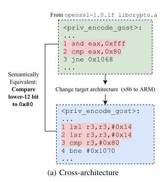             

    2. 跨编译选项         
    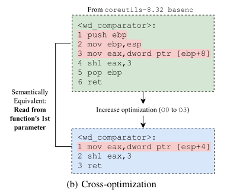          

    3. 跨混淆      
    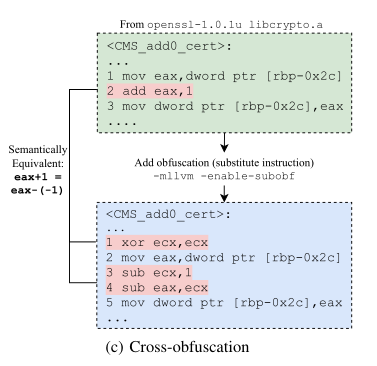           

## Method(s)       

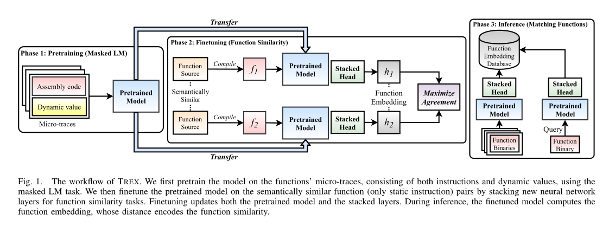          

### 预备工作1：micro-tracing
>  Godefroid[34]实现微执行

- **IR语言**：因为要实现多架构，所以使用中间语言
    - 这是IR的例子，实际实现使用的是正式的汇编指令          

    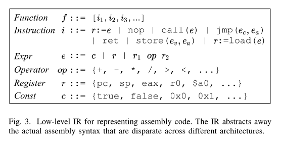       

- **Micro-tracing algorithm**             

    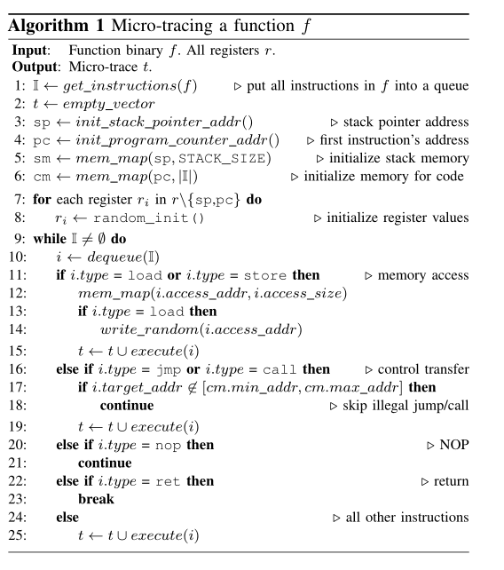         

    1. 初始化：初始化内存和地址
    2. 提取函数f中的指令到一个「队列」中去。并*线性执行*f
        - `load`或者`store`类型：要么按需访问内存，要么初始化一个随机值
        - `jmp`或者`call`类型：跳过不可达，比如跳过潜在的异常检测
        - `nop`：跳过
        - `ret`或者超时：停止
### 预备工作2：input representation

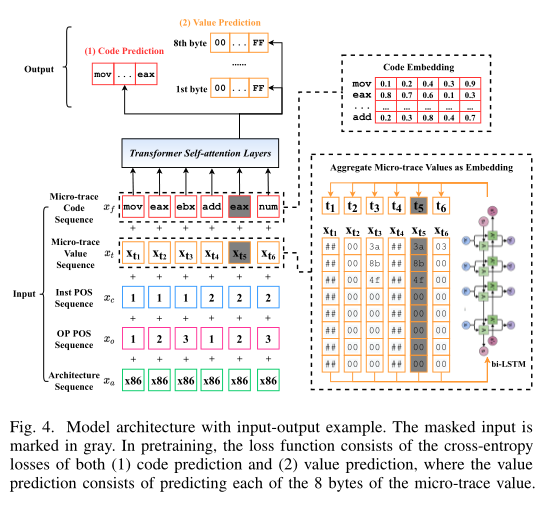           

- $x_ f$ ：**Micro-trace code sequence**
    - $x_ f$：汇编代码序列
    - 将汇编指令中出现的所有符号视为tokens，数值用`num`替换
    - **预处理后，所有架构的词汇量为3300**
- $x_ t$：**Micro-trace value sequence**    
    - 每个值都是toke，保留显示值，不使用虚拟值
- **Position sequences**
    - $x_ c$：指令位置
    - $x_ o$：操作码/操作数位置
- **Architecture sequence**
    - 帮助模型区分不同体系结构的语法
    > emmmmm，有必要么，测试的时候又不标注是哪个架构
- **Encoding numeric values**
    > 每个数字作为一个token会导致词汇量过大   

    - 将 $x_ {ti}$ 表示为8字节固定长度字节序列，如$x_ ti = { (0x00,...,0xff) }^ 8$
    - $t_ i = bi-LSTM(x_ {ti})$

### 阶段1：预训练
> 预训练时，Masked LM模型在欠约束动态轨迹数据集中学习，对每个执行语义有大致了解的后，在推理过程中就不需要动态执行函数
1. **Learned embedding**：将上述五个序列（$x_ f，x_ t，x_ c，x_ o，x_ a$）中的所有token生成相同维度($d_ {emb}$)的embedding，这样，序列间就可以进行**相加**
    - $E_ t$：是利用bi-LSTM对字节序列进行编码
    - 其他序列编码，简单将token(one-hot编码)与嵌入矩阵相乘
2. **Masked LM**
    - $x_ f$和$x_ t$：随机使用`<mask>`替换
    - $m(E_ i)$：masked $x_ i$的嵌入
    - $MP$：有masked的位置集
    - 预训练模型$g_ p$的输入：$E_ 1,...,m(E_ i),...,E_ n, i \in MP$，寻找参数$\theta$使得「预测masked code和实际」、「预测masked value和实际」的**交叉熵损失**最小
    > 交叉熵长用作分类函数的损失函数     

    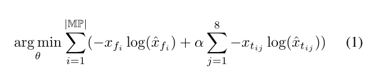            

    > 8：$x_ t$有8字节，α是超参数，为权重
- **mask策略**
    - **Masking register**:模型了解操作码的语义或者说执行效果
    - **Masking opcode**:预测操作码需要模型了解每个操作码的执行效果
    - mask窗口大小：随机从{1,3,5}中抽取，mask后，调整窗口大小，确定mask百分比不会变
- **Contextualized embeddings**
    - 通过「自注意力机制」实现上下文关联
    - $E_ l = (E_ {l,1}, ..., E_ {l,n)}$表示第 l 个自注意力层产生的嵌入
### 阶段2：finetune
> 此时的输入已经是函数的静态代码
> 微调对象：2层的多层感知器$g_ t$和预训练模型$g_ p$
- 使用带标签的数据集进行微调      
- 堆叠一个 2层多层感知器$g_ t$，将每个函数的embedding平均值作为输入，并生成一个函数嵌入       
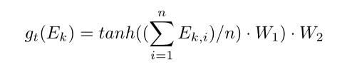         
> 最后乘以$W_ 2$是为了降维，便于大规模搜素      
- 损失函数
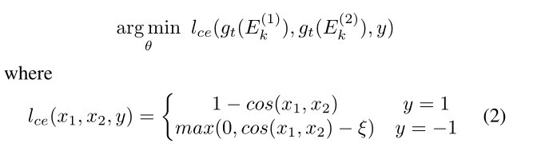         

> $l_ ce$：cosine embedding loss       

### 阶段3：微调完后
- 计算函数embedding： $f_ {emb} = g_ t(g_ p (f))$
- 相似性：$cos(f^ {(1)} _ {emb}, f^ {(2)} _ {emb})$

## Evaluation

### 实验环境和配置
- PyTorch 1.6.0
- Ubuntu 18.04, with an Intel Xeon 6230 at 2.10GHz
with 80 virtual cores including hyperthreading, 385GB RAM,
and 8 Nvidia RTX 2080-Ti GPUs.

> 环境配置高，不容易复现，不能作为对标文献

### 数据库

- 软件项目数量：13
- 架构四种：x86、x64、arm(32bit)、mips(32bit)
- 四个编译级别：00~O3
- 使用Hikari在 x64 上使用 5 种类型的混淆
    - 伪造控制流 (bcf)、控制流扁平化 (cff)、基于寄存器的间接分支 (ibr)、基本块拆分 (spl) 和指令替换 (sub)
- 编译器：gcc-7.5
### 实现
- micro-tracing：使用Unicorn实现
- 预训练：此时不需要带标签的数据，所以可以使用数据集种所有函数（除了二用于微调和评估的函数）
- 微调：**选取10%进行训练，其余用作测试集，与典型的80%训练20%测试不同，这样能使模型具有更好的泛化能力，减少过拟合的可能性**
    - 相似：不相似=1：5

### baseline
- 跨架构
    - SAFE和Gemini
- 跨编译选项和混淆
    - Asm2vec和Blex(Blex 利用函数的动态行为)
### 指标
- ROC（the receiver operating
characteristic ）曲线和AUC
    - 避免特定阈值引入潜在的偏差，衡量模型在不同阈值下的误报/真阳性
- 评估预训练性能：perplexity (PPL)

### 实验结果
1. 准确率      

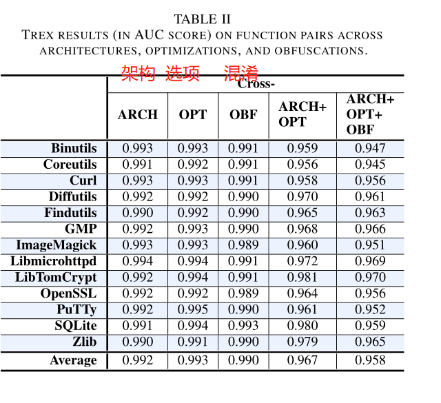          

> 单种类的跨，AUC已经很高了，都是0.99以上，只有跨多个种类时，AUC稍微低点，95%左右

2. baseline比对
- 跨架构搜索：与SAFE、Gemini比对      

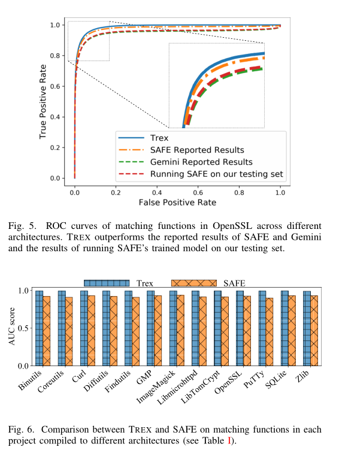         
> 平均高出7.3%

- 跨优化选项搜索：与Asm2vec、Blex（这些都是单一架构）           
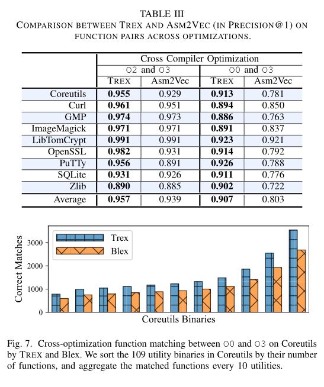      
> 比起asm2vec平均提高7.2%，比起blex，匹配数量一只更加优秀

- 跨混淆的搜索：与asm2vec相比     
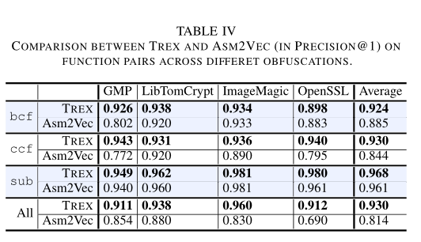         
> 平均提高 14.3%

3. 运行速度      
- 不考虑一次性成本（预训练），只考虑      
    1. 函数解析：将函数转换成模型需要的格式        
    2. 函数embedding生成                        
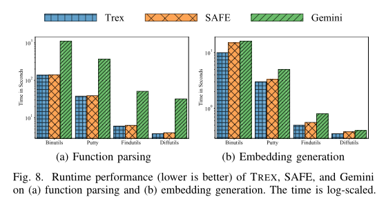       
> 函数解析阶段，因为Gemini涉及图结构相关操作，所以要慢于SAFE和Trex；函数embedding生成阶段，transformer模型优于时序模型和图神经网络        

4. 消融实验         
- 预训练消融      

            

> 当模型未经过预训练时，模型的 AUC 分数显着下降（平均下降 15.7%）。但是训练的数目影响不大         

- micro-traces消融      

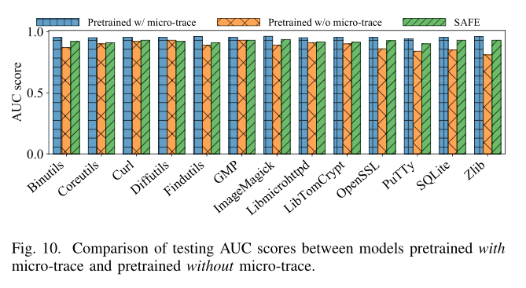          

> 当模型在没有微量跟踪的情况下进行预训练时，AUC 分数下降了 7.2%

- 预训练精度          

5. 实例应用
    - 漏洞挖掘
## Conclusion

- 作者提出的trex根据函数执行语义来匹配相似的函数，在**跨不同架构、优化和混淆**的函数匹配方面表现出色
## References(optional) 

- 作者指出ML模型中取得最先进成果的研究
>  [25] Steven HH Ding, Benjamin CM Fung, and Philippe Charland. Asm2vec: Boosting static representation robustness for binary clone search against code obfuscation and compiler optimization. In 2019 IEEE Symposium on Security and Privacy, 2019.    

[50] Luca Massarelli, Giuseppe Antonio Di Luna, Fabio Petroni, Roberto Baldoni, and Leonardo Querzoni. Safe: Self-attentive function embeddings for binary similarity. In International Conference on Detection of Intrusions and Malware, and Vulnerability Assessment, 2019.        

[77] Xiaojun Xu, Chang Liu, Qian Feng, Heng Yin, Le Song, and Dawn Song.Neural network-based graph embedding for cross-platform binary code similarity detection. In 2017 ACM SIGSAC Conference on Computer and Communications Security, 2017.
-   Godefroid [34] 实现微执行(micro-execution)，一种欠约束动态执行的形式      
> [34] Patrice Godefroid. Micro execution. In 36th International Conference on Software Engineering, 2014.
- Blex 利用函数的动态行为
> [27] Manuel Egele, Maverick Woo, Peter Chapman, and David Brumley.Blanket execution: Dynamic similarity testing for program binaries and components. In 23rd USENIX Security Symposium, 2014.

## Tags

2020, BCSD，有数据集，开源，transformer