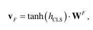

# UniASM: Binary Code Similarity Detection without Fine-tuning

> Gu Y, Shu H, Hu F. UniASM: Binary Code Similarity Detection without Fine-tuning[J]. arXiv preprint arXiv:2211.01144, 2022.

* 当前被引用数:13

## Summary

这篇文章提出了一个**UniASM**，一个基于**transformer（UniLM）**的BSCD模型，它可以**跨编译器、跨编译选项和跨混淆**进行检测。UniASM提出了两个训练任务：**ALG（Assembly Language Generation ）**和**SFP（Similar Function Prediction）**，并在后续的消融实验中证明ALG的实验效果要优于Bert使用的MLM模型。           
同时，这篇文章的实验非常充分，做了许多的消融实验，
1. 比较了不同的backbone模型，UniLM和Bert，证明了UniLM的效果要优于Bert
2. 比较了不同的训练任务，ALG和SFP，证明了ALG+SFP的效果要优于单独使用ALG或者SFP以及MLM
3. 比较了不同的函数序列化方法，证明了线性顺序的效果要优于随机游走和最长游走
4. 比较了不同的tokennization算法，证明了整个指令视为token的效果要优于其他方法
...

**开源：https://github.com/clm07/UniASM**
## Research Objective(s)

- BSCD
    - 如何选择backbone
    - 如何选择training task
    - 如何正确序列化汇编代码

## Background / Problem Statement

### 研究现状

#### 传统方法

- 动态方法
    1. 基于符号执行和深度五点分析：BinHunt [20] 和 iBinHunt [21]
        - 符号执行成本高，难以大规模运用
    2. 通过执行目标程序获取函数的I/O值：Blex[22]、BinGo[23]、BinGo-E[24]和Multi-MH[25]
        - I/O值不能完全代表函数语义
    3. 模拟执行：CACompare [6] 和 BinMatch [26]
    4. 运行时特征：IMF-sim [27] 和 BinSim
- 静态方法
    1. 统计特征：BinClone [31]、ILINE [32]、MutantX-S [33]、BinSign [34]和BinShape [35]
    2. 通过指令序列之间的编辑距离：Tracelet [36]和BinSequence [37]
    3. 通过树和图的编辑距离比较函数的CFG：TEDEM[38]、XMATCH[39]和Sæbjørns等人[9]
    4. 利用图同构：DiscovRe [40]、BinDiff [41]、Genius [42] 和 Kam1n0 [7]
#### 基于学习的方法

- 基于DNN（会丢失顺序信息）
    1. 二进制文件转化成图像，然后使用CNN：Marastoni等人[43]
    2. 从原始字节中使用CNN：αdiff [1] 
    3. 提取基本块的特征输入DNN：VulSeeker [44]

- 基于图（计算复杂度高）
    1. 基于ACFG：Gemini [11] 和 GraphEmb [45] 、BugGraph [10]（graph triplet-loss）、HBinSim[48]（分层注意力图嵌入） 
    2. 图匹配网络：GMNN [46]
    3. 图卷积：Bin2vec [47]
    4. 在语法树上使用Tree-LSTM: Asteria [49]
- 基于NLP
    1. word2vec: Asm2vec [12]、InnerEye [2]（还使用了LSTM）
    2. bert：PalmTree [17]、DeepSemantic [52] 和 BinShot [53] 
    3. transformer：MIRROR [54]、jTrans [19]

- 混合方法：
    1. word2vec+自注意力神经网络：SAFE [14]
    2. word2vec+DeepWalk：DeepBinDiff [55]
    3. CNN、LSTM 和常规全连接前馈神经网络:BinDNN [57] 
    4. NLP+图自动编码器模型： BEDetector [58]
    5. NLP+图表示学习模型： Codee [59]
    6. word2vec、BERT、MPNN [61] 和 CNN：OrderMatters [60]

## Method(s)
> 受到SimBERT [62] 和 UniLM [63]得启发

### 整体框架

        

### function representation

#### 1. 指令规范化

- 替换地址、浮点指令、条件跳转指令
1. 间接寻址寄存器 eip/rip 替换为 PTR
2. 间接寻址寄存器 esp/rsp 替换为 SSP
3. 间接寻址寄存器 ebp/rbp 间接寻址替换为 SBP
4. 其他间接寻址替换为 MEM
5. 相关寻址替换为 REL
6. 立即数替换为 NUM
7. 浮点指令寄存器 xmm 的替换为 XMM
8. 条件跳转（例如 jnz）替换为 cjmp

#### 2. Assembly Tokenization
将整个指令视为一个token：mov rax, 0x10 -> mov_rax_NUM
> 将整个指令视为一个token，首先需要考虑的问题就是OOV问题，这也是上一步作者进行规范化的原因。但是作者在此也提出了通过消融实验，这种整个指令当作token的方法要优于更细粒度的方法

#### 3. 函数序列化

- 选择的是按照线性顺序（地址顺序）进行序列化
> 后续笑容实验表明，线性顺序的性能和随机游走、最长游走类似，但那时随机游走和嘴仗游走依赖于CFG

### Backbone network
> backbone为transformer             

         

#### 1. token embedding

- 用来生成函数token序列的输入向量
- 函数$F$表示为：$F=[x_1,x_2,...,x_n]$，$x_i$表示函数F的第i个token
- 输入向量$H^0$：

         

- $E(x_i)$:   
           
    - $E_{x_i}$：token embedding
    - $E_{p_i}$：position embedding
    - $E_{s_i}$：segment embedding

#### 2. Self-attention Layer

- 由多个transformer层相互堆叠组成
- 第一层的输入就是input vector：$H^0$

- Self-attention层公式     

    -     
    - $L$：transformer总共层数
    - $H^l$：第l层的输出，$H^l=transformer_l(H^{l-1})$

#### 3. Function Embedding Layer

> 通过token`CLS`的输出向量计算函数嵌入向量

      

### training task

> ALG和SFP

#### 1.Assembly Language Generation      

       

- 利用注意力掩码矩阵来定义双向注意力和单向注意力，输入序列中的第一个函数使用双向注意力，而第二个函数使用单向注意力。
- 输入是两个函数，第一个函数$F=[x_1,x_2,...,x_n]$和第二个函数$F'=[y_1,y_2,...,y_m]$，ALG的目标就是根据第一函数预测第二个函数
- 损失函数：交叉熵，p未softmax            

          

          

#### 2. Similar Function Prediction 

> 每一次处理一批函数

         

- 每一批次中的每个样本都是一对相似函数`[CLS] F [SEP] F' [SEP]`,`F`和`F'`是相似函数对1，交换两个函数后，得到一个新的样本：`[CLS] F' [SEP] F [SEP]`
- 同一批次中第k个函数的embedding为$v_k=[v_1,v_2,...,v_d]$，d是hidden size，然后对向量中每个元素进行归一化        
          
    
    - 最终得到归一化函数embedding   

    

    - 合并起来得到embedding矩阵,b为batch size                 

                

- 两个函数之间的相似度S：embedding矩阵与其转置矩阵的点积        

            

    - S中每个值标书两个函数的相似度
        1. 单位向量的点积值等于cos(a)，a为两个向量的夹角，向量越相似，角度越小，cos越接近于一，不相同函数的向量，点积接近于-1
    - 由于矩阵S对角线上的值都等于1，为了避免对角线元素的影响，将所有对角线元素设置为`-∞`   

- 每个矩阵经过softmax层处理    

              

    - $s_{ij}$：第i个函数和第j个函数的相似度

- SFP的损失函数：交叉熵，p未softmax

           
       

- 整个框架的损失函数为两者之和        

    

## Evaluation

### Dataset

- 训练集
    - 开源项目：7个
    - 优化选项：O0-O3+3个混淆（sub/fla/bcf），**使用“-fno-inline”编译的，以避免函数内联**
    - 编译器：GCC-7.5和clag-10
    - 二进制文件数：133
    - 反汇编工具：Radare2
    - 不重复函数：12,694
    - 相似函数对：500k
- 评估数据集
    - Dataset-1
        - 由五个开源项目生成，四个优化级别 (O0/O1/O2/O3) 的两个编译器（GCC 和 Clang）以及具有三个混淆（sub/fla/bcf）的 Ollvm14 编译
    - Dataset-2：消融研究。从Dataset1的每个项目中随机选择 200 个函数，得到 1000 个函数。
    - Dataset-3：用于评估现实世界漏洞搜索的性能

### 评估指标 

- 原函数池$F$和ground truth池$G$

          

    - 每个函数$fi ∈ F$在ground truth中都有对应的值     

- 评估指标：Recall@k

          

### 超参数
1. 4 transformer layers
2. 12 attention heads
3. max sequence length of 256
4.  vocabulary size of 21000
5. intermediate size of 3072
6. train batch size of 8
7. learning rate is set to 5e-5 with the warmup of 4 steps

### 评估结果 

#### 跨编译器、跨编译选项、跨混淆的相似函数检测

          

- P1~P5对应着五个不同的软件版本

#### 消融研究

##### backbone models

        

- UniLM和Bert进行比较
    - rand:随即参数
    - unsuper：无监督学习
    - super：监督学习

##### training tasks

- 具有 ALG+SPF 任务的模型最优

- ALG在跨编译选项和跨编译器中都表现出了高性能。然而，跨混淆中的性能相对较差
- SFP 任务在所有 BCSD 任务中表现不佳。然而，当与 MLM 或 ALG 结合时，它可以显着提高模型的性能

##### 函数序列化

        

- 随机游走和最长游走都只能提取函数的一条执行路径，所以会丢失函数的一部分语义信息
- 默认情况下，函数内联是开启了的，开启内联函数的数据及会降低函数对的相似性 

##### tokennization算法

     

- 选择了五种方法：
    1. Full-Instruction
        - 整个指令视为token，可以有更多指令进行表示学习，但是容易OOV
    2. Half-Instruction
        - 操作码和操作数分别视为token。可以减少词汇量，但是可能会导致输入长度超过模型的限制
    3. Piece-Instruction
        - 每个单词视为token，幻剑ooc问题，但是破坏了指令的完整性
    4. Byte-Pair Encoding（为自然语言设计的）：较所有指令连城一个句子，然后用空格分割
    5. Word-Piece

##### 最大序列长度 

- 128长度表现最差,256,512,1024在前两个任务中表现相差不多

      

- 只有12%左右的函数超过256长度，所以256长度是一个比较合适的选择

#### Embedding Space Analysis 

        

> 良好的嵌入空间应该使点均匀分布

- UniASM 的嵌入比 BERT 分布更均匀
- 联合任务ALG+SFP使得大部分嵌入均匀分布

#### 漏洞搜索

        

## Conclusion

- 限制
    1. 跨架构：需要重新训练
    2. 控制流语义缺失
    3. OOV问题（如果是跨架构，整个字典会更大，更容易oov）

## Notes(optional) 

- t-SNE [76] 来可视化高维向量
> L. van der Maaten and G. E. Hinton, “Visualizing data using t-sne,” Journal of Machine Learning Research, vol. 9, pp. 2579–2605, 2008.

## References(optional) 

- 通过BSCD进行补丁分析
> [9] A. Sæ bjø rnsen, J. Willcock, T. Panas, D. J. Quinlan, and Z. Su, “Detecting code clones in binary executables,” in Proceedings of the Eighteenth International Symposium on Software Testing and Analysis, ISSTA 2009, Chicago, IL, USA, July 19-23, 2009. ACM, 2009, pp. 117–128.

- Jtrans
> [19] H. Wang, W. Qu, G. Katz, W. Zhu, Z. Gao, H. Qiu, J. Zhuge, and C. Zhang, “jTrans: jump-aware transformer for binary code similarity detection,” in ISSTA ’22: 31st ACM SIGSOFT International Symposium on Software Testing and Analysis, Virtual Event, South Korea, July 18 - 22, 2022. ACM, 2022, pp. 1–13.

- 库函数的识别：IDA FLIRT [29] 和 UNSTRIP [30]

> [29] Hex-rays, “Flirt,” https://hex-rays.com/products/ida/tech/flirt/, 2022
> [30] E. R. Jacobson, N. E. Rosenblum, and B. P. Miller, “Labeling library functions in stripped binaries,” in Proceedings of the 10th ACM SIGPLAN-SIGSOFT workshop on Program analysis for software tools, PASTE’11, Szeged, Hungary, September 5-9, 2011. ACM, 2011, pp. 1–8.

## Tags
2022, BSCD, Transformer, ALG, SFP

