# 2018-VulSeeker A Semantic Learning Based Vulnerability Seeker for Cross-Platform Binary（文章标题）

> Gao J, Yang X, Fu Y, et al. Vulseeker: A semantic learning based vulnerability seeker for cross-platform binary[C]//2018 33rd IEEE/ACM International Conference on Automated Software Engineering (ASE). IEEE, 2018: 896-899.

* A类会议
* 当前被引用数：73
* github开源地址：https://github.com/buptsseGJ/VulSeeker python2.7

## Summary

- VulSeeker通过带标签的语义流图(LSFG)和基于函数的语义可知DNN实现了更高的准确率和性能。语义可知DNN模型将函数内基本块的数字特征转化为函数的语义特征(或者说是embedding vector)，通过比较embedding vector之间的的余弦相似度来识别漏洞。
- **与之前方法的主要差别**： Vulseeker是第一个通过合并CFG和DFG来形成LSFG的工具，并应用深度学习来进行跨平台漏洞搜索。它它从LSFG的每个基本块中提取8种类型的轻量级的指令特征。基于图拓扑结构和修正的语义可知DNN模型，我们对LSFG应用6次迭代来获得整个二进制函数的语义表示，从而获得更高的准确率。

## Research Objective(s)

- VulSeeker的目标是：给定目标二进制程序，判定其是否具有已知的漏洞。因此，此模型的两个输入为来自目标二进制程序和漏洞库的两个二进制函数。

## Background / Problem Statement

> 研究的背景以及问题陈述：作者需要解决的问题是什么？

## Method(s)

### VulSeeker设计

- 整个VulSeeker的工作流图如下，它主要包含4个模块：LSFG 构建、Block 特征提取、基于DNN的函数语义生成、相似性计算
  
  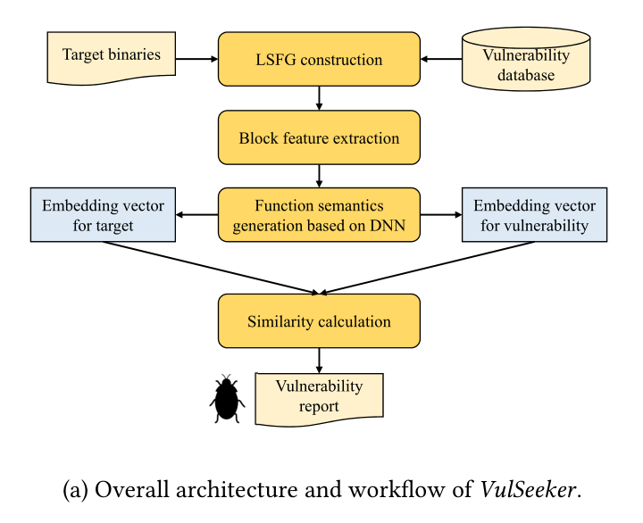

- 首先，VulSeeker为两个二进制函数构建LSFGs，然后提取8种类型的轻量级指令特征，并且将LSFG中的每个基本块编码为数字向量。函数的语义信息通过将数字向量feed DNN从而得到。最后基于输入两个函数的相似性来判断是否包含漏洞。

### LSFG构建

- LSFGs构建的方法如下： 先使用IDAPython基于IDA pro来提取出CFG，并将CFG的每个控制依赖边标记为0，基于CFG再利用IDA Pro的插件LLVM IR来 推断两个基本块之间 是否应当有一条数据指向边(data pointing edge)。
- 数据指向边的一个例子如下：如果指令i和j来自于CFG的两个不同basic block，并且指令i写了一个内存地址，指令j读了一个相同的内存地址，那么我们就可以为这两个数据块标记一条数据依赖边，其被标记为1.
- 另外，只有不同basic block之间的数据依赖会被保留，并且两个basic block之间最多存在一条数据依赖边。

  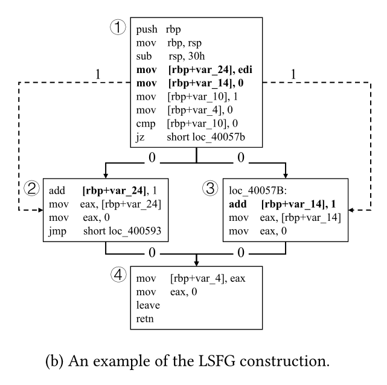

- **因为LSFG既考虑了程序的控制结构，也考虑了函数内的数据流动，所以其可以有效的缓解不同平台下对CFG的变化扰动。**

### 基本块特征提取

- 根据过去工作中使用的特征和在经过了一系列的对不同特征及合的代码克隆实验后，**最终确定使用表1中的8类特征来作为每个basic block的语义表征。**这些被选择的轻量级特征时比较健壮的，在不同的平台、处理器架构、编译优化配置上变动很小，并且可以容易地被提取。

  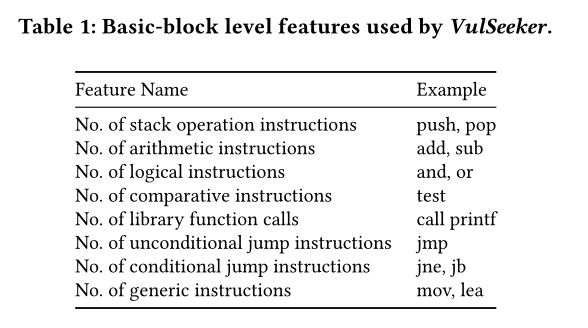

- 利用IDAPython可以提取出如上的特征，然后将每个基本块的8个特征编码为数字向量
对图(b)的一个block feature的例子如下：

  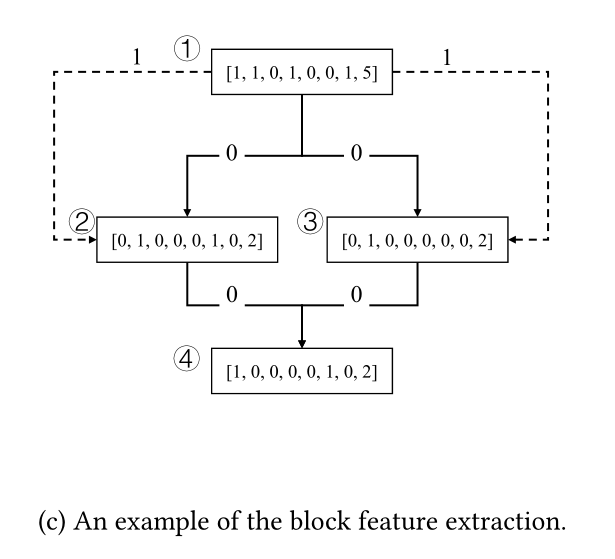

### 函数语义生成

- 此模块的输入为函数内所有基本块的初始d维数字向量，输出为p维的函数表征嵌入向量。
- 为了能够精确地捕捉函数语义信息，LSFG拓扑中的数据依赖和控制依赖都需要考虑到。为此，根据structure2vec神经网络，作者提出了图2所示的感知模型，专门用来处理结构化的LSFG表征。

  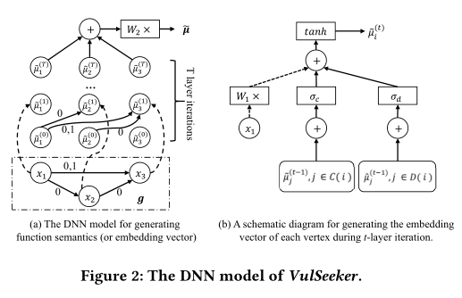

- 图2(a)中，LSFG被表示为g=<V,E>，V表示顶点，E表示边。包含了3个节点，其初始向量分别为：x1,x2,x3。Edges被标记为0和1分别代表数据依赖和控制依赖。DNN模型总共包含T层的迭代，并且每一层迭代都将每个节点i的输出向量xi转换成其嵌入向量μ˜(t)i.
- 在获得了函数内所有basic block节点的嵌入向量后，将它们全部累加后乘以p×p维参数矩阵W2后得到p维的嵌入向量μ˜。其计算的具体公式如下
  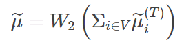

- 图2(b)展示了在第t层迭代中每个节点i的嵌入向量μ˜(t)i的生成过程示意图。这个转换过程的输入有三个不同的部分组成：节点i的初始向量xi（图中的虚线箭头）、通过控制依赖指向节点i的之前的节点嵌入向量之和（由C(i)表示）、和通过数据依赖指向节点i的先前节点的嵌入向量之和（由D(i)表示）。
- 其中节点i的嵌入向量通过如下公式计算：

  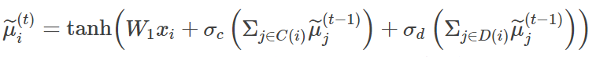

  - 其中W1为d×p维参数矩阵，σc和σd是两个n层全连接网络来计算具有更强表征能力的嵌入向量，其网络结构如下：

  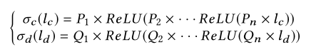

- 其中n为每个节点的embedding深度，Pi和Qi为p×p维的参数矩阵。
- 在经过了T层的迭代后，每个节点的features都被传播到其他的节点，来保证每个基本块都具有其对应上下文的语义信息。

### 相似度计算

- 一旦获得了目标函数和漏洞函数的embedding vector μ˜和v˜后，可以直接计算余弦相似度：
  
  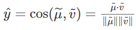

- 并设置一个阈值来判定是否相似。

## Evaluation

### 数据集

- Dataset I: compile BusyBox (v1.21.0),OpenSSL (v1.0.1f and v1.0.1u) and Coreutils (v6.5 and v6.7) in X86,X64, MIPS32, MIPS64, ARM32, ARM64 architectures, using GCC(v4.9 and v5.5) with optimization levels O0-O3。共包含735540个函数，9345K个基本块。
- Dataset Ⅱ： 用的还是Genius中的4643个固件镜像。

### Accuracy

- 和Genimi的对比，AUC值和ACC值比Genimi高 8.23% and 12.14%。原因是除了CFG还采用了DFG，和修改后的DNN图嵌入网络。

  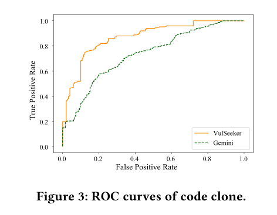

  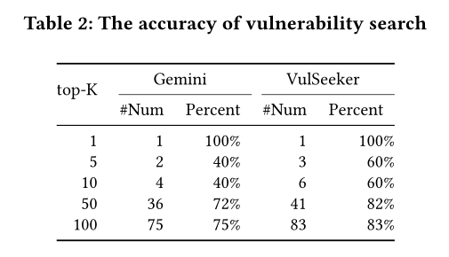

### 效率

- Genimi对一个二进制程序进行搜索已知漏洞所需要的时间为0.15s，而VulSeeker需要0.2秒

## Conclusion

> 作者给出了哪些结论？哪些是 `strong conclusions`, 哪些又是 `weak conclusions`（即作者并没有通过实验提供 `evidence`，只在 `discussion` 中提到；或实验的数据并没有给出充分的 `evidence`）?「论文作者」自己指出的本文不足之处、`Future Works` 请记录在本小节。

## Cons

> 「当前论文笔记作者」指出的本文不足之处、`Future Works` 请记录在本小节。请从日后写综述、研究选题依据的角度，指出本文的不足之处，目的是为了给自己和实验室其他同学今后在当前研究方向继续深入指明一些可能的深入研究方向或改进思路。

> 对于综述类论文，本小节是可选的。

## Pros(optional)

> 通常本文的优点已经被论文作者自己在论文中讲清楚了，所以在上述论文笔记摘要中已写过的优点就不必在此重复。「当前论文笔记作者」认为被论文作者自己忽视的优点、贡献，可以在本小节记录。

## Notes(optional) 

> 不在以上列表中，但需要特别记录的笔记。例如英文书写模板，精美绘图所使用到的工具软件等。

## References(optional) 

> 列出相关性高的文献，以便之后可以继续 track 下去。

## Origin

> 给出指向你个人论文仓库的本篇论文阅读笔记原文链接。

## Tags

> 逗号分隔本文的所有标签，标签使用规范参见以下 `GitLab Issue 标签使用规范` 。

------ 以下内容仅为解释说明，请在提交时删除 ------

### GitLab Issue 标签使用规范

* 在不影响语义理解的前提下，标签关键词要尽可能短
* 优先选择已有标签，确实没有的情况下再 `新建标签`

#### 建议的标签列表

* 文献发表年份。例如 2021
* 检索收录情况：EI, SCI 
* 中科院 JCR 分区（针对 SCI 收录文献才需要标记）：SCI-1, SCI-2, SCI-3, SCI-4
* 关联实验室内项目简称（最近更新 2021-05-22）：Fuzz, CyberRange, osint4sn, SoftFP, MTD
    * 物联网漏洞挖掘：Fuzz
    * 靶场：CyberRange
    * 开源社区情报分析：osint4sn
    * SoftFP：软件指纹
    * 欺骗式防御：MTD
* 研究对象（不超过3个）。例如：IoT, 源代码 等
* 研究方法（不超过3个）。例如：综述, 动态分析, 静态分析, CNN 等
* 数据集（不超过3个）。例如： NB-15，MalwareZoo, VulDeePecker, LAVA-M 等

