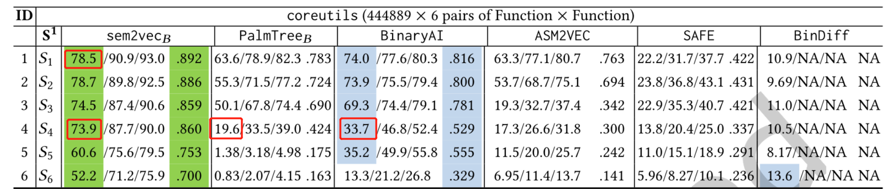

# sem2vec: Semantics-Aware Assembly Tracelet Embedding

> Wang H, Ma P, Wang S, et al. sem2vec: Semantics-Aware Assembly Tracelet Embedding[J]. ACM Transactions on Software Engineering and Methodology, 2022.

* SCI-1
* 中科院 JCR 分区:：Q1
* 当前被引用数

## Summary

本文提出了一个基于语义学习的生成汇编代码embedding的框架——sem2vec。sem2vec通过angr反汇编二进制代码并进行符号执行，得到的tracelet聚合成一个图（TCFG）。首先使用RoBERTa模型生成符号约束的embedding，结合外部调用函数的编码和调用栈的状态，一起连接成TCFG节点的embedding。然后使用GGNN迭代节点信息，最后使用Set2Set聚合。

sem2vec支持跨编译器、跨优化选项、混淆（使用跨架构数据集的情况下，也能支持跨架构）。sem2vec更亮眼的他对于**混淆**的鲁棒性，能够达到比BinaryAI更高的准确性。鲁棒性的一大原因是因为相较于汇编代码，SE得到的tracelet能够排除一些混淆代码的干扰。但是对于对图结构有改动的混淆，他的鲁棒性会受到一定的影响

---

开源[代码]( https://github.com/sem2vec)和[数据集](https://drive.google.com/file/d/17EVsS2ff7IMheYO_MllXU23aBLVLk_6G/view)

## Research Objective(s)

生成一种具有健壮性的汇编语言的embedding

## Background / Problem Statement

- 研究背景：
  - 现有的基于 DNN 的技术基于捕获汇编代码的语法、控制级或数据级信息，这些信息过于粗粒度，无法表示程序功能。
  - 这些方法鲁棒性差，会受到例如编译器优化和混淆的影响。

- 二进制embedding概述         

             

- 基本块级别：每个块是一个段落，每一个指令是一个句子，操作数操作码为字

- CFG级别：还利用了GNN（MPNN家族）
	- MPNN：包含消息传递阶段和读出阶段（聚合阶段）。
		- 消息传递阶段就是根据相邻节点更新每个基本快的隐藏状态，这个隐藏状态就是embedding
		- 聚合阶段：使用预定义的聚合函数计算整个图的嵌入，得到最终结果。例如堆积游走、GGNN

## Method(s)

> 本文基于pre-trained RoBERTa[57]

    

### 1. Tracelet-Based USE
> 基于USE[69]

             

Traverse_CFG(F, MAX_STATE)：入口函数

	1. line22->27：获取函数F所有基本块$B_{entry}$，并逐一出栈一个starting基本块$B_0$
	1. line28->29：没有执行过的基本块输入Traverse_Tracelet函数

Traverse_Tracelet(B0, MAX_STATE)：

	1. line2->4：将当前基本块标记为执行过，并初始化符号状态$S_0$为空
	1. line5：通过MAX_STATE进行控制，防止路径爆炸问题
	1. line20：收集最终的符号状态将其转化成tracelet

Symbolic_Execution(S)： 

​	1. 在基本块上执行SE（使用的为angr）

### 2. Tracelet Embedding

              

- Tracelet Embedding由以下三部分连接组成

 	1. 符号约束的embedding
 	2. 外部调用函数的one-hot embedding
 	3. 用1bit表示调用堆栈状态
 	 - 调用堆栈状态表示 tracelet 的后继块是否属于目标函数

#### 符号约束的embedding

- **符号约束的预处理**

	1. 通过有序遍历来生成一个符号约束，为每个约束生成一个token序列
	1. 将常数转化成「对数归一化」形式。当常数c>0时，转化成$2^{\lfloor \log_2c \rfloor}$，c=0时，转化成0。能保留一些重要常数，如$0,1,2^{64}$等，而不是简单得用`INT`等字符代替

- **Pre-training Using Whole Word Masking (WWM)**

	> WWM相比于MLM是更进阶版本，通俗而言就是整个词一起mask，而不会出现字词被mask的现象
	
	- 随机mask 15%的token
	- 预训练任务采用`RoBERTa`进行多分类预测任务
	- 损失函数：交叉熵损失函数
	- token embedding：均值池化值
- **Pre-training with Siamese Network**
	- 通过匹配来自同一行源代码（编译优化/混淆）的符号约束来训练 RoBERTa 模型
- **选择具有代表性的约束**
	- 从符号状态中选取K个约束，包括一个路径约束和超过K-1个寄存器上的输入/输出约束。sem2vec选择最长的K-1个符号约束
	- 给定K个embedding，进一步使用HBMP[79]（一种RNN模型）压缩到一个长度为L的向量中

### 3. CFG-Level Embedding

函数F的tracelets会形成一个连通图G，G的每个节点就是tracelets的embedding           

文章采用GGNN[56]消息传递方案，根据邻居节点迭代更新每个embedding向量$V_{tracelets}$。然后使用Set2Set [82]（graph pooling方案）聚合所有的$V_{tracelets}$到embedding V，V就是G的embedding

## Implementation

- 反汇编和SE：angr，目前支持ELF格式的64bit x86文件
- 使用 Transformers 实现 RoBERTa，并使用 Sentence-BERT [70] 对其进行训练

## Evaluation：PalmTree [54], ASM2VEC [30],BinaryAI [93, 94], and SAFE

### 数据集

- 软件种类：9个
- 编译器：gcc和clang
- 编译选项：O0,O2,O3
- 混淆编译：LLVM Obfuscator，四种混淆模式：-sub（语义等效，语法更复杂）， -bcf，-fla以及三种结合的混合模式
- 汇编函数数量：116,941,424 对汇编函数

### 评估标准

- top-k和归一化折损累计增益（ Normalized Discounted Cumulated Gain (NDCG)）

- 同一源码通过不同编译/混淆选项生成两个Bin，两个程序中函数名相同的为「真」

### 耗时

- sem2vec SE模块
	- 每个函数平均花费 76.6 到 120.8 CPU 秒来启动 SE（随着混淆的程度而相应增加）
	- 但是SE可以并行处理，目前设置了30个线程，执行单个二进制文件所需的实时时间（不是 CPU 时间）通常不到一小时
- 训练时间
	- 训练时间：embedding生成时40小时（4159 × 2 × 2个函数），训练 BinaryAI 需要 4 小时，训练 Gemini 需要 6 小时

### 评估结果

                

S1：跨编译选项；S2：跨编译器和编译选项；S3-S6：跨编译选项、编译器、加混淆；

> sem2vec：37/50个最高分，12/50个较高分

#### $sem2vec_b$ 和 BinaryAI 之间的消融评估

> $sem2vec_b$:sem2vec + BinaryAI

sem2vec和BinaryAI使用的是相同的图嵌入实现。所以sem2vec和BinaryAI形成了消融实验，用 sem2vec 计算的 tracelet 级embedding替换 BinaryAI 中的token级嵌入               

sem2vec在20个对比设置中都优于BinaryAI，其他的设置情况下，和BinaryAI有接近的性能。同时目前sem2vec只进行了预训练，还没有进行fine-tuning，finetune后的模型精确度有可能进一步提高           

#### $sem2vec_b$  和 $PalmTree_b$ 之间的消融评估

PalmTree算然可以有效地捕捉到汇编指令的内部格式、控制流依赖性和数据流依赖性，但是由于sem2vec能捕获到精确的符号约束，所以最终效果仍然优于PalmTree

#### 混淆弹性分析

##### 指令替换混淆（-sub）

> 此混淆是通过一个活一些列语法不同但是语义等价的替换语句来进行混淆

      

指令混淆可以欺骗一些工具，如asm2vec（将指令视为单词），S3-6的top1降到了十几。SAFE也有降到20多，但是SAFE训练时并没支持混淆                   

但是指令混淆不改变输入输出约束，所以sem2vec影响不大。同时「垃圾代码插入」理论上也不会影响sem2vec，因为「垃圾代码插入」也不影响输入/输出约束                   

##### 不透明谓词（Opaque Predicate）(-bcf)

> 不透明谓词是指一个表达式，他的值在执行到某处时，对程序员而言必然是已知的，但是由于某种原因，编译器或者说静态分析器无法推断出这个值，只能在运行时确定               

                 

BinaryAI 和 PalmTree在「不透明谓词」的混淆下，相关指标也下降到33.7和19.6。而sem2vec稳定住了，是因为sem2vec在使用USE生成tracelets期间能有效去除`-bcf`引入的deadcode

##### 控制流扁平化(-fla)

> 将 CFG 压缩成一个大的 switch 语句

sem2vec从函数入口点开始遍历，并始终遵循函数的正常执行流程，所以影响不如其他的研究大（其他研究直接将CFG作为图进行嵌入）。但是由于CFG的变化，sem2vec会使用更多路径约束

### 漏洞函数搜索

> 给定一个汇编函数f，搜索已知漏洞的函数数据库，确定是否与任何函数匹配

漏洞数据集D

	1. 由[26]提供的
	2. 包含8个CVE漏洞示例（由于ollvm限制，使用了其中的7个）

                  

在`-hybrid`的情况下，sem2vec12个示例中有11个真正的匹配在top1，剩下的一个ws-snmp准确性较低，是因为这个漏洞包含大的CFG，会阻碍SE（有MAX_STATE）的限制。而 PalmTree 通常难以匹配混淆的代码样本

### 跨架构

             

> 使用的sem2vec只使用了64位的x86文件进行的训练；但是符号执行引擎angr支持多平台，所以可以自己训练

### 泛化性评估

> 将sem2vec与不同的图嵌入技术桥接

#### 与Gemini桥接

              

$sem2vec_G$ 在 top-1上有比PalmTree更好的效果

#### 与GTN桥接

> 采用的是GGNN       

           

$sem2vec_B$的NDCG更高，但是 $sem2vec_{GTN}$相隔不大 ，说明给定相同的输入，不同的图神经网络对准确性的影响很小           

### 更重量级的混淆方案（Tigress）：基于虚拟化的混淆

> 基于虚拟化的混淆将每个函数转化为在编译的二进制代码中附加的解释器内执行的字节码

             

所有工具的有效性都不太行，但是sem2vec任然优于其他工具，因为sem2vec 的符号执行可以合理地跟踪解释器的执行，并恢复与分析非混淆代码时获得的约束相关或一致的符号约束

### 语义特征的贡献

         

- S1: 只保留图结构（完全不考虑语义）
- S2：不考虑符号约束
- S3：不考虑外部函数调用
- S4：不考虑调用栈状态

最终实验结果表明，语义特征会显著提高准确性，三类语义特征的贡献：符号约束（近一半）>外部调用>调用栈

### 超参数选择

        

K：从tracelet符号状态中提取K-1个输入输出约束

L：函数embedding长度

MAX_STATE：USE期间保持的最大符号状态

### 失败案例分析

#### 假阳性

CASE1：f和f_other有几乎相同的功能，只是实现细节有所不同（功能相同的函数是否定义为相似）

CASE2：优于内联。

CASE,：f和f'确实就是更长一些

### 假阴性

大多数FN是由严重混淆的情况引起的

## Conclusion

- 提出了sem2vec：基于语义学习的tracelet嵌入框架
	- 采用了SE和GNN模型
	- 可以生成对不同的编译、优化、架构和混淆设置都很稳定的代码嵌入

## References(optional) 
- pre-trained RoBERTa
> [57] Yinhan Liu, Myle Ott, Naman Goyal, Jingfei Du, Mandar Joshi, Danqi Chen, Omer Levy, Mike Lewis, Luke Zettlemoyer, and Veselin Stoyanov. 2019. Roberta: A robustly optimized bert pretraining approach. arXiv preprint arXiv:1907.11692 (2019).

- BinaryAI 
> [93] Zeping Yu, Rui Cao, Qiyi Tang, Sen Nie, Junzhou Huang, and Shi Wu. 2020. Order Matters: Semantic-Aware Neural Networks for Binary Code Similarity Detection. (2020).

- USE
> [69] David A. Ramos and Dawson Engler. 2015. Under-Constrained Symbolic Execution: Correctness Checking for Real Code (USENIX).

- HBMP：一种RNN模型
> [79] Aarne Talman, Anssi Yli-Jyrä, and Jörg Tiedemann. 2019. Sentence embeddings in NLI with iterative reinement encoders. Natural Language Engineering 25, 4 (2019), 467ś482.

- GGNN：一种图嵌入模型
> [56] Yujia Li, Daniel Tarlow, Marc Brockschmidt, and Richard Zemel. 2015. Gated graph sequence neural networks. arXiv preprint arXiv:1511.05493 (2015).

- Set2Set
> [82] Oriol Vinyals, Samy Bengio, and Manjunath Kudlur. 2015. Order matters: Sequence to sequence for sets. arXiv preprint arXiv:1511.06391 (2015).

- Sentence-BERT
> [70] Nils Reimers and Iryna Gurevych. 2019. Sentence-bert: Sentence embeddings using siamese bert-networks. arXiv preprint arXiv:1908.10084 (2019). 
 
- 漏洞函数搜索使用的数据库
> [26] Yaniv David, Nimrod Partush, and Eran Yahav. 2016. Statistical Similarity of Binaries (PLDI).

基于符号执行的研究：与动态执行相比，代码覆盖率低
> [59] Lannan Luo, Jiang Ming, Dinghao Wu, Peng Liu, and Sencun Zhu. 2014. Semantics-based Obfuscation-resilient Binary Code Similarity Comparison with Applications to Software Plagiarism Detection. In FSE.                
[83] Ke Wang and Zhendong Su. 2020. Blended, precise semantic program embeddings. In Proceedings of the 41st ACM SIGPLAN Conference on Programming Language Design and Implementation. 121ś134.

- TRACY ：另外一种tracelet
> [28] Yaniv David and Eran Yahav. 2014. Tracelet-based Code Search in Executables. In Proceedings of the 35th ACM SIGPLAN Conference on Programming Language Design and Implementation (PLDI ’14). ACM, 349ś360.

- Code Vectors:从函数中提取符号执行traces（而不是从CFG中）
> [40] Jordan Henkel, Shuvendu K Lahiri, Ben Liblit, and Thomas Reps. 2018. Code vectors: Understanding programs through embedded abstracted symbolic traces. In Proceedings of the 2018 26th ACM Joint Meeting on European Software Engineering Conference and Symposium on the Foundations of Software Engineering. 163ś174.

## Tags

2022, SCI, SCI-1,预训练, 二进制相似性