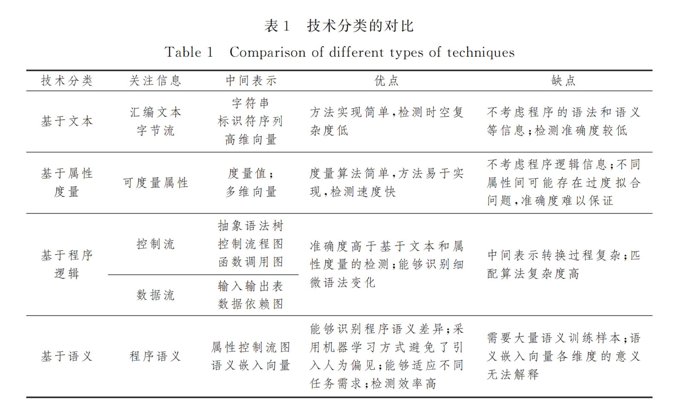
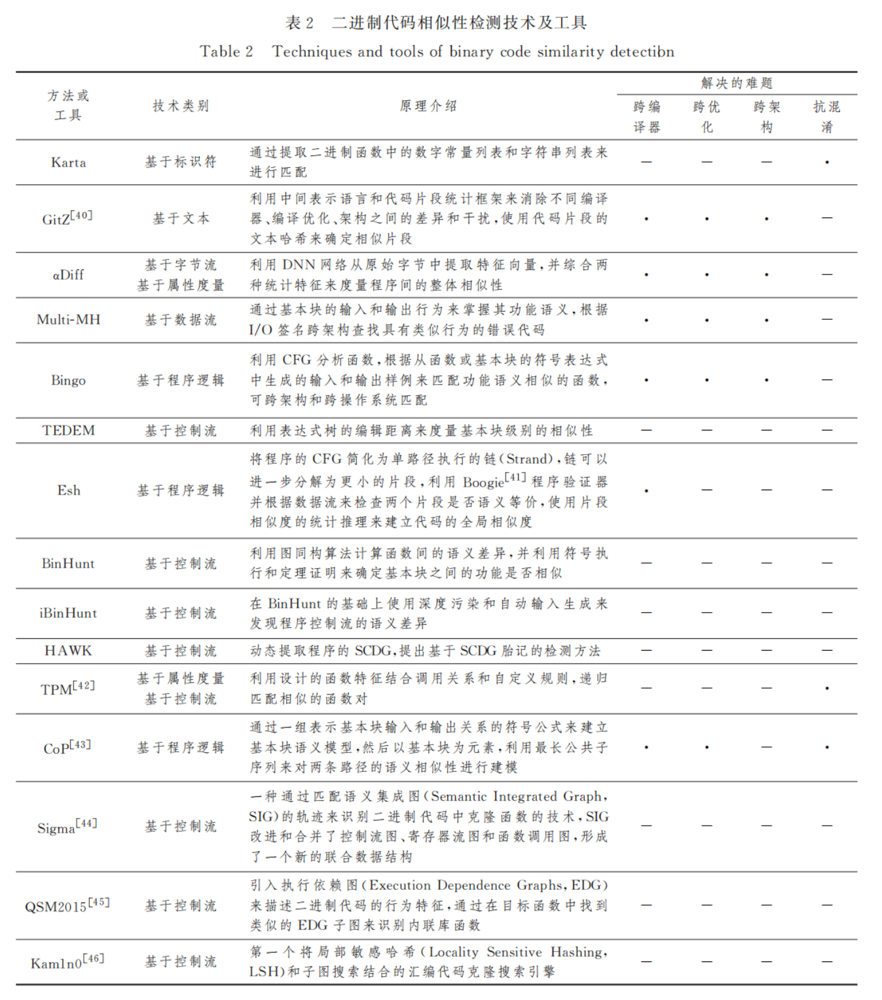
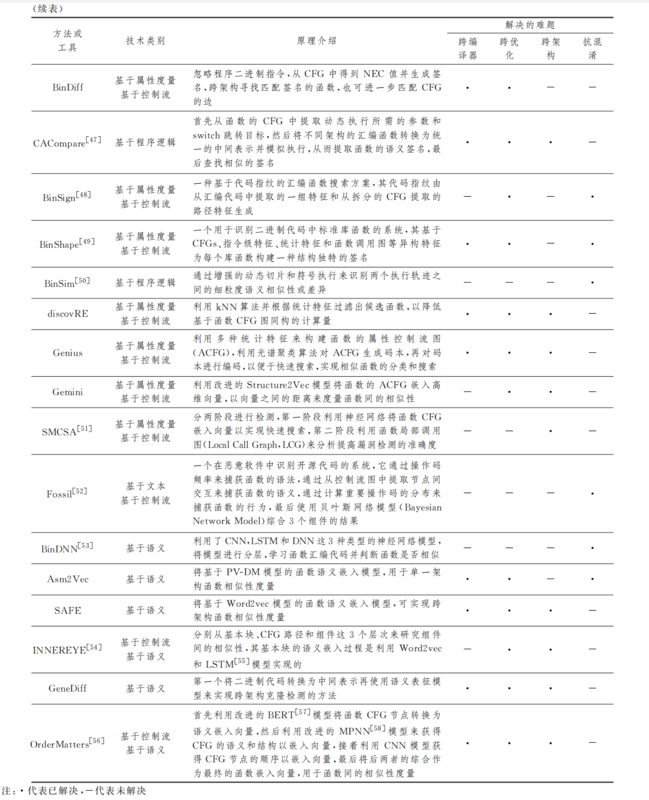
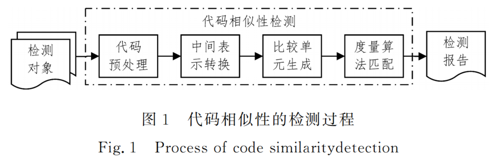

# 二进制代码相似性检测技术综述

> 方磊武泽慧, FANG LEI W Z hui. 二进制代码相似性检测技术综述[J/OL]. 计算机科学, 2021, 48(5): 1-8. DOI:10.11896/jsjkx.200400085.

* 北大核心
* 当前被引用数：0

## Summary

> 写完笔记之后最后填，概述文章的内容，以后查阅笔记的时候先看这一段。

> 注-1：写文章summary切记需要通过自己的思考，用自己的语言描述。忌讳直接Ctrl + C原文。

> 注-2： **以下笔记内容** ，无论图文，如果确实复制粘贴而来，要进行引用标记。原文可以用 `markdown` 的引用格式进行标注，论文原图在截图时保留原文中的图标题。其他排版格式的图文均表示为笔记作者自己的「原创」内容。

## Milestones of this field
- αdiff
> LIU B,HUO W,ZHANG C,etal．αdiff:cross-version binary code similarity detection with dnn[C]∥Proceedings of the 33rd ACM/IEEE International Conferenceon Automated Software Engineering．２０１８:６６７-６７８．
- discovRE
> ESCHWEILER S,YAKDAN K,GERHARDSＧPADILLA E． discovRE:Efficient Cross-Architecture Identification of Bugs in BinaryCode[C/OL]∥TheNetworkandDistributedSystemSeＧ curitySymposium(NDSS２０１６)．２０１６．http://dx．doi．org/１０． １４７２２/ndss．２０１６．２３１８５．

- HAWK：通过系统调用依赖图的**动态检测**
> WANGX,JHIYC,ZHUS,etal．Behavior based software theft detection[C]∥ACM Conference on Computer and Communications Security(CCS２００９)．Chicago,Illinois,USA,DBLP,２００９: ２８０Ｇ２９０

- BinHunt,iBin-Hunt：在CFG的基础上利用了**符号执行**
> GAO D,REITER M K,SONG D．Binhunt:Automatically finding semantic differences in binary programs[C]∥International Conference on Information and Communications Security． Springer,Berlin,Heidelberg,２００８:２３８Ｇ２５５． 
> MINGJ,PAN M,GAOD．iBinHunt:Binary hunting with interprocedural controlflow[C]∥International Conferenceon Information Security and Cryptology．Springer,Berlin,Heidelberg, ２０１２:９２Ｇ１０９．

- Gemini
> XU X,LIUC,FENG Q,etal．Neural network-based graph embedding for cross-platform binary code similarity detection[C]∥ Proceedings of the２０１７ ACM SIGSAC Conference on Computer and Communications Security．２０１７:３６３Ｇ３７６．

- Asm2vec
> DINGSH H,FUNGBC M,CHARLANDP．Asm2vec:Boosting static representation robustness for binary clone search against code obfuscation and compiler optimization[C]∥２０１９IEEE Symposium on SecurityandPrivacy (SP)．IEEE,２０１９: ４７２-４８９．

- SAFE网络
> MASSARELLIL,DILUNAGA,PETRONIF,etal．Safe:Selfattentive function embeddings for binary similarity[C]∥International Conference on Detection of Intrusions and Malware,and Vulnerability Assessment．Springer,Cham,２０１９:３０９Ｇ３２９
## Research Objective(s) of this field

- 代码分类
    - 源代码
    - 二进制代码（反汇编代码）
        - 基于文本
            - 基于标识符的检测
            - 基于字节流的检测

        - 基于属性度量
        - 基于程序逻辑
        - 基于语义

## Background / Problem Statement of this field

- 二进制代码相似性「难题」
    1. 跨编译器
    2. 跨编译优化
    3. 跨指令架构

## Method(s) of this field

### 基于文本
- 基于标识符的检测
    - Karta
        - 使用函数调用列表来匹配一组相似函数
    - DarunGrim２
        - 基本块的指令序列的哈希值作为相似特征，符号名称的匹配作为辅助手段
- 基于字节流的检测
    - αDiff
        - 利用「二维卷积神经网络(ConvolutionalNeuralNetwork, CNN)」对程序的二进制字节进行嵌入，综合函数出度和入度构建特征向量，用向量之间的距离来度量程序间的相似性

### 基于属性度量

-  discovRE
    - 通过构建函数的简单特征（算数指令、函数调用、局部变量、基本块等统计个数），利用**kNN**计算函数间的相似度实现「预筛选」，降低后续基于CFG的最大子图同构匹配方法的计算量
- BinDiff
    - 基于图形和指纹理论的。函数匹配主要是基于从 CFG 中得到的 NEC 值,即基本块数(Nodes)、边数(Edges)、调用数(Calls).
---
- 缺点
    1. 忽略程序的逻辑结构
    2. 属性特征是人为选择

### 基于程序逻辑
> 利用**列表、树形或图形**等数据 结构来记录和描绘程序的**数据流**或**控制流**信息
- Multi-MH:
    - 通过基本块的输入和输出
- Bingo：
    - 从符号表达式中生成的输入和输出
- HAWK
    - 实现了一种基于系统调用依赖图(SystemCallDependenceGraph,SCDG)胎记的**动态**检测方法
- Genius
    - 基于属性优化CFG
- Esh,BinHunt,iBin-Hunt等工具在基于 CFG 的基础上，利用了**符号执行**来确定基本块或函数的相似性

---
- 优点
    - 准确度较高
    - 可伸缩性强
- 缺点
    - 时空复杂度高

### 基于语义

- 二进制中间表示
    - 规范化的汇编文本
    - 其他中间语言
    - CFG
- 神经网络模型
    - 暹罗架构(Siamese Architecture)
        - 需要**专家和先验知识**

- Gemini
    - 利用改进的Structure2vec模型

- **Asm2vec**
    - 利用**自定义的函数内联**和**随机漫步机制**,将函数的CFG建模为汇编指令的线性序列,以该汇编文本为输入,**不需要任何先验知识**, 学习指令的语义,构建指令嵌入向量,最终得到函数的语义嵌入向量
    - Asm２vec是第一个将*表征学习*作为汇编代码构建特征向量的方案,具有优秀的**抗混淆**和**抗编译器优化**特性,但其还**不能用于跨架构**比较

- SAFE网络
    - 利用Word2vec进行汇编语言指令嵌入，在利用RNN捕获上下文关系
    - 没有选择CFG作为中间表示
    - 针对跨架构检测任务，训练样本库会组合扩大
- GeneDiff
    - 使用语义表征模型来学习二进制代码中间语言
    - 借助动态分析VEXIR（中间语言）消除指令架构差异，通过改进的 PV-DM 模型来为函数的 VEXIR生成语义嵌入向量
--- 
- 优点
    - 检测速度和准确度提升
    - 神经网络可以针对不同任务再次训练
    - 自行学习和选择特征
- 难题
    - 跨学科知识交叉应用，针对自身实际进行理论创新
    - 需要大量训练数据集
    - 输出结果可解释性差
### 技术分类比对
            

### 二进制代码相似性技术与工具比对      
           

          
## General Workflow(s) of this field

- 代码相似性的检测过程       

              

## Tags

* 2021
* SoftFP
* 二进制
* 综述

