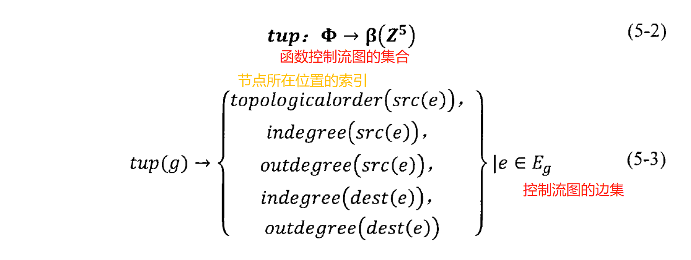
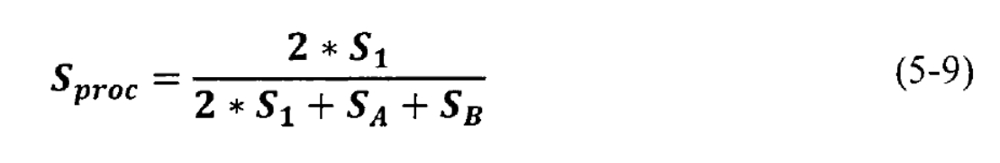

# 基于二进制代码同源性的恶意程序检测技术的研究与实现_黎恒

> 黎恒. 基于二进制代码同源性的恶意程序检测技术的研究与实现[D].北京邮电大学,2019.

- 当前被引用数
    - 知网引用次数：1

## Summary

### 文章主要内容

- 系统主要作用是用来比对两个程序之间的相似程度。主要是通过计算两个程序整体md5，然后使用IDA进行反汇编，然后提取一些函数特征，然后进行特征匹配从而计算函数的相似度。通过匹配函数队的数量来计算两个程序之间的相似度

### 创新点

- 无。作者是将多种已有技术融合在一起来达到目标

## Research Objective(s)

> 作者的研究目标是什么？

- 设计并实现一个高准确率和高效率的**二进制代码同源性比对系统**，对恶意程序变体和恶意程序家族样本进行检测，并根据系统运行结果对程序进行后续分析。

## Background / Problem Statement

> 研究的背景以及问题陈述：作者需要解决的问题是什么？

### 研究背景

- 许多新的而恶意程序都是通过已知的恶意软件演变过来的，并且在这些恶意程序中，存在着大量的恶意程序家族。
- 由于同一开发作者所编写的恶意程序源代码具有很大的相似性，且恶意程序开发过程中的部分代码可以复用，使得恶意程序中存在着大量的恶意程序变体。

### 研究现状

#### 恶意软件检测方法

- 对恶意软件检测方法主要有静态分析、动态分析和恶意程序样本聚类
    - 静态分析：对程序的汇编代码、程序调用图、控制流图等静态特征进行分析
    - 动态分析：将恶意程序在沙箱或者虚拟机中运行，收集恶意程序运行时产生的系统调用、内存使用等情况，判断其是否具有恶意行为
    - 恶意程序样本聚类：使用机器学习的方法对恶意特征进行处理，从不同的样本中鉴别出相同的代码
- 此文主要是通过对二进制代码的静态特征进行相似性分析，静态特征主要包含**程序字节流、汇编代码以及程序的函数调用图和控制流图**等特征。

#### 二进制代码同源性比对技术

- 二进制代码同源性比对技术主要分为五类：
    - 基于二进制文件字节流地同源性比对技术：该技术是最早出现的技术，速度很快，但是该技术只能比较出二进制文件字节改变很少的情况，所以准确率比较低
    - 基于二进制程序汇编指令的同源性比对技术：该技术可以检测少量变化，但是无法避免因为不同编译器和不同平台对程序比对造成影响。
    - 基于结构化图形的同源性比对技术：该技术对程序的结构图进行签名，通过签名的比较确定函数之间的关系。该技术准确率较高
    - 基于基本快指纹的同源性比对技术：提取基本快内部的跳转逻辑、代码序列和子函数名的指纹信息，然后对指纹信息进行签名和比较。该技术能得到准确结果但是比较效率较低
    - 基于机器学习的二进制程序同源性比对技术：构建适合的模型对二进制程序的**静态特征**进行训练，用于对恶意家族的分类与识别。当样本较少时，无法进行训练和识别

### 研究意义

- 对于准确和高效地发现恶意程序变体以及恶意程序家族有着十分重要意义。

## Organizational structure

> 该学位论文的写作结构，章节安排，概括章节里面的写了什么内容

1. 第一章：主要介绍了研究背景（互联网和恶意软件发展的背景）、研究现状（二进制代码同源性比对技术的研究现状），分析已有的相关各项技术的优点和不足，提出了研究目标（设计二进制代码同源性比对系统，用于恶意程序变体和恶意程序家族的检测）。最后，对论文的主要研究内容和整体结构进行介绍。
2. 第二章：主要介绍了论文相关的技术，即已有的二进制代码同源性比对技术，序列相似比较方法、小素数乘积法以及Tarjan算法，最后对此章节进行总结。
3. 第三章：进行需求分析（采用了用例图的方式对系统各个模块进行分析），最后对此章节进行总结。
4. 第四章：主要介绍了系统的整体架构,根据系统的需求分析对系统的各个功能模块进行详细的设计，最后对此章节进行总结。
5. 第五章：主要介绍系统的整体运行流程，关键技术的实现以及系统各个功能模块的实现，最后对此章节进行总结。
6. 第六章：主要对整个系统进行测试，包过系统的功能和性能测试，以及与其他工具的对比测试，并对测试结果进行分析，最后对此章节进行总结。
7. 第七章：对论文进行了总结，并对未来的发展趋势进行了展望。

## Method(s)

> 作者解决问题的方法/算法是什么？是否基于前人的方法？基于了哪些？

### 使用的关键技术

#### 二进制代码同源性比对技术

- 基于二进制文件字节比较的同源性比对技术
    - 本文使用的是计算完整软件的签名，速度快但是准确率较低
- 基于汇编指令的二进制代码比对技术
- 基于结构化图形的二进制代码比对技术
    - 提取函数调用关系图和函数内部控制流图，然后进行图结构的比较
- 基于基本块指纹的二进制代码同源性比对技术
    - 提取不同函数的基本块的属性（子函数名、变量名）及其跳转关系

#### 序列相似比较

- `python`的`difflib.SequenceMatcher`对序列进行比较
- 小素数乘积法：为汇编指令的每一个助记符分配一个小素数，将整个程序的汇编代码转化为素数的乘积，从而代替基本块内部指令流
- Tarjan算法：计算程序控制流图的强连通分量

### 系统设计与实现      

#### 1.字节流比对模块：检测待测程序是否为恶意程序样本的完整拷贝
1. 程序的MD5值作为其签名
    - MD5算法速度块，具有很好的抗碰撞性，可以保证MD5签名一致的两个程序基本完全相同
2. 直接比较两个程序的MD5值是否相同
    - 相同：两个程序相似度为100%
    - 不同：传入后续的模块处理

#### 2.IDA反汇编：对程序进行反汇编
- 使用IDA对程序进行逆向，输出汇编代码

#### 3. 特征提取
##### 函数直接特征
可以直接从IDA反汇编后的结果中提取的特征：
- 函数相对虚拟地址(RV)
- 函数名称(包含可以识别出的库函数名字和无法识别的函数名称，如sub_400010)
- 函数汇编代码和基本块汇编代码(包含助记符，操作数，注释等)
- 函数的调用关系(即函数出入度)
- 函数伪代码
- 基本块地址及基本块的跳转关系

##### 函数间接特征

- 函数控制流程图
- 强连通分量和函数内部循环次数
    - 强连通分量借助Tarjan算法
    - 借助强连通分量计算函数内部的循环次数
- md_index：对函数控制流程图进行计算得到一个签名值     
1. 将控制流图中的边集转化为整数的n元组集       

     

2. 进行编码       

      

3. 将单个元组值组合起来（不考虑边的顺序），即生成函数控制流程图的`hash`值，即`MD_index`        

        

- 函数`hash`
    - 未处理的汇编代码生成`hash`
    - 去除汇编代码中包含常数的指令后生成的`hash`

- 助记符签名和伪代码签名
    - 采用小素数乘积法生成
    - 个不同的助记符分配不同的素数
    - 伪代码中每个表达式或指令对应着不同的标识符，讲不通的标识符映射为不同的素数

#### 4. 特征比对

- 基于**结构化比对**的特征比对算法,通过提取出控制流图和调用图的特征作为图形的**编码表示**并对其进行特征比对，找到相匹配的函数对。     

      

#### 5. 相似度计算
- 计算函数间的相似度
1. 取出其下列序列特征:函数汇编代码, md_ index,函数伪代码和伪代码签名,并将伪代码中的sub_ addr、 loc_ addr 等字符串替换为统一的字符串，避免因地址不同造成的影响
2. 利用序列相似度比较算法分别计算函数汇编代码、伪代码的相似度，并记为s1，s2
3. 计算函数伪代码签名的相似度s3， 具体计算方法遵循如下原则:       
若某些素数只在某一签名中存在，则计算这些素数的数量和，记为n1;若某些素数在两个签名中均存在，则计算这些素数出现的数量差之和，记为n2;将两个签名中素数出现数量分别记为N1、N2。该签名相似度的计算方法为:       

     

4. 计算 `md_ index` 的相似度`s4`。当 `md_ index` 值不相等时,记`s4`为0;当`md_ _index`相等时，s4计算方法为:       

      

5. 计算函数的相似度Sfanco该相似度的计算公式如下:     

     

6. 判断函数相似度`Sfunc`是否达到阈值0.5。若达到，则将函数加入已匹配函数列表;若相似度低于阈值，则将函数加回最开始的函数列表。

- 计算程序间的相似度
    - 根据匹配函数的数量计算最终数据之间的相似度
    - 由上述步骤可以得到两个程序匹配的函数对数量S1,两个程序未匹配的函数数量SA和SB，则最终的程序函数相似度Sproc为      

       

## Evaluation

> 作者如何评估自己的方法？实验的setup是什么样的？感兴趣实验数据和结果有哪些？有没有问题或者可以借鉴的地方？

- 作者首先通过表格和示例截图，列出了系统的每个模块运行结果了，然后得出"通过"的结论，证明这个系统搭建起来了，能成功运行
- 为了验证系统的准确性，作者选取了四个病毒家族，每个家族两个样本进行测试
    - 四组样本之间代码相似度高，说明四组样本之间代码重用程度较高

- 系统对比试验：使用上面提到的四组样本与bindiff进行比较
    - 时间花费比bindiff更少

## Conclusion

- 该系统极大的提高了同源性比对的效率和准确率。该系统可以很好的计算出恶意程序家族内程序之间的关系，并判断程序是否为恶意程序变体或属于恶意程序家族。
    - 由于作者通篇体现的实验就是对来自四个家族的四队样本，所以虽然给出了证据，但是实验数据有些单薄，不能有力证明此系统的准确率和效率时高的

### 个人总结

1. 因为我的本科论文和这篇论文的叙述方式相似。通过比对发现，其实本科论文在对用例进行描述时可以采用表格的形式，并且缺少了异常事件流的描述
2. 整个论文中的图显得很`low`。图片的背景与论文的背景颜色不一致，图片的背景像是打印纸的颜色。这点是之后自己写论文需要避免的，图片的背景、字体、大小应该与论文相吻合
3. 作者的实验部分感觉比较单薄，进行系统整体测试和对比实验时，只采取了四组样本进行测试，只给出了准确率的结果，没有给出误报或者漏洞率如何的相关实验。同时在进行横向比对时，只在`测试时间`这一维度进行比较，并没给出关键点：`准确率`的比较
4. 这个系统只实现了计算两个程序相似度的功能。但是如果能扩大恶意程序的数据库，将一对一比较变为一对多比较，即一个程序输进去，能给出他是否与已知恶意软件相似，如果是，可以给出一个相似度排名。但是现有的恶意程序的数据库一般都是商用的，如果是自己做的话，只能先在`virusshare`网站上下载一大波数据，提取特征，存入数据库
5. 参考文献都比较老旧，2016之后的期刊等只有5篇，而且有很多网络资料