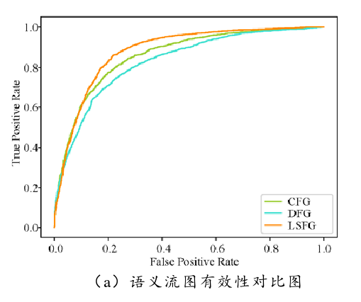

# 基于语义学习的二进制漏洞代码克隆检测

> 杨鑫. 基于语义学习的二进制漏洞代码克隆检测[D].清华大学,2019.DOI:10.27266/d.cnki.gqhau.2019.000311.          

> [1]Jian  Gao,  Xin  Yang,  Ying  Fu,  Yu  Jiang,  Heyuan  Shi,  and  Jiaguang  Sun. VulSeeker-pro: enhanced semantic learning based binary vulnerability seeker with  emulation.  ESEC/FSE,  2018,  803-808.  (EI 收 录 ,  检 索 号 : 20185006250340.) 
[2]  Jian Gao, Xin Yang, Ying Fu, Yu Jiang, Jiaguang Sun. VulSeeker: a semantic learning  based  vulnerability  seeker  for  cross-platform  binary.  ASE,  2018, 896-899. (EI 收录,  检索号: 20184706087496.) 

* 清华大学
* 软件工程硕士专业学位论文
* 当前被引用数：2

## Summary

> 本文的作者是VulSeeker的二作，这篇文章的内容可以看作是Vulseeker的大论文形式

作者提出了一种语义模型进行漏洞代码的搜索，该模型在**struct2vec**的基础上进行改进，基本块特征增加了指令和库函数的分类类别，基本块间特征采用**语义流图**的信息。在训练模型的时候，采用**“预训练+微调”**的方式，首先使用大批量的同一源码不同编译方式后的二进制代码学习「普适性语义」，微调阶段使用漏洞代码学习漏洞代码所特有的语义信息。

> PS：1. Vulseeker基本块内的信息是通过每一类指令/函数的数量组成的向量表示的，这样的话丢失了语义的顺序信息
>
> 2. 这篇文章有关于数据集部分工作量的描写：第 3 章  训练样本构造，后续如果数据集的工作量能够支持一大章的话，可以参考一下这一篇的目录结构

## Research Objective(s)

- 使用深度学习，进行「二进制代码」的语义相似检测研究，从而提高二进制**漏洞代码检测**准确率

## Background / Problem Statement

- 目前的研究普遍停留在源码级别（2019），关于二进制漏洞代码克隆检测的研究目前较少
- 难点
	1. 机器语言的语义信息不易被理解
	2. 统一源码，不同指令系统、结构、编译配置编译后的二进制代码差别大	
- 四类代码克隆检测：主要针对type-2和type-3
	1. type-1：完全克隆。只有空格和注释不同。（二进制代码基本不存在这种类型）
	2. **type-2：近似克隆。语法句法基本相同，只有空格、注释、类型、标注符不同。**
	3. **type-3：近似克隆。语句有略微删减与改动。**
	4. type-4：语义克隆。句法上完全不同，但实现了完全相同的功能。（相当于重写）
	> type-4从软件动态行为方面进行分析更精准

### 研究现状
#### 克隆代码检测
- 基于文本
	- 没有考虑语义逻辑信息
- 基于词法的检测（基于token）
	- 计策速度较快；可以较好解决一类和二类克隆问题，不适用三、四类
-	基于语法的检测
	-	鲁棒性较前两种好，但是随着代码行数增多，耗费时间会越来越长
- 基于语义的检测
	- 提取图结构（数据流图、函数调用图等），通过同构子图匹配等算法来寻找克隆代码
	- 时间复杂度和空间复杂度高
- **基于度量的检测(本文选用方法)**
	- 基于一定的粒度，预先设定一系列度量元，对代码进行抽象
	- 只能基于特定的粒度来进行检测。若克隆的代码段小于这一粒度，比如程序员只抄袭了函数的前半段，而恰好前半段中
	被报出存在漏洞，这种情况下将很难检测出来。（这类问题即为DeepBindiff中的跨函数问题）

#### 漏洞检测

- 补丁分析
	- 将漏洞代码于待测程序比对，通过对补丁文件进行分析，确定问题具体位置
- **静态分析（本文选用方法）**
- 动态分析          

- 现有的工具：ReDeBug、CCFinder、DECKARD、DyCLINK难以应用到大规模检测          

            

## Method(s)
> 基于structure2vec[57]的基础进行修改建造：1. 无向图 -> 有向图；2. 两种类型的边，权重不同 
### 训练样本构造

> 小的数据集容易出现「过拟合」

- 预训练数据：用于学习二进制代码的**普适性语义**
	- 克隆组：同一段代码在不同架构和编译配置下得到的二进制代码（在这种情况下，同名函数即可以认为是相似函数）
	- 5种软件，6个架构，2个版本编译器，4种优化选项 -> 240个文件、70多万个数据
		- 编译工具：Buildroot
	- 划分数据组
		- 训练集、验证机和测试集=10:1:1
		- 克隆对：非克隆对 = 1:1
		- 解析工具：IDA Pro
- 微调样本数据
	- 利用固件镜像数据：爬取libcur、openssl 等开源库的github日志中和CVE对应的函数信息，将开源代码交叉编译后得到的二进制函数与固件镜像中对应的同名函数视为克隆对

### 语义特征

- 基本块特征
	- 对比前人工作，对对指令进行更细致的分类
		- 指令分为**9类**：堆栈操作类指令、算术操作类指令、逻辑操作类指令、比较操作类指令、外部调用类指令、内部库函数用类指令、条件跳转类指令、非条件跳转类指令、其他基本指令
		- 库函数调用分为**18类**：文件输出/输出类（fstream.h）、数学函数类（math.h）、杂项函数及内存分配类（stdlib.h）、异常处理类（exception）、STL 线性列表容器类（list）、STL 映射容器类（map）、STL 队列容器类（queue）、STL 集合类（set）、STL 堆栈容器类（stack）、STL 动态数组容器类（vector）、本地化函数类（locale.h）、字符串处理类（string.h）、时间函数类（time.h）、宽字符处理类（wchar.h）、复数处理类（complex.h）、字符处理类（ctype.h）、浮点数处理类（float.h）、输入/输出类（stdio.h）

> 外部函数的调用一般很少有文献考虑，这里也只考虑了c相关的库函数             

            

- 结构化特征
	- 采用 **语义流图(Semantic Flow Graph, SFG)[52]** ，在语义流图的基础上增加参数 $\alpha$、$\beta$ 用于表示数据依赖和控制依赖的权重
	- 控制流提取：IDA（提取边信息） + NetworkX 包（存储边信息）
	- 数据流提取：Miasm（同时支持X86_64、ARM32、ARM64、MIPS32、MIPS64），需要将反汇编指令转化成中间语言

### 模型构造

- 因为 输入为「1v1」 -> 选择 孪生神经网络（Siamese Network）      

             

- 基本块节点i的特征向量$X_i$，经过RNN的T层迭代，映射为嵌入向量$\mu_i$             

           

- 最后整体的embedding向量：为W2 * 所有节点$\mu$的求和        

           

- 隐藏层计算过程           

                  

                     

### 算法实现

- 损失函数：（实际余弦值-标签）的平方，然后进行所有维度求和（tf.reduce_sum()），然后将张量转换为 float32 类型（tf.to_float）                 

          

- 计算距离：就是计算「余弦」           

             

- 搭建孪生神经网络           

           

- 搭建网络整体结构:实现子网络中的 T 层迭代以及公式 5-8，依次计算批量输入中各个样本对的特征向量                                  

          

- 各个隐含层节点参数的计算            

            

            

## Evaluation

**本文其实就是VulSeeker**

- 精度分析：明显优于Gemini            

           

- 漏洞搜索结果：优于Gemini，但是空间很大            

          

- 验证语义流图有效性         

          

- 验证指令分类策略的有效性          

          

- 检测时间:Genius精度高，但是耗时是Gemini和VulSeeker的10倍。VulSeeker 虽然比 Gemini平均一对样本的检测时间多了 0.04s，但其检测精度得到了大幅度提升        

         

- 预处理时间             
	- 基本块特征抽取：需要抽取控制流和数据流，Gemini只需要控制流，所以Gemin较快
	- 结构化信息抽取：Gemini需要计算介数中心性等需要复杂计算的参数，所以VulSeeker较快                 

             

## Conclusion

- 工作归纳

	1. 提出“预训练+微调”的训练模式进行模型的训练
	2. 提出语义流图结构
	3. 提出了基于语义学习得模型

- 未来展望

	1. 数据存储方式不利于数据维护
	2. 函数得选取是完全随机的，不能保证函数的分布概率
	3. 特征表示方法仍有改进空间
	4. 距离传统的基于图匹配的检测方法仍然存在一定的差距
## References(optional) 

- 语义流图的出处
> [52] Alrabaee S, Wang L, Debbabi M. BinGold: Towards robust binary analysis by extracting the semantics  of  binary  code  as  semantic  flow  graphs  (SFGs)[J].  Digital  Investigation,  2016, 18:S11-S22. 

- structure2vec
> [57] Dai  H,  Dai  B,  Song  L.  Discriminative  embeddings  of  latent  variable  models  for  structured data[C]. // Proceedings of the 33rd International Conference on International Conference on Machine Learning. New York, NY, USA: Journal of Machine Learning Research, 2016:2702-2711

## Tags

2019，二进制代码，相似性，漏洞挖掘
