# 面向漏洞检测的二进制代码相似性分析技术

> [1]程蕾蓉. 面向漏洞检测的二进制代码相似性分析技术[D].哈尔滨工业大学,2021.DOI:10.27061/d.cnki.ghgdu.2021.004764.

* 哈尔滨工业大学-网络空间安全
* 知网当前被引用数：0

## Summary
- 作者提出了一个二进制漏洞检测引擎。首先使用**基本块级别**的汇编代码对**transformer**的encoder部分采用「MLM」和「同一基本块」两个预训练任务进行预训练后得到基本块语义预训练模型。          

- 将预训练模型的输出作为特定任务的一部分特征向量来参与下游任务模型模型训练：「基于多层感知机的函数语义特征提取模型」和「基于图神经网络的函数语义与结构特征提取模型」，当函数节点小于40（阈值如何来的没有实验）时，采用「基于多层感知机的函数语义特征提取模型」，大于40时，采用「基于图神经网络的函数语义与结构特征提取模型」。因为传统的图神经网络没有考虑两个图之间的关系，所以作者在传统的图神经网络上加上注意力机制解决该问题。
- 模型仅仅支持**跨编译选项和跨编译器（不支持跨架构）**
> 本文期望在时间和准确率中间取得折中。通过实验发现在函数中基本块节点数比较小的时候可忽略函数的结构信息，仅通过丰富的基本块语义信息可以达到很好地效果（为看到相关实验）

> 文中解释为何粒度选择函数级别：通常一个函数是实现了某个特定的功能的最小单位，比较两个函数是否是同源才具有实际的意义，所以函数是进行已知漏洞检测的最小单位。但是也需要考虑跨函数可能的情况（粒度为基本块可解决）

> 作者在进行预训练时采用了两个预训练任务，但是实验表明没有「同一基本块」预训练任务得出的模型效果更好。说明毕设有想法就可以写出来，实验好不好另说（允许失败）
## Research Objective(s)

引入自然语言处理领域的深度学习模型来学习二进制代码的**语义**和**结构**特征，通过检测代码片段与漏洞代码的相似性来进行漏洞检测

## Background / Problem Statement

解决的问题：BCSD     

- 基于图结构

	- 精度好，但是耗时，难以解决大型任务得到漏洞检测
- 基于特征
	- 速度快，但是存在人工干预，可扩展性差

- 基于深度学习

	- 可泛化性不高

## Method(s)

### 基本块语义特征提取预训练模型

**函数是进行已知漏洞检测的最小单位**，但是函数包含的丰富语义和复杂结构可能难以学习，所以先采用基本块级别来进行语义学习。

- 预处理
	1. 反汇编
	2. 过滤无效基本块：单个指令的基本块
	3. 操作数规范化
	4. 长度规范化
- 预训练模型基于**自注意力机制**
	- 卷积神经网络和循环神经网络解决长距离依赖问题主要通过增加网络深度和建立全连接网络，但这样计算开销大
	- 缺点：没有位置信息，所以通常需要引入位置编码
- 预训练模型采用**transformer的编码部分**构建预训练模型

	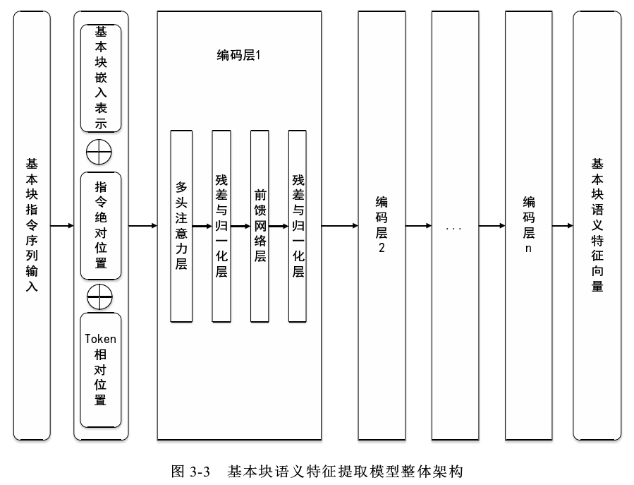           
	
	- 指令内部相对位置：区别操作码和操作数
	- 指令的绝对位置：区别每条指令
- 预训练模型任务
	1. **掩蔽语言模型（MLM）预测任务**：静态掩码，损失函数采用交叉熵
	2. **“同一个基本块”预测任务** ：NSP任务的变体。与文本任务不同，相邻的基本块不一定是上下文关系。“同一个基本块”预测任务通过将一个基本块看作一个句子，随机将一个基本块 A 划分为两个序列 B 和 C，则 B 和 C 两个序列一定具有上下文关系，从而**无监督**得学习

	> “由于每一条汇编指令都有相对固定的表达规范，可能会导致模型在执行MLM预测任务的时候，模型仅根据被屏蔽 token 附近的token就可以正确预测出结果本文期望利用NSP任务促使模型进一步学习到基本块内部各指令间的关系，而将学习基本块之间关系的任务作为下游模型需要完成的任务。”：原文的这句话表达不太对，NSP应该是学习句子间的关系，对应汇编代码是基本块之间的关系
	> 这一块继续更改的话，不考虑基本块级别这一说，直接考虑函数。将函数按照有向图的深度遍历（或者其他能够序列化图的算法），这样就可以确定上下文关系（可能不是那么准确，但是大部分上下文关系能够保留）

### 二进制代码相似性检测模型 
基本块节点数比较小的时候，可忽略函数的结构信息，采用基于多层感知机的函数语义特征提取模型             
基本块节点数比较多（阈值为40）的时候，结构信息重要，采用基于图神经网络的函数语义与结构特征嵌入模型
#### 基于多层感知机的函数语义特征提取模型

- 预处理
	1. 反汇编，提取函数名和函数体
	2. 无效基本块过滤
	3. 对基本块的操作数和长度进行规范化
	4. 过滤同一份二进制文件内相同函数名的函数
	5. 将汇编代码按照函数名匹配，生成正例标签

- 模型架构：多层感知机（MLP）

	- 层数：三层神经网络，两个隐藏层，最后一层为输出层
	- 网络结构：线性网络子层+激活函数（tanh）
	- 输入：预训练模型的输出
	- 训练模式：对偶训练
	> 输入一对被标记为正例（相似）或负例（不相似）的函数的基本块嵌入序列，在分别计算出每个函数的嵌入表示后，应用损失函数来反向传播，学习模型中的参数
	- 损失函数：               

	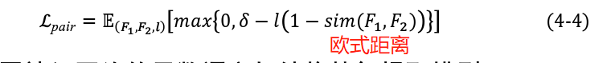           

#### 基于图神经网络的函数语义与结构特征提取模型

- 预处理：和上一步基本一样，除了多了保留函数的控制流图信息
- 模型架构：基于注意力机制的图神经网络模型，共包含三个部分，分别是编码器、传播层和聚合器-。传统的图嵌入网络是单独生成一个图的特征嵌入表示，为考虑两个图之间的关系，所以引入**注意力机制**（主要改动在传播层），学习两个图之间的关联信息，一次输入一对图后利用注意力机制联合计算一对图的相似性分数
	- **编码层**：将节点和边的特征向量映射成n维的特征向量
		- 节点的特征向量：由预处理模型生成。边的特征向量：单层的前馈神经网络
		             
	- **传播层**：多次迭代聚合每个节点周围的局部信息以传播信息，核心是将节点表示$h^t_i$聚合映射维新的节点表示$h_i ^ {t+1}$ 
		- 注意力分布：表示图𝐺1中各个节点对图𝐺2中所有节点的注意力分布的向量           

		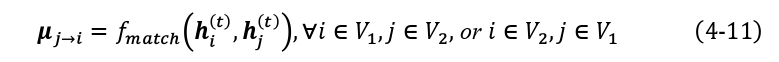               
		
		- 边更新模块：对于每个到达节点i的节点j，通过$𝑓{m𝑒𝑠𝑠𝑎𝑔𝑒}(⋅)$来聚合节点j的特征状态和对应边的特征状态，得到节点j到节点i的便特征状态。$𝑓{m𝑒𝑠𝑠𝑎𝑔𝑒}(⋅)$采用「前反馈神经网络」。       
		               
		
		- 节点更新：在更新节点时考虑到两图间的注意力分布。
			- 函数$fn𝑜𝑑𝑒$：聚合到达节点 i 的所有边的特征状态与节点 i 本身的特征状态，生成节点 i 的当前轮迭代的特征状态。$fn𝑜𝑑𝑒(⋅)$采用「门控神经网络」 
			- $\sum_j \mu_{j -> i}$：反映了图𝐺1节点𝑖的特征状态$𝐡^ t_i $ 和图𝐺2中所有节点的特征状态之间差异   
			- 计算节点的特征状态差异    
			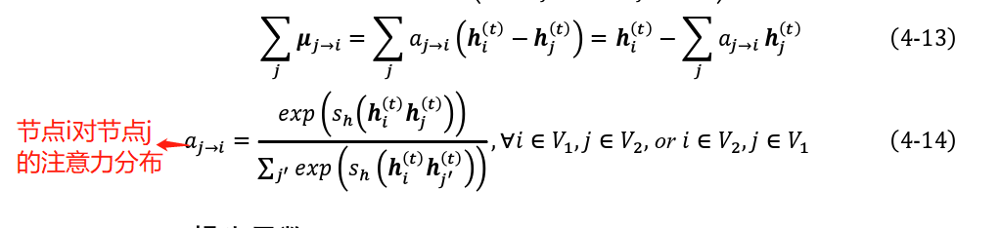             
			            

	- **聚合器** ：经过 T 轮的聚合传播后聚合各节点的特征状态以得到图的特征状态        
    
	
	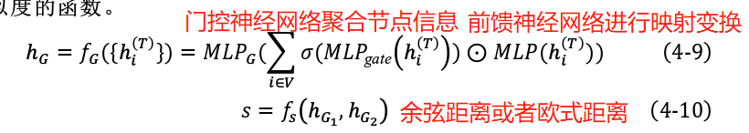
	
	- 损失函数：
	
	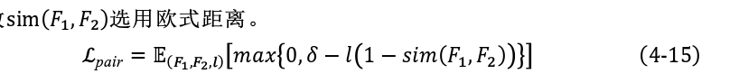                  
	

## Evaluation

- 数据集
	- 7种软件，两种编译器，四个优化选项，共11 320 056 个基本块
- 漏洞数据库：Esh 漏洞库[43]
- 超参数：
	- 优化器：Adam 优化器，学习率设置为 0.001
	- 预训练模型的迭代周期： 10
	- 基于多层感知机和基于图神经网络的函数语义与结构特征提取模型的迭代周期： 100

- 选择函数对策略：同名函数为正例，随机抽取一个二进制程序种的不同名函数作为负例

### 实验结果：与asm2vec比对
- 跨优化级别
	- 基于多层感知机的函数语义提取模型            
	> 基于仅使用掩蔽语言模型任务的预训练模型的函数语义模型可以取得更好的效果              
	
	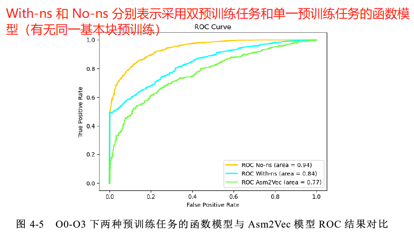           
	
	- 基于图神经网络的函数语义与结构特征提取模型：混合模型效果更好            

	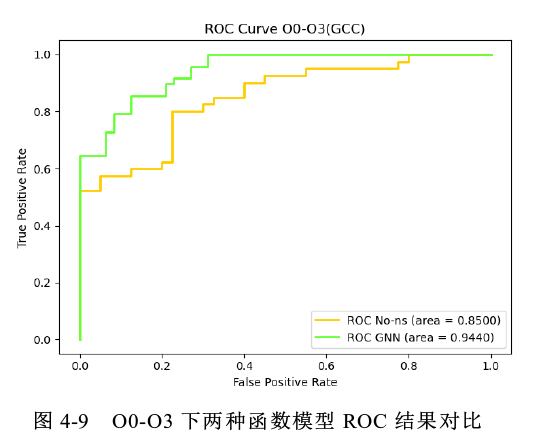            
- 跨编译器
	- 基于多层感知机的函数语义提取模型        
	
	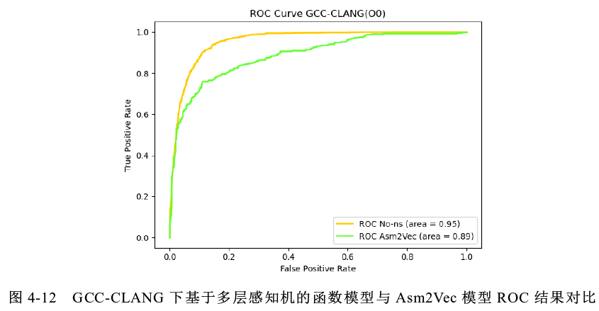            
	
	- 基于图神经网络的函数语义与结构特征提取模型       
	
	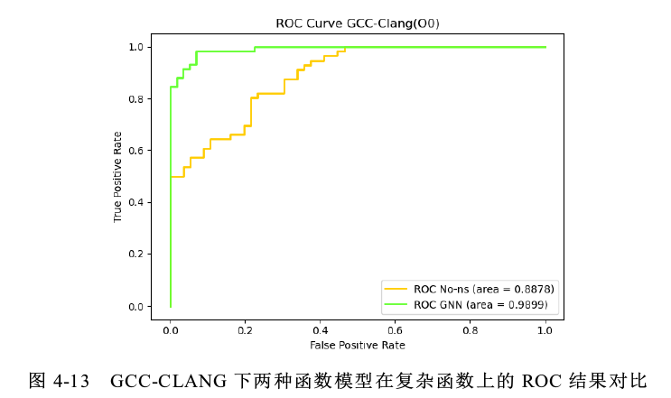          
	
- 漏洞检测
	- 因为Esh漏洞库的节点大部分都小于40，所以选择多层感知机的函数语义提取模型       

	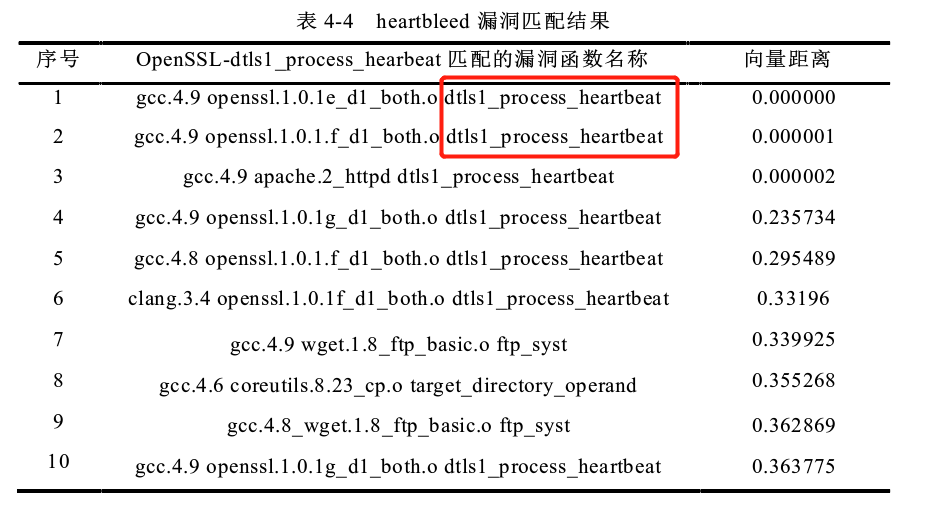            
		
> 没有提到关于选择多层感知机还是图神经网络模型时的阈值（40）怎么选择
## Conclusion

- 提出了一个漏洞检测引擎
	- 采用基本块＋函数的双层检测模式（其实还是函数级别，真正进行检测的模型还是进行了聚合）
	- 预训练一个个基本块语义特征提取模型
	- 提供两种不同复杂度的特征提取模型，针对节点数小于40的小型函数使用简单的多层感知机模型，其他的采用基于图神经网络的函数语义与结构特征提取模型来生成函数嵌入
	- 将注意力机制引入图相似神经网络
	- 与asm2vec相比，跨选项和跨编译器AUC都有提高
## References(optional) 
- Esh 漏洞库
> [43] https://github.com/nimrodpar/esh-dataset-1523

## Tags

2021, 哈尔滨工业大学，二进制代码相似检测，漏洞检测，语义特征，图嵌入